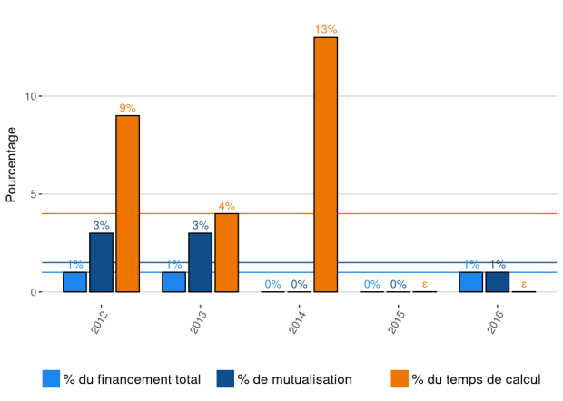

.. _igfl:

Institut de Génomique Fonstionnelle de Lyon
===========================================

* `http://igfl.ens-lyon.fr/ <http://igfl.ens-lyon.fr/>`_

Informations
------------

Représentant et responsable de l'ouverture des comptes: Magali NAVILLE.

+-----------------------------------------------------+--------+------+------+------+------+------+------+-----------+
| Année                                               |  2017  | 2016 | 2015 | 2014 | 2013 | 2012 |      | 2013-2016 |                                                               
+=====================================================+========+======+======+======+======+======+======+===========+
| Nombre total de comptes actifs                      |  27    |  30  |  31  | 30   |  24  |  nd  |      |           | 
+-----------------------------------------------------+--------+------+------+------+------+------+------+-----------+
| Nombre de comptes fermés                            |  4     |  3   |  5   |  0   |  2   |  nd  |      |           |      
+-----------------------------------------------------+--------+------+------+------+------+------+------+-----------+
| Nombre total de comptes ouverts                     |  1     |  2   |  6   |  6   |  4   |  nd  |      |           |      
+-----------------------------------------------------+--------+------+------+------+------+------+------+-----------+
|                                                     |        |      |      |      |      |      |      |           |      
+-----------------------------------------------------+--------+------+------+------+------+------+------+-----------+ 
| Nombre de comptes étudiants en master ouverts       |  0     |  0   |  0   |  2   |  2   |  nd  |      |           |      
+-----------------------------------------------------+--------+------+------+------+------+------+------+-----------+
| Nombre de comptes  doctorants ouverts               |  0     |  1   |  3   |  1   |  1   |  nd  |      |           |      
+-----------------------------------------------------+--------+------+------+------+------+------+------+-----------+ 
| Nombre de comptes  post-doctorants ouverts          |  0     |  1   |  1   |  2   |  0   |  nd  |      |           |  
+-----------------------------------------------------+--------+------+------+------+------+------+------+-----------+
|                                                     |        |      |      |      |      |      |      |           |      
+-----------------------------------------------------+--------+------+------+------+------+------+------+-----------+
| Financement (en % du financement mutualisé total)   |        |  1   |  0   |  0   |  3   |  3   |      |    1,5    |       
+-----------------------------------------------------+--------+------+------+------+------+------+------+-----------+
| Financement (en % du financement total)             |        |  1   |  0   |  0   |  1   |  1   |      |    1      |       
+-----------------------------------------------------+--------+------+------+------+------+------+------+-----------+
|                                                     |        |      |      |      |      |      |      |           |       
+-----------------------------------------------------+--------+------+------+------+------+------+------+-----------+
| Utilisation (en % du total des heures produites)    |        |  ɛ   |  ɛ   |  13  |  4   |  9   |      |    4      |       
+-----------------------------------------------------+--------+------+------+------+------+------+------+-----------+

*Les chiffres pour l'année en cours sont amenés à évoluer*

*Structure créée en 2012*

