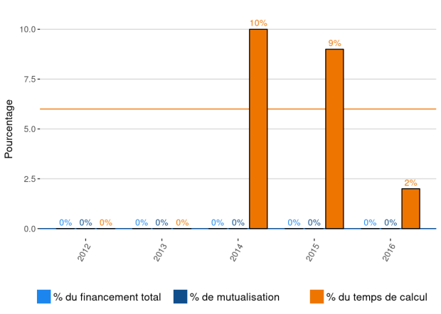

.. _lmfa:

Laboratoire de Mécanique des Fluides et d'Acoustique (LMFA - UMR 5509)
======================================================================

* `http://lmfa.ec-lyon.fr/?lang=fr <http://lmfa.ec-lyon.fr/?lang=fr>`_

Informations
------------

Représentant et responsable de l'ouverture des comptes: à déterminer. 

+-----------------------------------------------------+--------+------+------+------+------+-----------+
| Année                                               |  2017  | 2016 | 2015 | 2014 |      | 2013-2016 |                                                               
+=====================================================+========+======+======+======+======+===========+
| Nombre total de comptes actifs                      |  7     |  7   |  6   |  3   |      |           | 
+-----------------------------------------------------+--------+------+------+------+------+-----------+
| Nombre de comptes fermés                            |  0     |  3   |  0   |  0   |      |           |      
+-----------------------------------------------------+--------+------+------+------+------+-----------+
| Nombre total de comptes ouverts                     |  0     |  4   |  3   |  0   |      |           |      
+-----------------------------------------------------+--------+------+------+------+------+-----------+
|                                                     |        |      |      |      |      |           |      
+-----------------------------------------------------+--------+------+------+------+------+-----------+ 
| Nombre de comptes étudiants en master ouverts       |  0     |  1   |  0   |  0   |      |           |      
+-----------------------------------------------------+--------+------+------+------+------+-----------+
| Nombre de comptes  doctorants ouverts               |  0     |  1   |  1   |  0   |      |           |      
+-----------------------------------------------------+--------+------+------+------+------+-----------+ 
| Nombre de comptes  post-doctorants ouverts          |  0     |  0   |  1   |  0   |      |           |  
+-----------------------------------------------------+--------+------+------+------+------+-----------+
|                                                     |        |      |      |      |      |           |      
+-----------------------------------------------------+--------+------+------+------+------+-----------+
| Financement (en % du financement mutualisé total)   |        |  0   |  0   |  0   |      |    0      |       
+-----------------------------------------------------+--------+------+------+------+------+-----------+
| Financement (en % du financement total)             |        |  0   |  0   |  0   |      |    0      |       
+-----------------------------------------------------+--------+------+------+------+------+-----------+
|                                                     |        |      |      |      |      |           |       
+-----------------------------------------------------+--------+------+------+------+------+-----------+
| Utilisation (en % du total des heures produites)    |        |  2   |  9   |  10  |      |    6      |       
+-----------------------------------------------------+--------+------+------+------+------+-----------+

*Les chiffres pour l'année en cours sont amenés à évoluer*

