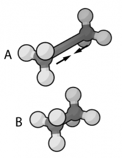
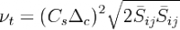
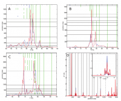

.. _se2010:

* :ref:`Évènements scientifiques <eventsci>`

Séminaires 2010 
===============

.. |br| raw:: html

    

**On the spectroscopy, diffusion, and dissociation dynamics of gas-phase molecular systems: is vibrational delocalization really important?** |br|
Séminaire du Centre Blaise Pascal |br|
Location: Salle de réunion LR6 C 023, Centre Blaise Pascal, ENS-Lyon, France |br|
**November 16, 2010 - 13:45**

* Florent CALVO, LASIM, University of Lyon and CNRS, France

Abstract: Quantum nuclear effects are usually manifested in weakly-bound compounds or at low temperatures. The role of nuclear delocalization has thus been emphasized in situations involving the hydrogen or neon atoms, for which the classical treatment is likely to be approximate. The path integral (PI) approach to quantum statistics at finite temperature offers a convenient theoretical framework to address such effects in molecular dynamics (MD) simulations of complex systems. In this talk, we will review the basics of the PIMD method and its variants, as well as some of its recent improvements. Several applications will be presented and discussed, ranging from the diffusion of hydrogen in palladium nanoparticles, the infrared spectroscopy of polycyclic aromatic hydrocarbons, and the dissociation and isomerization pathways in neon clusters.

----

.. image:: ../../_static/Animations/SE/pdes.png
    :class: img-float pe-2
    :alt: pdes

**A spectral fictitious domain method with internal forcing for solving elliptic PDEs** |br|
Séminaire du Centre Blaise Pascal |br|
Location: Salle de réunion LR6 C 023, Centre Blaise Pascal, ENS-Lyon, France |br|
**October 19, 2010 - 15:00** |br|

* Marc BUFFAT, Laboratoire de Mécanique des fluides et acoustique, Université Claude Bernard Lyon I, France

Abstract: A fictitious domain method is presented for solving elliptic partial differential equations using Galerkin spectral approximation. The fictitious domain approach consists in immersing the original domain into a larger and geometrically simpler one in order to avoid the use of boundary fitted or unstructured meshes. In the present study, boundary constraints are enforced using Lagrange multipliers and the novel aspect is that the Lagrange multipliers are associated with smooth forcing functions, compactly supported inside the fictitious domain. This allows the accuracy of the spectral method to be preserved, unlike the classical discrete Lagrange multipliers method, in which the forcing is defined on the boundaries. In order to have a robust and efficient method, equations for the Lagrange multipliers are solved directly with an influence matrix technique. Using a Fourier-Chebyshev Petrov-Galerkin approximation, the high-order accuracy of the method is demonstrated on one- and two-dimensional elliptic problems of second- and fourth-order. Thanks to its simplicity and high-order accuracy, the present method is particularly attractive for solving elliptic problems in complex geometry.

----

**Simulation numérique des écoulements complexes ; importance de l'écoulement moyen dans la modélisation de la viscosité sous-maille** |br|
Séminaire du Centre Blaise Pascal |br|
Location: Salle de réunion LR6 C 023, Centre Blaise Pascal, ENS-Lyon, France |br|
**Septembre 14, 2010 - 15:00** 

* Emmanuel LEVEQUE, Laboratoire de Physique, ENS LYON, France

----

**Physique statistique du repliement et de la dénaturation des acides nucléiques** |br|
Location: Amphi A, ENS-Lyon, France |br|
**June 23, 2010** 

* Daniel JOST, Laboratoire de Physique / Centre Blaise Pascal, École Normale Supérieure de Lyon, France

Abstract: L'étude de nombreux processus biologiques et nanotechnologiques requièrent une bonne compréhension du repliement et de la dénaturation des acides nucléiques. Les travaux décrits dans cette thèse portent principalement sur le développement et l'utilisation de modèles thermodynamiques de ces mécanismes. Nous avons tout d'abord mis en place un formalisme unifié du modèle de Poland-Scheraga qui permet de décrire la dénaturation thermique de l'ADN quelque soit la taille des molécules considérées, leur concentration et leur environnement ionique. Nous utilisons ce modèle pour décrire quelques aspects génériques de la dénaturation. En particulier, nous montrons que le comportement des observables est particulièrement sensible à l'incertitude sur les paramètres du modèle pour les longs oligomères. Nous considérons ensuite le modèle de Zimm-Bragg qui est une approximation du modèle précédent. Cela nous permet de procéder à une analyse statistique systématique des corrélations entre domaines thermodynamiquement stables et gènes dans les génomes. Nous avons ensuite développé un modèle sur réseau du repliement de l'ARN paramétré à l'aide d'une version réduite et unifiée du modèle de Turner. L'étude du modèle sur réseau, gr\^ace à la mise en place de plusieurs techniques avancées de Monte-Carlo, montre qu'il décrit quantitativement le repliement de structures complexes. Nous évaluons aussi l'importance des interactions stériques. En particulier, nous estimons des corrections de champ moyen utilisables dans les programmes standards traitant la structure secondaire. Enfin, nous exploitons l'aspect tridimensionnelle du modèle, pour étudier l'effet d'un confinement géométrique. 