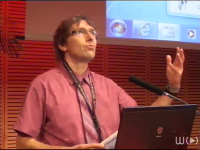
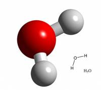
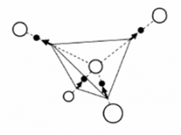
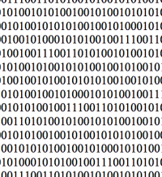
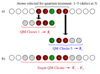
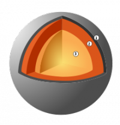

.. _se2011:

* :ref:`Évènements scientifiques <eventsci>`

Séminaires 2011
===============

.. |br| raw:: html

    
   

**France Grilles : Enjeux et perspectives** |br|
Séminaire du Centre Blaise Pascal |br|
Location: Salle de réunion LR6 C 023, Centre Blaise Pascal, ENS-Lyon, France |br|
**December 13, 2011 - 14:00** 

* Vincent BRETON, Directeur de l’Institut des Grilles, Laboratoire de Physique Corpusculaire de Clermont-Ferrand

**(22 participants)**

Abstract: Depuis 10 ans, les grilles informatiques ont fait évoluer l'environnement du calcul distribue en proposant un nouveau paradigme dans lequel tous les utilisateurs sont égaux. Cree il y a 18 mois, France Grilles a pour vocation de coordonner la construction, le déploiement et les opérations d'une infrastructure informatique distribuée ouverte à toutes les disciplines scientifiques et de faire de cette infrastructure un lieu d'échanges et de collaborations scientifiques et techniques. France Grilles organise son activité autour de trois axes: les opérations de la grille de production, le service aux utilisateurs et le démarrage d'une feuille de route sur le cloud. La mise en œuvre de synergies avec les mésocentres et centres nationaux de calcul intensif fait aussi partie des objectifs importants pour 2012. Le séminaire présentera France Grilles, les principales communautés d'utilisateurs et des opportunités de collaboration. Il montrera comment les grilles ont permis l'émergence de nouvelles démarches collaboratives dans les sciences du vivant et la sante, notamment avec les pays en développement."

----

**Computing solvation free energies: quality of force fields, affinity of amino acids for solvent water, and a methodological digression** |br|
Séminaire du Centre Blaise Pascal |br|
Location: Salle de réunion LR6 C 023, Centre Blaise Pascal, ENS-Lyon, France |br|
**July 28, 2011 - 14:30** 

* Stefan BORESCH , University of Vienna, Austria

Séminaire organisé par M. Martin Spichty, Laboratory of Molecular and Cellular Biology Differentiation and the Cell Cycle, ENS de Lyon

Abstract: We start by assessing the currently attainable accuracy and precision of molecular dynamics based computations of free energy differences with emphasis on the calculation of solvation free energy differences. In such applications it is possible to differentiate between errors resulting from the molecular mechanical force fields used and other methodological errors. We then present results concerning the solvent affinity of amino acids (which *cannot* be measured) and contrast them with the solvation free energy differences of the respective side chain analogs (for which experimental data are available since the seminal work of Wolfenden and co-workers, Biochemistry 1981, 20, 849). The reasons for the huge differences in solvent affinity of amino acids and side chain analogs are analyzed, and the implications for fields that rely on side chain analog data (e.g., hydrophobicity scales) are discussed. We conclude with a methodological digression in which we present an approach to enhance the efficiency of molecular dynamics based free energy simulations by carefully crafted modifications of the potential energy function during sampling.

----

**Magnetic Monopoles in Spin Ice** |br|
Séminaire du Centre Blaise Pascal |br|
Location: Salle de réunion LR6 C 023, Centre Blaise Pascal, ENS-Lyon, France |br|
**June 7, 2011 - 14:00**  

* Peter HOLDSWORTH, Laboratoire de Physique, École Normale Supérieure de Lyon

**(28 participants)**

Abstract: Models for the frustrated magnetic material “spin ice” show the remarkable property of fractionalization of magnetic moments into effective free magnetic charge : magnetic monopoles [1]. The development of experimental signatures of the presence of monopoles in spin ice materials, Holmium and Dysprosium Titanate is hence one of the most engaging and exciting challenges of condensed matter physics. In this talk I will present a theory of diffusive monopole dynamics, motivated by magnetic relaxation measurements on both materials [2]. I will show that the relaxation rate of the underlying network of constraints, which are classical analogues of Dirac strings, is in quantitative agreement with that for magnetic relaxation in Dy2Ti2O7[3]. This agreement provides an explanation for the non- standard nature of spin freezing in spin ice compounds and gives strong evidence for the presence of monopoles. I will also review recent experiments giving direct measurement of the magnetic charge through the Wien effect [4,5].

[1] Castelnovo, C., Moessner, R. & Sondhi S. « Magnetic monopoles in spin ice ». Nature 451, 42 |br|
[2] L. Jaubert and P. C. W. Holdsworth, « Signature of magnetic monopole and Dirac string dynamics in spin ice », Nature Physics 5, 258. |br|
[3] Snyder, J. et al. « Low temperature spin freezing in Dy2Ti2O7 spin ice ». Phys. Rev. B 69, 064414 (2004). |br|
[4] S. T. Bramwell, S. R. Giblin, S. Calder, R. Aldus, D. Prabhakaran, T. Fennell, « Measurement of the charge and current of magnetic monopoles in spin ice » Nature, 461, 956, (2009). |br|
[5] - S. R. Giblin, S. T. Bramwell, P. C. W. Holdsworth, D. Prabhakaran4 and I. Terry, « Creation and Measurement of Long-Lived Magnetic Monopole Currents in Spin Ice, Nature Physics 7, 252-258 (2011). 
 
----

**Humanités Numériques : Histoire, enjeux et structuration institutionnelle** |br|
Séminaire du Centre Blaise Pascal |br|
Location: Salle de réunion LR6 C 023, Centre Blaise Pascal, ENS-Lyon, France |br|
**April 19, 2011 - 14:00** 

* Jean-Philippe MAGUE, Humanités Numériques, Ecole Normale Supérieure de Lyon

**(24 participants)**

Abstract: Les sciences humaines et sociales sont restées jusqu'à récemment, dans leur grande partie, peu, voire pas du tout, équipées en outils et instruments. La généralisation de l'accès à des données numérisées et la quantité croissante de ces données changent cet état de fait : le format numérique rend possible l'utilisation d'outils pour conduire l'analyse, et ces derniers sont même une condition nécessaire au passage à l'échelle de ces analyses. Ce mouvement de fond d'outillage et d'instrumentation, qui change le rapport que le chercheur entretient avec son objet d'étude, est transversal à l'ensemble des SHS et est couramment désigné par le terme d'Humanités Numériques. Nous proposerons un parcours à travers cette "transdiscipline" émergente.
 
----

**Hybrid simulations of materials at the atomic scale : The Learn On The Fly technique and its application to the brittle fracture in silicon**  |br|
Séminaire du Centre Blaise Pascal |br|
Location: Salle de réunion LR6 C 023, Centre Blaise Pascal, ENS-Lyon, France |br|
**March 15, 2011 - 14:00**

* Tristan ALBARET, Laboratoire de Physique de la Matière Condensée et Nanostructures, Université Claude Bernard Lyon 1

**(26 participants)**

Abstract: For many material science systems, an accurate enough atomistic description cannot be obtained either by full quantum approaches based on electronic structure calculations nor by classical schemes using empirical potentials. These difficulties arise from the limited system size imposed by the high computational cost of the quantum schemes and by the lack of accuracy of the empirical potentials when they are employed in conditions that depart strongly enough from those for which they have been designed. However, in a large class of problems, the regions where the "quantum" accuracy is required is small enough and relatively well identified. In such a situation it may be worthwhile to describe concurrently the quantum and classical regions within a single hybrid scheme that realizes the coupling. This is the aim of the so-called QM/MM techniques which have been developed in various fields as for instance bio-chemistry or material science. In this presentation I will focus on material science problems for which we have developed our own technique called "Learn On The Fly". First, I will explain the technique and then discuss its application to the brittle fracture in Silicon. I will show that the results provide a consistent description of several experimental observations concerning crack propagation instabilities and the structures of the cleaved surfaces. Before concluding, and if time allows it, I will briefly talk about the main drawbacks of the LOTF technique and also about its possible extensions to other systems and problems like, for instance, the "acceleration" of ab-initio molecular dynamics.

**Statistical mechanics and dynamics of long-range interacting systems**  |br|
Séminaire du Centre Blaise Pascal |br|
Location: Salle de réunion LR6 C 023, Centre Blaise Pascal, ENS-Lyon, France |br|
**February 15, 2011 - 15:00** 

* Stefano RUFFO, Dipartimento di Energetica "S. Stecco", Università di Firenze, and Chair d'Excellence ENS-Lyon

**(22 participants)**

Abstract: Systems with long-range interactions, like gravitational, charged and dipolar systems, can be made extensive, but are intrinsically non additive. The violation of this basic property of thermodynamics is the origin of ensemble inequivalence, which in turn implies that specific heat can be negative in the microcanonical ensemble, temperature jumps can appear at microcanonical first order phase transitions, ergodicity may be broken. Realizing that such features may be present for a wide class of systems has renewed the interest in long-range interactions. In this seminar, I will present a review of the recent advances on the statistical mechanics and out-of-equilibrium dynamics of models with long-range interactions.
 
----

**Convection dans les manteaux des planètes telluriques** |br|
Séminaire du Centre Blaise Pascal |br|
Location: Salle de réunion LR6 C 023, Centre Blaise Pascal, ENS-Lyon, France |br|
**January 25, 2011 - 14:00** 

* Stéphane LABROSSE, Laboratoire des Sciences de la Terre, ENS de Lyon , France 

**(26 participants)**