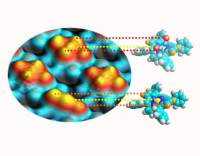
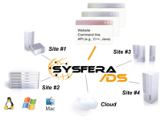

.. _se2012:

* :ref:`Évènements scientifiques <eventsci>`

Séminaires 2012
===============

.. |br| raw:: html

    

**Modélisation ab initio d’une microscopie à sonde locale (Scanning Tunneling Microscope) - principes et applications en nanochimie** |br|
Séminaire du Centre Blaise Pascal |br|
Location: Salle de réunion LR6 C 023, Centre Blaise Pascal, ENS-Lyon, France |br|
**March 20th 2012** 

* Marie-Laure Bocquet, ENS Lyon - Laboratoire de Chimie - Chimie Théorique 

----

**From DIET to SysFera-DS** |br|
Séminaire du Centre Blaise Pascal |br|
Location : Salle de réunion LR6 C 023, Centre Blaise Pascal, ENS-Lyon, France |br|
**January 24th 2012** 

* Eddy Caron, ENS Lyon - LIP - Projet GRAAL/Avalon 

Abstract: The Avalon Team from the LIP (UMR CNRS - ENS Lyon - UCB Lyon 1 - INRIA 5668) and SysFera company develop and distribute an open-source software solution for mutualizing, managing and optimizing heterogeneous and distributed HPC resources and infrastructures, in particular for intensive applications. The middleware offers a simple, efficient, evolutive and transparent way to make using HPC resources easier and faster for end-users and administrators. SysFera provides tools, support and maintenance for this solution. It also proposes consulting and training courses for its customers. SysFera continuously develops new features in close collaboration with research labs and innovative customers. It allows users to simply run intensive applications or manage dataflows (that can be designed using an integrated GUI tool or an XML-like language). It also features data-management functionalities over the infrastructure (persistence, implicit and explicit replication). Users can access the power of the HPC infrastructure without worrying about its underlying complexity.