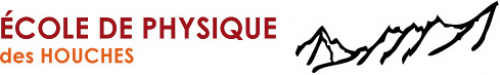

.. _flhscpsm:

* :ref:`Tutoriels 2011 <tt2011>`

First Les Houches school in computational physics - soft matter 
===============================================================

Jun 20, 2011 - Jul 01, 2011 

Location: :ref:`Les Houches/Rhone-Alpes/France <venue>`

Organizers:

* Jean-Louis BARRAT (Université Lyon 1)
* Ralf EVERAERS (École Normale Supérieure de Lyon)
* Werner KRAUTH (École Normale Supérieure, Paris) 

Introduction and Format
-----------------------

The school will present computational methods for the study of soft matter. It is the first of a series proposed within the prestigious settings of the Les Houches physics center, and intended to disseminate the methods of atomic and molecular simulation in an audience of advanced undergaduate (second year of master) and PhD students. Such methods are rarely presented in the typical curriculum of physics or chemistry students.

The aim of the school is to make the students familiar with the numerical techniques used in their field of (condensed matter) physics and the physical concepts underlyiong these methods, and to allow them to gain some practice by actually implementing some of these numerical techniques.

Although the school will be centered on methodological issues a general theme in terms of physical applications will be maintained within each session, so that the lectures can include physical examples of general interest to the audience. Some of the lectures (e.g. MD or MC) could be repeated in several sessions.

Format : typically 5-6 lectures of 4x1h30, 2 weeks (10 days) ; the students would be expected to carry out a numerical project in relation with one of the lectures, supervised by one of the lecturers. Suggesting a project will be part of the application procedure. The last two days would be devoted to presentations made by students. Lecturers stay for the whole duration of the school. Lecture notes/slides would be made available electronically but not published.

Full plan of lectures
---------------------

Lecture 1: Introduction to Monte-Carlo and Molecular Dynamics, Walter Kob
~~~~~~~~~~~~~~~~~~~~~~~~~~~~~~~~~~~~~~~~~~~~~~~~~~~~~~~~~~~~~~~~~~~~~~~~~

1) Monte Carlo Technique

* master equations and detailed balance
* the Monte Carlo Method 
2) Molecular Dynamics

* Basic idea and various issues
* The Verlet algorithm 
3) Practical Issues

* potential and forces
* periodic boundary conditions
* neighbor lists
* random number generators 
4) Advanced techniques

* simulation at constant pressure, temperature
* Gibbs ensemble technique
* rare events 

Lecture 2: Soft Matter on a Lattice: From generic properties to semi-quantitative models, Ralf Everaers
-------------------------------------------------------------------------------------------------------

1) Generic Polymer models / Monte Carlo techniques

* Exact Enumeration
* Simple Sampling
* Dynamic Algorithms / Importance Sampling
* Dimerization
* Configurational Bias, Rosenbluth, PERM
* Performance of the different algorithms for simulating self-avoiding walks 
2) 1d Poland-Sheraga model of cooperatively folding biopolymers

3) 2d Lattice models of biomembranes

4) 3d Lattice models of biopolymers

* Generic aspects of protein folding
* A semi-quantitative lattice model of RNA and DNA melting, folding & association 

Lecture 3: Molecular simulation approaches to polymer systems, J. Baschnagel
~~~~~~~~~~~~~~~~~~~~~~~~~~~~~~~~~~~~~~~~~~~~~~~~~~~~~~~~~~~~~~~~~~~~~~~~~~~~

This course intends to give an introduction to molelcular simulation approaches of polymer systems. The computational study of the physical properties of polymers is challenging because of the extremely broad spectra of length and time scales governing their structure and dynamics.
Therefore, the simulation models used in current research are obtained by some kind of coarse-graining procedure, designed to eliminate fast degrees of freedom. The resulting models can address phenomena over a specific window of time and length scales. This model-building step can take different levels of complexity, ranging from chemicallly realistic models over generic bead-spring models to coarse-grained representations of polymer systems inspired by self-consistent field theory or similar theoretical concepts and also tohierachical models encompassing many interconnected levels. After a brief introduction to polymer physics, serving as a justification for the coarse-graining idea, the course will discuss each level of modeling alluded to above, present adapted simulation strategies, and give example applications.

Lecture 4: Coarse-grained dynamics, Ignacio Pagonnabaraga
~~~~~~~~~~~~~~~~~~~~~~~~~~~~~~~~~~~~~~~~~~~~~~~~~~~~~~~~~

In these lectures I will describe the physical basis of kinetic based coarse grained methods to describe the dynamics of materials in the mesoscale. In particular, I will analyze the relationship between lattice gases and the lattice Boltzman approaches. I will explore the flexibility that these approaches offer to model a variety of complex fluids, including binary mixtures, colloidal suspensions and electrolytes.

I will also address kinetically based methods which build on the knowldege of molecular modelling. In particular, MPCD combine the insight of Bird's approach to the Boltzmann equation with the knowledge developed in past decades on molecular modelling. Understanding the basic collision process from a more general perspective, MPCD can be applied to dense fluid systems, in regimes far beyond those which can be covered with the original Boltzmann equation.
Momentum conserving thermostats (like dissipative particle dynamics or lowe-anderson thermostat) offer natural alternatives to model coarse grained fluids, and constitutive natural venues to explore the dynamics of complex fluids in the mesoscale .
I will analyze critically the different approaches, their potentialities and limitations discussing representative examples.

Lecture 5: Phase field models, Thierry Biben
~~~~~~~~~~~~~~~~~~~~~~~~~~~~~~~~~~~~~~~~~~~~

Phase field models are very efficient tools to investigate the dynamics of a system undergoing a phase transition, or simply to solve a problem with free boundaries (moving interfaces for example). They are essentially based on two ingredients: the phase-field, a local order parameter field, and the corresponding dynamical equations. The goal of this lecture is to give an overview of the wide range of problems that can be treated with these models and to provide a practical experience on the way to design phase field models and to avoid the main dangers. We shall thus illustrate the different parts of the lecture with examples, and use the problem of the dendric growth as a basic example

Outline:
1 - Introduction: why and when is it interesting to use phase-field models?
2 - The Phase-Field:
a - Interfaces: Phase equilibrium, the square gradient theory and surface tension.
b - Allen-Cahn and Cahn-Hilliard equations.
3 - Conservation equations.
4 - An elementary example: Dendritic growth and implementation.
5 - Control of the model.
a - The Sharp Interface limit.
b - The "smooth interface problem" and possible solution.
6 - Various examples involving hydrodynamics, elasticity or heat transfer.

Basic literature
----------------

- Allen and Tildesley, *Computer simulation of liquids*
- Frenkel and Smit, *Understanding Molecular simulation*
- Krauth, *Statistical Mechanics, computations and algorithms*