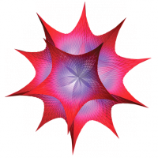
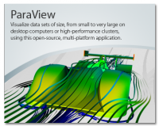

.. _tt2009:

* :ref:`Évènements scientifiques <eventsci>`

Tutoriels 2009
==============

.. |br| raw:: html

    

**Formation LINUX** |br|
Location: Centre Blaise Pascal, ENS-Lyon, France |br|
**Août 26 -Séptembre 01, 2009**

* Tristan Albaret, University Lyon 1, France

----

**Formation MATHEMATICA 7** |br|
Location: Centre Blaise Pascal, ENS-Lyon, France |br|
**11 juin 2009**

* Céline Lelièvre, Wolfram Education Group

----

**Formation Visualisation avec vtk et Paraview** |br|
Location: Centre Blaise Pascal, ENS-Lyon, France |br|
**12-13 mai 2009**

* CIRA