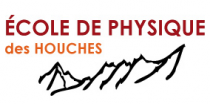
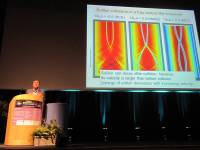
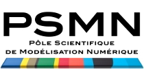

.. _tt2012:

* :ref:`Évènements scientifiques <eventsci>`

Tutoriels 2012
==============

.. |br| raw:: html

    

:ref:`Second Les Houches school in computational physics - Ab initio quantum simulations in condensed matter physics <slhscp>` |br|
Location: Les Houches, Rhone-Alpes, France |br|
**June 19, 2012 - June 29, 2012**

* Xavier Blase, Institut Néel, CNRS/UJF, Grenoble, France
* Thierry Deutsch, L_Sim, CEA/INAC, Grenoble, France
* Jean-Louis Barrat, Liphy, UJF, Grenoble, France

----

:ref:`Formation Python <python>` |br|
Location: Centre Blaise Pascal, ENS Lyon, France |br|
**June 11, 2012 to June 15, 2012**

* Observatoire de Lyon
* DR 7 du CNRS
* Fédération Lyonnaise de Modélisation et Sciences Numériques

----

:ref:`Theory of Quantum Gases and Quantum Coherence <quantumgases>` |br|
Location: Centre Blaise Pascal, ENS Lyon, France |br|
**June 5, 2012 to June 8, 2012**

* Frederic Chevy, LKB - ENS Paris, France
* Roberta Citro, Università degli Studi di Salerno, Italy
* Anna Minguzzi, Laboratoire de Physique et Modélisation des Milieux Condensés, Grenoble, France
* Edmond Orginac, Ens-Lyon, France
* Alessio Recati, INO-CNR, Bose-Einstein Condensate Center, Trento, Italy
* Tommaso Roscilde, ENS Lyon, France

----

**Formation à l'utilisation du PSMN** |br|
Location: Centre Blaise Pascal, ENS Lyon, France 

**- 13 Janvier 2012 (10h00 à 11h00 et 14h00 à 16h30)** |br|
**- 15 Mai 2012 (10h00 - 12h00 et 14h - 16h)** |br|
**- 19 Juin 2012 (10h00 - 12h00 et 14h - 16h)** |br|
**- 18 Septembre 2012 (10h00 - 12h00 et 14h - 16h)** |br|
**- 23 Octobre 2012 (10h00 - 12h00 et 14h - 16h)**

* Hervé Gilquin, PSMN, École Normale Supérieure de Lyon, France
* Cerasela Calugaru, Centre Blaise Pascal / PSMN, École Normale Supérieure de Lyon, France