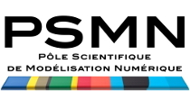

.. _tt2013:

* :ref:`Évènements scientifiques <eventsci>`

Tutoriels 2013
==============

.. |br| raw:: html

    

`Quand la science devient un jeu <animation:tutoriels:2013:fetescience>`_ |br|
**Atelier - Fete de la science ENS Lyon**  |br|
Du 10 au 11 octobre 2013 

----

:ref:`Catalysis Training Course 2013 <ctc2013>` |br|
Lyon-Villeurbanne |br|
**August 28-31 2013**

* Tivadar Cseri – IFPEn
* Anne Giroir-Fendler – IRCELYON UCBL1
* Michel Lacroix – IRCELYON CNRS
* Leonarda Liotta – ISMN CNR (Italy)
* Carine Michel – ENS Lyon
* Catherine Pinel – IRCELYON CNRS
* Alessandra Quadrelli – CPE CNRS
* Jose Luis Valverde – UCLM (Spain)
* Philippe Vernoux – IRCELYON CNRS 

----

.. image:: ../../_static/Animations/Tutos/mutecplume_logo.jpg
  :class: img-float pe-2
  :width: 160px
  :alt: Logo mutecplume 

:ref:`Formation « Bases de données XML natives » <fbdxml>` |br|
Salle de travaux pratiques (LR6 D 014); Centre Blaise Pascal, ENS Lyon, France |br|
**22-24 mai 2013**

* Maud Ingarao, École Normale Supérieure de Lyon, France
* Nathalie Arlin,  École Normale Supérieure de Lyon, France

----

.. image:: ../../_static/Animations/Tutos/houches.png
  :class: img-float pe-2
  :width: 160px
  :alt: Houches

:ref:`3rd Les Houches School in computational physics: DNA, from molecules to evolution <lhscpdna>` |br|
Les Houches/Rhone-Alpes/France |br|
**May 20-31, 2013**

* Jean-Louis Barrat, Université Grenoble 1, France
* Ralf Everaers, École Normale Supérieure de Lyon, France

----

**Formation a l'utilisation du PSMN** |br|
Salle de travaux pratiques (LR6 D 014); Centre Blaise Pascal, ENS Lyon, France 

**- le 14 Février 2013** |br|
**- le 26 Mars 2013** |br|
**- le 14 Mai 2013** |br| 
**- le 24 Septembre 2013**  |br|
**- le 7 Novembre 2013** |br|
**- le 5 Décembre 2013**

* Cerasela Calugaru, Centre Blaise Pascal / PSMN, École Normale Supérieure de Lyon, France
* Hervé Gilquin, PSMN, École Normale Supérieure de Lyon, France
    