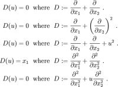

.. _eslsnlpde:

* :ref:`Workshops 2013 <ws2013>`

Efficient solution of large systems of non-linear PDEs in science
=================================================================

.. |br| raw:: html

    

Centre Blaise Pascal, ENS Lyon, France |br|
October 7-9, 2013 |br|
`Website of the Workshop <http://pde.sciencesconf.org>`_ |br|
 
Scientific committe:
Co-chair

* **Rolf Walder**, Centre de Recherche Astrophysique de Lyon (CRAL), ENS-Lyon, France
* **Eric de Sturler**, Department of Mathematics, Virginia Tech, Blacksburg, Virginia, USA

* **Isabelle Baraffe**, University of Exeter, GB
* **Maxime Viallet**, Max Planck Institute for Astrophysics, Garching, Germany
* **Doris Folini**, Institute for Atmospheric and Climate Science, ETH Zurich, Switzerland & CRAL, ENS-Lyon, France

Local Organizing committee:

* **Rolf Walder**, CRAL, École normale supérieure de Lyon
* **Christophe Winisdoerffer**, CRAL, École normale supérieure de Lyon
* **Mickaël Melzani**, CRAL, École normale supérieure de Lyon

Administrative coordination:

* **Samantha Barendson**, CBP, ENS de Lyon, France (samantha.barendson\@ens-lyon.fr)

The workshop is supported by:

* Centre Blaise Pascal
* FLMSN
* CRAL

Objectives
----------

Computation and simulation are at the heart of current science. Today, 3D multi-physics, multi-scale simulations are within reach, but also encounter the grand challenge of how to efficiently use massively parallel machines with thousands of processors to solve large non-linear systems of equations.

A whole class of most efficient solution technique for such systems rely on Newton-Krylov (NK) solvers, the iterative use of 2 basic algorithms: the Newton algorithm to find the roots of the non-linear equations and an iterative Krylov method to solve the resulting linear part. Convergence properties of NK methods heavily depend on a good preconditioning of the matrix defining the linear system.

NK methods are used by the entire research community. This workshops aims at bringing together experts from different fields of science with people who are developing algorithms, numerical methods and implementing complex numerical methods on massively parallel machines. With this approach, we hope to popularize new efficient computing methods, initiate collaboration among scientists of different research fields, and between applicants and developers of methods.

Note 
----

This workshop is part of the TOFU European Research Council Project  (toward a new generation of multi-dimensional stellar evolution models: the TOol of the FUture) which aims at developing such powerful methods.