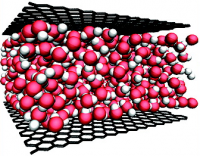

.. _iiisrpcl:

* :ref:`Workshops 2013 <ws2013>`

Influence of Interfacial Interactions on Structural and Rheological Properties of Confined Liquids
==================================================================================================

.. |br| raw:: html

    

Centre Blaise Pascal, ENS-Lyon, France |br|
September 23, 2013 |br|
`Website of the workshop <http://confine.sciencesconf.org/>`_

Organizing committee: **Claire Loison**, Lasim, UCBL-CNRS, France

Administrative coordination: **Samantha Barendson**, CBP, ENS de Lyon, France (samantha.barendson @ ens-lyon.fr) 

The workshop is supported by:

* **CBP** - Centre Blaise Pascal, Lyon, France
* **FLMSN** - Fédération Lyonnaise de Modélisation et Sciences Numérique

Summary 
-------

The structure of a liquid may drastically change if it is confined within a narrow space. This affects many phenomena in nature and technology such as diffusion through narrow pores, viscosity, swelling of clay and lubrication. However, an understanding of the fluid ordering induced by the confining surfaces is still lacking.

During this workshop, experimental and theoretical results shall be presented on the impact of confinement on the structure and rheological properties of colloidal fluids, ie liquids which spontaneously show nanometer-scale ordering even in a bulk phase.
