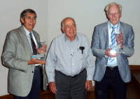

Workshops 2013
==============

.. |br| raw:: html

    

`Journée en l'honneur de Jean-Pierre Hansen <#>`_ |br|
**December 13, 2013** - Institut Henry Poincaré, Paris, France 

* Jean-Louis Barrat, UJF Grenoble
* Daniel Borgis, ENS
* Jean Clérouin, CEA
* Ralf Everaers, CBP, ENS de Lyon
* Benjamin Rotenberg, UPMC
* Gilles Zérah, CEA

----

.. image:: ../../_static/Animations/WS/cbp_ens.jpeg
    :class: img-float pe-3
    :width: 170px
    :alt: Image cbp_ens

`Journées du Centre Blaise Pascal - Data Analysis and Modeling in Life Sciences <#>`_ |br|
**November 28, 2013** |br|
Centre Blaise Pascal, ENS Lyon, France 

* Paul Fleurat-Lessard, Laboratoire de Chimie - ENS de Lyon
* Claire Loison, Laboratoire de Spectrométrie Ionique et Moléculaire - Université de Lyon / CNRS
* Cerasela Calugaru, Centre Blaise Pascal - ENS de Lyon 

----

.. image:: ../../_static/Animations/WS/image_2_fluidgrains.jpg
    :class: img-float pe-3
    :width: 170px
    :alt: Image image_2_fluidgrains

`Workshop on Numerical Modelling of Grains/Fluid Flows <#>`_ |br|
**November 5-6, 2013** |br|
Centre Blaise Pascal, ENS Lyon, France 

* Nicolas Taberlet, Physics laboratory, École normale supérieure de Lyon, France

----

.. image:: ../../_static/Animations/WS/flmsn.png
    :class: img-float pe-3
    :width: 170px
    :alt: Image flmsn

`Inauguration de la nouvelle plateforme de calcul de la FLMSN <#>`_ |br|
**October 16, 2013** - Université Claude Bernard Lyon 1, France |br|
**October 17, 2013** - Ecole normale supérieure de Lyon, France 

----

.. image:: ../../_static/Animations/WS/pde.png
    :class: img-float pe-3
    :width: 200px
    :alt: Image pde

`Efficient solution of large systems of non-linear PDEs in science <#>`_ |br|
**October 7-9, 2013** |br|
Centre Blaise Pascal, ENS Lyon, France 

* Rolf Walder CRAL, École normale supérieure de Lyon, France
* Eric de Sturler, Department of Mathematics, Virginia Tech, Blacksburg, Virginia, USA
* Isabelle Baraffe, University of Exeter, GB
* Maxime Viallet, Max Planck Institute for Astrophysics, Garching, Germany
* Doris Folini, Institute for Atmospheric and Climate Science, ETH Zurich, Switzerland & CRAL, ENS de Lyon, France

----

`Geoturb: Numerical Modeling and theoretical challenges in atmosphere and ocean turbulence <#>`_ 

**October 2-4, 2013** 

Centre Blaise Pascal, ENS-Lyon, France  

* Antoine Venaille, Physics laboratory, École normale supérieure de Lyon, France
* Freddy Bouchet, Physics laboratory, École normale supérieure de Lyon, France 

----

.. image:: ../../_static/Animations/WS/confine.png
    :class: img-float pe-3
    :width: 170px
    :alt: Image confine

`Influence of Interfacial Interactions on Structural and Rheological Properties of Confined Liquids <#>`_ 

**September 23, 2013** 

Centre Blaise Pascal, ENS Lyon, France 

* Claire Loison, Lasim, UCBL-CNRS, France 

----

.. image:: ../../_static/Animations/WS/topological_insulator.png
    :class: img-float pe-3
    :width: 170px
    :alt: Image topological_insulator

`Journées de Physique Mathémathique Lyon: Topological insulators <#>`_ |br|
**11-13 september 2013**  |br|
Institut Camille Jordan, Lyon, France

* Johannes Kellendonk, Université Claude Bernard Lyon 1, France
* Henning Samtleben, ENS Lyon, France
* Thomas Strobl, Université Claude Bernard Lyon 1, France

----

.. image:: ../../_static/Animations/WS/plasmalogo.jpeg
    :class: img-float pe-3
    :width: 170px
    :alt: Image plasmalogo

`Shocks, Reconnection, and Particle Acceleration in Plasma-fluids <#>`_ |br|
**June 20-21, 2013** |br|
Centre Blaise Pascal, ENS Lyon, France 

* Rolf Walder, CRAL, École normale supérieure de Lyon
* Christophe Winisdoerffer, CRAL, École normale supérieure de Lyon

----

.. image:: ../../_static/Animations/WS/lyoncalcul.png
    :class: img-float pe-3
    :width: 180px
    :alt: Image lyoncalcul

`Réseau "LyonCalcul" : 2nde matinée de rencontres des acteurs du calcul à Lyon <#>`_ |br|
**16 avril 2013** de 10h à 12h |br|
Centre Blaise Pascal  

----

.. image:: ../../_static/Animations/WS/sierra.jpg
    :class: img-float pe-3
    :width: 170px
    :alt: Image lyoncalcul

`Colloque SIERRA : "Avancées récentes autour de l'extraction de modes" <#>`_ |br|
**March 13, 2013** |br|
Centre Blaise Pascal, ENS de Lyon, France 

* Pierre Borgnat, Laboratoire de Physique, ENS de Lyon
* Patrick Flandrin, Laboratoire de Physique, ENS de Lyon
* Nelly Pustelnik, Laboratoire de Physique, ENS de Lyon