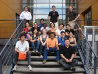

Formation universitaire
=======================

.. container:: disp
   
    .. toctree::
        :maxdepth: 1
        :caption: Table des matières

        Master/MEMA
        Master/MNPC
        Stage
        Stage/SIB3D

Le Centre Blaise Pascal participe activement à la formation universitaire proposée par l'École normale supérieure de Lyon dans le cadre du Master de Sciences de la Matière. Le CBP a ainsi fortement contribué à la création du parcours `"Modélisation numérique en physique et chimie" <#>`_ , mettant ainsi l’accent sur l’articulation étroite entre les concepts fondamentaux et la modélisation numérique en physique et chimie.

Le Centre Blaise Pascal est également porteur d'un projet européen Erasmus Mundus, en partenariat avec l'Universiteit van Amsterdam, la Vrije Universiteit van Amsterdam et l'Università degli studi di Roma "La Sapienza". Le `Master Erasmus Mundus AtoSiM <#>`_ s'appuie, au cours du semestre lyonnais sur le parcours "Modélisation numérique en physique et chimie".
