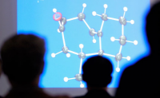

.. _mnpc:

Master 2 - Modélisation numérique en physique et chimie 
=======================================================

        
`Site du département Science de la matière <http://www.ens-lyon.fr/MasterSDM/fr/master-2/m2-modelisation-numerique>`_

**L'outil numérique** est devenu un levier déterminant de progrès, irremplaçable pour mesurer, stocker et analyser les masses de données empiriques, pour résoudre les équations fondamentales qui décrivent les systèmes, pour établir et simuler des modèles, et pour la mise au point de techniques de contrôle. **Cette importance croissante des approches numériques concerne toutes les disciplines scientifiques et sociétales**.

Le leitmotiv du parcours "Modélisation numérique" est d’enseigner **l’approche numérique comme complément naturel** (mais pas comme substitut) **des théories analytiques et concepts fondamentaux** qui forment la base de la formation Sciences de la Matière. Ce parcours est commun avec le Master européen Erasmus Mundus `AtoSiM <http://www.erasmusmundus-atosim.cecam.org>`_.

Le principe de ce parcours est de sélectionner des UE fortement basées sur l’utilisation des méthodes numériques, à hauteur de 12 à 18 ECTS, et de les associer avec des UE proposées par ailleurs au niveau M2 en chimie ou en physique dans le cadre du Master Sciences de la Matière. Les UE orientées numériques pourront être spécifiques au parcours ou déjà offertes dans le cadre d'un autre parcours. Voir une liste de cours éligibles.

Ce panachage permet d'élaborer des profils-types plus ou moins spécialisés dans un grand domaine de la physique ou de la chimie.

Au second semestre, le parcours se prolonge par un **stage de recherche de 4 à 6 mois sur un sujet théorique ou numérique**.
