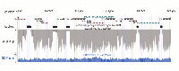

Logiciels
=========

.. |br| raw:: html

    

SynopsX
-------

http://ahn.ens-lyon.fr/synopsx

Image segmentation : Level Set Method
-------------------------------------

.. image:: ../../_static/img_projets/stage_rdp.png
    :class: img-float pe-3 
    :width: 100px
    :alt: Image stage rdp

**Contact** : Typhaine Moreau, Annamaria Kiss, Cerasela Calugaru 

* **Objectif** : :ref:`Level Set Method <lsm>` : Optimization of Level Set Methods for biological image segmentation (LSM). An automatic way to segment grayscale 3D images of cells. 

Image processing : Anisotropic Blur
-----------------------------------

.. image:: ../../_static/img_projets/stage_rdp.png
    :class: img-float pe-3
    :width: 100px
    :alt: Image stage rdp

**Contact** : Typhaine Moreau, Annamaria Kiss, Cerasela Calugaru 

* **Objectif** : :ref:`Anisotropic Blur <ipab>` : PDE-based algorithm to reduce noise in grey-scale |br|
image (2D or 3D) from biology, using a diffusion process. 

Twist-DNA
---------

**Contact** : Daniel Jost 

:ref:`Twist-DNA <twistDNA>` is a freely-available open source code that allows the computations of base-pair and bubble opening probabilities for any DNA sequences at a given temperature, a given superhelical stress and a given salt concentration.

INCNS - Parallel INCompressible Navier-Stokes solver
----------------------------------------------------

**Contact** : Emmanuel Lévêque, Cerasela Calugaru 

* **Objectif** : Portage du code **INCNS** sur GPU avec CUDA : implémentation des transformées de Fourier rapide du code en utilisant la bibliothèque CuFFT sur GPU (dans un environnement PGI CUDA Fortran Compiler) à la place de de FFTw sur CPU \\
* :ref:`Développements au CBP <incns>`

AquaSol - Generalized Poisson-Boltzmann theory and simulation applied to DNA and the nucleosome 
-----------------------------------------------------------------------------------------------

.. image:: ../../_static/Réalisations/figureaquasol.png
    :class: img-float 
    :width: 170px
    :alt: Image figureaquasol

**Contact** :  Cerasela Calugaru, Ralf Everaers, Sam Meyer

* **Objectif** : Optimisation (nouveaux algorithmes, parallélisation), implémentation des nouvelles fonctionnalités, analyse du comportement numérique et informatique du code **AquaSol**.
* :ref:`Développements au CBP <logAquasol>`
  
Logiciel de simulation 3D des phénomènes d'écoulement et de transport
---------------------------------------------------------------------

**Contact** : Cerasela Calugaru

.. image:: ../../_static/Réalisations/figuresoftp.png
    :class: img-float pe-2
    :alt: Image figuresoftp

* Le code **SoFTP** a été initialement développé pour simuler les phénomènes d'écoulement et de transport de masse en milieux poreux. Avec les derniers développements, il prends aussi en compte le transferts de chaleur et d'autres types de milieux (complètement fluide ou complètement solide).
* :ref:`Documentation <s3dpet>`

Outil de simulation numérique en mécanique des fluides pour l'optimisation aérodynamique et aéroacoustique
----------------------------------------------------------------------------------------------------------

.. container:: d-flex

    .. image:: ../../_static/Réalisations/animation.png
        :class: img-float pe-2
        :alt: Image animation

    **Contact** : Emmanuel Lévêque

Gaussian : portage sous compilateur Open Source
-----------------------------------------------

.. image:: ../../_static/Réalisations/gaussian.png
    :class: img-float pe-2
    :alt: Image gaussian

**Contact** : Emmanuel Quemener

**Objectif** : libérer Gaussian de l'exigence du compilateur PGI |br|
**Opérations** : modifier le code source pour accepter la norme imposée par Gfortran |br|
**Documentation** pour :ref:`Debian Squeeze et Wheezy <instagaussian>`