.. _etsn:

ETSN 2022 : les GPU, la technologie disruptive du 21ème siècle
==============================================================

.. container:: note note-important
    
    Contient certainement encore un nombre non négligeable de coquilles... Merci de votre compréhension. Mon adresse de courriel est en bas pour vous permettre d'en assurer l'amélioration !

Cette session de travaux pratiques se compose de 7 séances de 1h30 du workshop `Les GPU, technologie disruptive du 21ème siècle <https://conferences.cirm-math.fr/2842.html>`_. Elle s'accompagne de 5 cours suivants donnés par Emmanuel Quémener.

* Cours 1 & 2 : `Les GPU : technologie disruptive du 21e siècle <http://www.cbp.ens-lyon.fr/emmanuel.quemener/documents/ETSN_IntroductionGPU_Cours12.pdf>`_
* Cours 3 : `Portage d'un vieux code, l'occasion d'un retour sur 40 ans d'informatique <http://www.cbp.ens-lyon.fr/emmanuel.quemener/documents/ETSN_PortageEtMetrologie_Cours3.pdf>`_
* Cours 4 : `Métrologie d'applications <http://www.cbp.ens-lyon.fr/emmanuel.quemener/documents/ETSN_MetrologieGPU_Cours4.pdf>`_
* Cours 5 : `Emergence de Codes "Matrices" et conclusion <http://www.cbp.ens-lyon.fr/emmanuel.quemener/documents/ETSN_CodesMatrices_Cours5.pdf>`_

CQQCOQP : Comment ? Qui ? Quand ? Combien ? Où ? Quoi ? Pourquoi ?
------------------------------------------------------------------

* **Pourquoi ?** Faire un tour d'horizon des GPUs et appréhender des méthodes d'investigation
* **Quoi ?** Programmer, tester et comparer les GPU sur des exemples simples pendant 6 séances de 1h30 heure
* **Quand ?** Entre le 25 et le 29 juillet 2022
* **Combien ?** Mesurer la performance que les GPUs offrent en comparaison des autres machines 
* **Où ?** Sur des stations de travail, des noeuds de cluster, des portables (bien configurés), dans des terminaux
* **Qui ?** Pour les édudiants, enseignants, chercheurs, personnels techniques curieux 
* **Comment ?** En appliquant quelques commandes simples, généralement dans des terminaux.

But de la session
-----------------
 
C'est de prendre en main les GPU dans les machines, d'appréhender la programmation en OpenCL et CUDA, de comparer les performances avec des CPU classiques par l'intermédiaire de quelques exemples simples et des codes de production.

Déroulement des sessions pratiques
----------------------------------

Le programme est volontairement touffu mais les explications données et les corrigés devraient permettre de poursuivre l'apprentissage par la pratique hors de cette école d'une unique semaine.

* Prise en main de l’environnement à distance du `Centre Blaise Pascal <https://www.cbp.ens-lyon.fr/doku.php>`_ à l'`ENS-Lyon <https://www.ens-lyon.fr>`_
* Découverte du matériel, autant CPU que GPU
* Exploration progressive en OpenCL avec l'`exemple de base <https://documen.tician.de/pyopencl/>`_ de la documentation Python/OpenCL
* Un intermède Python/CUDA pour tester *l'autre* implémentation sur GPU
* La réalisation et le portage d'une transformée de Fourier discrète
* Choix du périphérique en Python et sa programmation
* Utilisation des librairies externes : exemple avec xGEMM
* Intégration de "codes métier" : `TensorFlow <https://www.tensorflow.org/>`_, `GENESIS <https://www.r-ccs.riken.jp/labs/cbrt/>`_ et `Gromacs <http://www.gromacs.org/>`_
* Expoitation de codes *Matrices* pour la métrologie 

De manière à disposer d'une trace de votre travail et de pouvoir l'évaluer, il est recommandé de rédiger un "livre de bord" sur la base des questions posées. N'hésitez pas à faire des copies d'écran et à les intégrer dans votre document. 

Démarrage de la session
-----------------------
 
Prérequis en matériel, logiciel et humain
~~~~~~~~~~~~~~~~~~~~~~~~~~~~~~~~~~~~~~~~~

De manière à proposer un environnement pleinement fonctionnel, le Centre Blaise Pascal fournit le matériel, les logiciels et un OS correctement intégré. Les personnes qui veulent réaliser cette session sur leur laptop doivent disposer d'un "vrai" système d'exploitation de type Unix, équipé de tout l'environnement adéquat.

Prérequis pour le matériel
""""""""""""""""""""""""""
 
* Si vous n'utilisez PAS le CBP, une machine relativement récente avec une GPU intégrée avec circuit Nvidia
* Si vous utilisez le CBP, un laptop disposant d'un écran assez confortable pour afficher une fenêtre de 1024x768, une connexion réseau la plus stable possible et la capacité d'y installer un logiciel adapté.

Prérequis pour le logiciel
""""""""""""""""""""""""""

* Si vous n'utilisez pas le CBP, un OS GNU/Linux correctement configuré pour la GPU embarquée avec tous les composants Nvidia, OpenCL, PyOpenCL, PyCUDA.
    
  * Un 'apt install time pciutils clinfo nvidia-opencl-icd nvidia-smi pocl-opencl-icd python3-pyopencl python-pyopencl-doc python-pycuda-doc python3-pycuda' devrait être suffisant comme prérequis pour une machine avec un circuit Nvidia pas trop ancien
  * Pour les implémentations OpenCL sur CPU sur Debian ou Ubuntu, essayez d'installer celle d'`Intel <http://www.cbp.ens-lyon.fr/emmanuel.quemener/software/opencl-1.2-intel-cpu_6.4.0.25-2_amd64.deb>`_ et celle d'`AMD <http://www.cbp.ens-lyon.fr/emmanuel.quemener/software/amd-opencl-icd_15.12-2~bpo8+3_fixed.deb>`_. A votre environnement s'ajoute un navigateur pour voir cette page ainsi qu'un traitement de texte pour rédiger le compte-rendu de ces séances. 
* Si vous utilisez le CBP, il faut avoir installé le logiciel `x2goclient <https://wiki.x2go.org/doku.php/download:start>`_ suivant les recommandations de la :ref:`documentation du CBP <x2go>`. Il est recommandé d'exploiter le traitement de texte et le navigateur dans la session distante.

Pour choisir "judicieusement" une machine parmi les plus de 130 de machines à disposition, consultez la page `Cloud@CBP <https://www.cbp.ens-lyon.fr/python/forms/CloudCBP>`_. Il est recommandé de prendre une machine disposant d'une GPU de type "Gamer" ou d'une "GPGPU". Les sélecteurs de la page précédente peuvent vous aider dans ce choix. Coordonnez-vous entre vous pour être si possible chacun sur la vôtre. Ensuite, une fois connecté via x2go, il peut être intéressant de se connecter sur une autre machine de configuration différente pour comparer les résultats de vos expérimentations.

.. container:: note note-important 
    
    Etant donné la combinatoire des machines, leurs matériels respectifs et la galaxie des OS GNU/Linux et leurs versions, cela peut prendre de quelques minutes à plusieurs heures (voire jamais) de s'assurer de la compatibilité de sa machine avec le prérequis logiciel. Donc l'exploitation de l'environnement du CBP, exactement construit pour suivre ces travaux pratiques, est TRES FORTEMENT recommandée.

Prérequis pour l'humain 
"""""""""""""""""""""""

* Une allergie à la commande en ligne peut dramatiquement réduire la portée de cette session pratique
* Une pratique des scripts shell sera un avantage, sinon vous avez cette session pour parfaire vos connaissances.

Investiguer le matériel GPU
---------------------------

Qu'y a-t-il dans ma machine ?
~~~~~~~~~~~~~~~~~~~~~~~~~~~~~

Le matériel en Informatique Scientifique est défini par `l'architecture de Von Neumann <https://upload.wikimedia.org/wikipedia/commons/e/e5/Von_Neumann_Architecture.svg>`_ :

* CPU (Unité Centrale de Traitement) avec CU (Unité de Contrôle) et ALU (Unité Arithmétique & Logique)
* MU (Unité de Mémoire)
* Input and Output Devices : Périphériques d'Entrée et Sortie

Les GPU sont généralement considérés comme des périphériques d'Entrée/Sortie. Comme la plupart des périphériques installés dans les machines, elles exploitent un bus d'interconnexion `PCI <https://en.wikipedia.org/wiki/Conventional_PCI>`_ ou `PCI Express <https://en.wikipedia.org/wiki/PCI_Express>`_.

Pour récupérer la liste des périphériques PCI, utilisez la commande 'lspci -nn'. A l'intérieur d'une longue liste apparaissent quelques périphériques **VGA** ou **3D**. Ce sont les périphériques GPU ou GPGPU.

Voici une sortie de la commande 'lspci -nn | egrep '(VGA|3D)' ' :

.. code-block:: bash

    3b:00.0 VGA compatible controller [0300]: NVIDIA Corporation GP102 [GeForce GTX 1080 Ti] [10de:1b06] (rev a1)
    a1:00.0 VGA compatible controller [0300]: NVIDIA Corporation GK107GL [Quadro K420] [10de:0ff3] (rev a1)

.. container:: note note-important

    **Exercice #1.1: récuperez la liste des périphériques (GP)GPU**

    * Combien de périphériques VGA sont listés ? 
    * Combien de périphériques 3D sont listés ?
    * Récupérez le modèle du circuit de GPU, dans son nom étendu.
    * Récupérez sur le web les informations suivantes pour chaque GPU :
        * le nombre d'unités de calcul (les "cuda cores" ou les "stream processors")
        * la fréquence de base des coeurs de calcul
        * la fréquence de la mémoire

La (presque) totalité des stations de travail contiennent des cartes Nvidia.

Dans les systèmes **Posix** (**Unix** dans le langage courant), tout est fichier. Les informations sur les circuits Nvidia et leur découverte par le système d'exploitation peuvent être récupérées avec un ``grep`` dans la commande ``dmesg``.

Si le démarrage de la machine n'est pas trop ancien, vous disposez des informations comparables aux suivantes :

.. code-block:: bash

    [   19.545688] NVRM: The NVIDIA GPU 0000:82:00.0 (PCI ID: 10de:1b06)
                NVRM: NVIDIA Linux driver release.  Please see 'Appendix
                NVRM: A - Supported NVIDIA GPU Products' in this release's
                NVRM: at www.nvidia.com.
    [   19.545903] nvidia: probe of 0000:82:00.0 failed with error -1
    [   19.546254] NVRM: The NVIDIA probe routine failed for 1 device(s).
    [   19.546491] NVRM: None of the NVIDIA graphics adapters were initialized!
    [   19.782970] nvidia-nvlink: Nvlink Core is being initialized, major device number 244
    [   19.783084] NVRM: loading NVIDIA UNIX x86_64 Kernel Module  375.66  Mon May  1 15:29:16 PDT 2017 (using threaded interrupts)
    [   19.814046] nvidia-modeset: Loading NVIDIA Kernel Mode Setting Driver for UNIX platforms  375.66  Mon May  1 14:33:30 PDT 2017
    [   20.264453] [drm] [nvidia-drm] [GPU ID 0x00008200] Loading driver
    [   23.360807] input: HDA NVidia HDMI/DP,pcm=3 as /devices/pci0000:80/0000:80:02.0/0000:82:00.1/sound/card2/input19
    [   23.360885] input: HDA NVidia HDMI/DP,pcm=7 as /devices/pci0000:80/0000:80:02.0/0000:82:00.1/sound/card2/input20
    [   23.360996] input: HDA NVidia HDMI/DP,pcm=8 as /devices/pci0000:80/0000:80:02.0/0000:82:00.1/sound/card2/input21
    [   23.361065] input: HDA NVidia HDMI/DP,pcm=9 as /devices/pci0000:80/0000:80:02.0/0000:82:00.1/sound/card2/input22
    [   32.896510] [drm] [nvidia-drm] [GPU ID 0x00008200] Unloading driver
    [   32.935658] nvidia-modeset: Unloading
    [   32.967939] nvidia-nvlink: Unregistered the Nvlink Core, major device number 244
    [   33.034671] nvidia-nvlink: Nvlink Core is being initialized, major device number 244
    [   33.034724] NVRM: loading NVIDIA UNIX x86_64 Kernel Module  375.66  Mon May  1 15:29:16 PDT 2017 (using threaded interrupts)
    [   33.275804] nvidia-nvlink: Unregistered the Nvlink Core, major device number 244
    [   33.993460] nvidia-nvlink: Nvlink Core is being initialized, major device number 244
    [   33.993486] NVRM: loading NVIDIA UNIX x86_64 Kernel Module  375.66  Mon May  1 15:29:16 PDT 2017 (using threaded interrupts)
    [   35.110461] nvidia-modeset: Loading NVIDIA Kernel Mode Setting Driver for UNIX platforms  375.66  Mon May  1 14:33:30 PDT 2017
    [   35.111628] nvidia-modeset: Allocated GPU:0 (GPU-ccc95482-6681-052e-eb30-20b138412b92) @ PCI:0000:82:00.0
    [349272.210486] nvidia-uvm: Loaded the UVM driver in 8 mode, major device number 243

.. container:: note note-important

    **Exercice #1.2 : récupérez les informations de votre machine avec 'dmesg | grep -i nvidia'**

    * Quelle est la version de pilote chargée par le noyau ?
    * Que représente, s'il existe, le  périphérique 'input: HDA NVidia' ? 
    * Est-ce un périphérique graphique ?

Le 'lsmod' offre la liste des modules chargés par le noyau. Ces modules sont de petits programmes dédiés au support d'une fontion très spécifique du noyau, le moteur du système d'exploitation. Le support d'un périphérique nécessite souvent plusieurs modules.

Un exemple de 'lsmod | grep nvidia' sur une station de travail :

.. code-block:: bash

    nvidia_uvm            778240  0
    nvidia_drm             40960  4
    nvidia_modeset       1044480  3 nvidia_drm
    nvidia              16797696  108 nvidia_modeset,nvidia_uvm
    ipmi_msghandler        49152  1 nvidia
    drm_kms_helper        155648  1 nvidia_drm
    drm                   360448  7 nvidia_drm,drm_kms_helper

Nous voyons que 4 modules sont chargés. La dernière colonne (vide pour les deux premières lignes) liste les dépendances entre les modules. Ici ``nvidia_modeset`` and ``nvidia_uvm`` dépendent du module ``nvidia``.

.. container:: note note-important

    **Exercice #1.3 : récupérez les informations de l'hôte par la commande ``lsmod | grep nvidia``**

        * Les informations sont-elles identiques à celles ci-dessus ? Caractère par caractère ?

Le périphérique apparaît également dans le dossier '/dev' (pour *device*), le dossier parent pour tous les périphériques.

Un 'ls -l /dev/nvidia*' offre ce genre d'informations :

.. code-block:: bash

    crw-rw-rw- 1 root root 195,   0 Jun 30 18:17 /dev/nvidia0
    crw-rw-rw- 1 root root 195, 255 Jun 30 18:17 /dev/nvidiactl
    crw-rw-rw- 1 root root 195, 254 Jun 30 18:17 /dev/nvidia-modeset
    crw-rw-rw- 1 root root 243,   0 Jul  4 19:17 /dev/nvidia-uvm
    crw-rw-rw- 1 root root 243,   1 Jul  4 19:17 /dev/nvidia-uvm-tools

Vous pouvez voir que chacun peut accéder au périphérique, à la fois en lecture ET en écriture (le 'RW'). Ici, vous avez un seul périphérique Nvidia, 'nvidia0'. Sur une machine disposant de plusieurs périphériques Nvidia, nous aurions : 'nvidia0', 'nvidia1', etc...

.. container:: note note-important

    **Exercice #1.4 : récupérez les informations de votre machine avec 'ls -l /dev/* | grep -i nvidia'**

        * Combien de '/dev/nvidia<number>' avez-vous ?
        * Cette information est-elle cohérente avec les 3 précédentes ?

Nvidia présente des informations sur l'usage instantané de ses circuits avec la commande 'nvidia-smi'. Cette commande peut aussi être exploitée pour régler certains paramètres de la GPU.

Voici un exemple de sortie de la commande 'nvidia-smi' :

.. code-block:: bash

    Fri Jul  7 07:46:56 2017       
    +-----------------------------------------------------------------------------+
    | NVIDIA-SMI 375.66                 Driver Version: 375.66                    |
    |-------------------------------+----------------------+----------------------+
    | GPU  Name        Persistence-M| Bus-Id        Disp.A | Volatile Uncorr. ECC |
    | Fan  Temp  Perf  Pwr:Usage/Cap|         Memory-Usage | GPU-Util  Compute M. |
    |===============================+======================+======================|
    |   0  GeForce GTX 108...  Off  | 0000:82:00.0      On |                  N/A |
    | 23%   31C    P8    10W / 250W |     35MiB / 11172MiB |      0%      Default |
    +-------------------------------+----------------------+----------------------+
                                                                                
    +-----------------------------------------------------------------------------+
    | Processes:                                                       GPU Memory |
    |  GPU       PID  Type  Process name                               Usage      |
    |=============================================================================|
    |    0      4108    G   /usr/lib/xorg/Xorg                              32MiB |
    +-----------------------------------------------------------------------------+

Beaucoup d'informations sont disponibles sur cette sortie :

* version du pilote et du logiciel 'nvidia-smi'
* l'identifiant de chaque GPU
* son nom
* sa localisation sur le bus PCIe
* sa vitesse de ventilateur
* sa température
* ses puissances : instantanée et maximale
* ses "occupations" mémoire : instantanée et maximale
* les processus les exploitant, leur consommation de mémoire et la GPU associée

.. container:: note note-important

    **Exercice #1.5 : récupérez les informations avec la commande 'nvidia-smi'**

        * Identifiez les caractéristiques ci-dessus et comparer les éléments
        * Combien de processus sont-ils listés ?

Comme nous l'avons vu dans l'introduction sur la GPU, leur programmation peut-être réalisée par différentes voies. La première, pour les périphériques Nvidia, est d'utiliser l'environnement CUDA. Le problème sera qu'il est impossible de réexploiter votre programme sur une autre plate-forme (une CPU) ou la comparer avec d'autres GPU. `OpenCL <https://www.khronos.org/opencl/>`_ reste une approche beaucoup plus polyvalente !

Sur les stations du CBP, la majorité des implémentations de OpenCL sont disponibles, autant sur CPU que sur GPU.

La commande 'clinfo' récupère des informations liées à tous les périphériques OpenCL disponibles. 
Pour récupérer une sortie compacte, utilisez 'clinfo '-l' '.

Tous les périphériques OpenCL sont présentés suivant une hiérarchie plateforme/périphérique ('Platform/Device').

Voici une sortie de 'clinfo '-l' ' pour une des stations de travail :

.. code-block:: bash

    Platform #0: AMD Accelerated Parallel Processing
    `-- Device #0: Intel(R) Xeon(R) CPU E5-2637 v4 @ 3.50GHz
    Platform #1: Portable Computing Language
    `-- Device #0: pthread-Intel(R) Xeon(R) CPU E5-2637 v4 @ 3.50GHz
    Platform #2: NVIDIA CUDA
    +-- Device #0: GeForce GTX 1080 Ti
    `-- Device #1: Quadro K420
    Platform #3: Intel(R) OpenCL
    `-- Device #0: Intel(R) Xeon(R) CPU E5-2637 v4 @ 3.50GHz

* '#0,#0' **AMD Accelerated Parallel Processing** : implémentation CPU de AMD, la plus ancienne, très proche de OpenMP en performances
* '#1,#0' **Portable Computing Language** : implémentation CPU OpenSource. Pas vraiment efficace
* '#2,#0' **Nvidia CUDA** : implémentation CUDA de Nvidia, périphérique 0, une GeForce GTX 1080 Ti
* '#2,#1' **Nvidia CUDA** : implémentation CUDA de Nvidia, périphérique 1, une Quadro K420
* '#3,#0' **Intel(R) OpenCL** : implémentation CPU Intel, plutôt très efficace

Ainsi, dans cette machine, 5 périphériques OpenCL sont accessibles, 3 permettent de s'adresser au processeur (vu pour le coup comme un périphérique) et 2 sont des GPU Nvidia.

.. container:: note note-important

    **Exercice #1.6 : récupérez les informations avec la commande 'clinfo -l'**

        * Identifiez et comparez votre sortie avec la liste ci-dessus
        * De combien de périphériques graphiques disposez-vous ?

L'appel de la commande 'clinfo' fournit également de nombreuses informations. Cependant, il est impossible avec cette commande de ne récupérer les informations que d'un seul périphérique : la commande 'egrep' permet alors de restreindre seulement certains attributs, par exemple 'Platform Name','Device Name','Max compute','Max clock'

Sur la plateforme précédente, la commande 'clinfo | egrep '(Platform Name|Device Name|Max compute|Max clock)' ' offre comme sortie:

.. code-block:: bash

    Platform Name                                   AMD Accelerated Parallel Processing
    Platform Name                                   Portable Computing Language
    Platform Name                                   NVIDIA CUDA
    Platform Name                                   Intel(R) OpenCL
    Platform Name                                   AMD Accelerated Parallel Processing
    Device Name                                     Intel(R) Xeon(R) CPU E5-2637 v4 @ 3.50GHz
    Max compute units                               16
    Max clock frequency                             1200MHz
    Platform Name                                   Portable Computing Language
    Device Name                                     pthread-Intel(R) Xeon(R) CPU E5-2637 v4 @ 3.50GHz
    Max compute units                               16
    Max clock frequency                             3501MHz
    Platform Name                                   NVIDIA CUDA
    Device Name                                     GeForce GTX 1080 Ti
    Max compute units                               28
    Max clock frequency                             1582MHz
    Device Name                                     Quadro K420
    Max compute units                               1
    Max clock frequency                             875MHz
    Platform Name                                   Intel(R) OpenCL
    Device Name                                     Intel(R) Xeon(R) CPU E5-2637 v4 @ 3.50GHz
    Max compute units                               16
    Max clock frequency                             3500MHz

Nous distinguons bien les éléments des 5 périphériques OpenCL déjà identifiés au-dessus (3 pour les 3 implémentations de CPU, respectivement d'AMD, PortableCL et Intel) et les deux GPU Nvidia (GTX 1080 Ti et Quadro K420). 

Nous constatons par exemple que les nombres d'unités de traitement sont identiques pour les implémentations CPU (16) mais que leurs fréquences ne le sont pas (1200, 3501, 3500 MHz). 

L'implémentation AMD récupère, elle, la fréquence instantanée, et les deux autres la fréquence maximale. 

Pour les GPU, nous constatons que les fréquences sont bien inférieures à celles des GPU (1582 et 875 MHz). 

Quant aux nombres d'unités de calcul (*compute units*), la première en dispose de 28 et la seconde de 1. Il sera donc intéressant de comparer ces valeurs par rapport aux valeurs trouvables dans les spécifications constructeur.

La notion d'unité de traitement (*compute unit*) pour les CPU n'est pas la même pour les GPU:

* pour les CPU, c'est généralement le produit du nombre de coeurs physiques et du nombre de *threads*
* pour les GPU, c'est le nombre de macro-unités de traitement : unité **SM** (pour *Stream multiprocessor*) chez Nvidia, unité **CU** (pour *Compute Unit*) chez AMD/ATI.

Ces unités de traitement disposent (autant pour les GPU que les CPU) d'unités arithmétiques et logiques (*Arithmetic and Login Unit*) lesquelles sont *vraiment* en charge du traitement des opérations. 

Ainsi, le nombre d'ALU dans chaque *Compute Unit* varie de 64 à 192 selon les générations de GPU. Ainsi, pour le GPU ci-dessus GTX 1080 Ti, le nombre de *Compute Unit* mentionné est 28, et le nombre d'ALU (appelé également *cuda core* par Nvidia) est de 3584 soit 28*128. Le schéma du constructeur du circuit GP102 suivant est trompeur : en fait, il dispose de 30 unités SM, mais sur un GP102, seuls 28 sont activés.

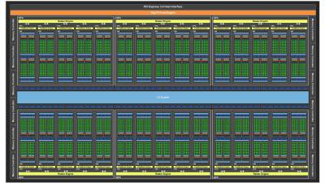

.. container:: note note-important

    **Exercice #1.7 : récupérez les informations à l'aide de deux commandes précédentes utilisant 'clinfo'**

    * Comparez les informations entre les implémentations CPU. Pourquoi ces différences ?
    * Comparez le nombre d'unités de traitement des CPU avec celles du Web : `Ark d'Intel <https://ark.intel.com/fr>`_
    * Comparez le nombre d'unités de traitement des GPU avec celles du Web : site `spécifications <https://www.nvidia.com/page/products.html#Architectures>`_ de Nvidia ou Wikipedia
    * Comparez les fréquences identifiées avec celles trouvées sur le Web.
    * Retrouvez-vous une cohérence entre le nombre de *Compute Units* et le nombre de *cuda cores* ? 
    * Combien de *cuda cores* contient chaque *Compute Unit* ?

Il est aussi possible de choisir quelle GPU Nvidia exploiter avec la variable d'environnement 'CUDA_VISIBLE_DEVICES'. Il existe deux manières de l'exploiter :

* en préfixant la commande à exécuter (ou son programme) par 'CUDA_VISIBLE_DEVICES=#GPU'
* en *exportant* la variable de manière permanente avec : 'export CUDA_VISIBLE_DEVICES=#GPU'

La commande 'nvidia-smi' offrait une liste de périphériques Nvidia identifiés mais les 'ID' donnés sont dans l'ordre inverse de celui exigé par 'CUDA_VISIBLE_DEVICES'. Par exemple, ``nvidia-smi`` donne comme ``ID`` les nombres ``0`` et ``1``. 

.. code-block:: bash

    # N'exploiter que la GPU identifie #0 avec nvidia-smi
    CUDA_VISIBLE_DEVICES=1 <MonProgramme>
    # N'exploiter que la GPU identifie #1 avec nvidia-smi
    CUDA_VISIBLE_DEVICES=0 <MonProgramme>
    # Exploiter les GPUs identifies #0 et #1 avec nvidia-smi
    CUDA_VISIBLE_DEVICES=0,1 <MonProgramme>
    # N'exploiter aucune GPU
    CUDA_VISIBLE_DEVICES=`` <MonProgramme>

.. container:: note note-important

    **Exercice #1.8 : récupérez les informations avec ``clinfo -l`` préfixée de CUDA_VISIBLE_DEVICES**

    * Mettez CUDA_VISIBLE_DEVICES=0 clinfo -l et observez la sortie
    * Mettez CUDA_VISIBLE_DEVICES=1 clinfo -l et observez la sortie
    * Mettez CUDA_VISIBLE_DEVICES=0,1 clinfo -l et observez la sortie
    * Mettez CUDA_VISIBLE_DEVICES=\'\' clinfo -l et observez la sortie
    * Avez-vous constaté la sélection des différents périphériques ?

Durant toutes les séances de travaux pratiques, l'accent sera mis sur la sollicitation de ressources matérielles, CPU ou GPU, lors des exécutions. Pour avoir une idée des ressources exploitées en temps réel sur la machine sollicitée, il est intéressant d'exploiter les commandes ``dstat`` et ``nvidia-smi`` (déjà connue) dans deux terminaux sur votre bureau à distance avec les options ``-cim`` pour la première et ``dmon`` pour la seconde.

.. container:: note note-important

    **Exercice #1.9 : lancez les commandes suivantes**

    * Ouvrez un terminal, tapez ``dstat -cim`` et observez la sortie 
    * Détaillez à quoi servent les paramètres de sortie ``c``, ``i`` et ``m``
    * Ouvrez un terminal, tapez ``nvidia-smi dmon`` et observez la sortie
    * Détaillez à quoi sert l'option ``dmon``
    * Arrêtez l``exécution de la précédente avec ``<Ctrl><C>``
    * Relancez la commande précédente avec ``-d 0`` ou ``-d 1``
    * Détaillez à quoi sert l'option ``-d `` suivie d'un entier

Récupération des sources
------------------------

La (presque) totalité des outils exploités par le CBP pour comparer les CPU et les GPU se trouve dans le projet `bench4gpu <https://forge.cbp.ens-lyon.fr/redmine/projects/bench4gpu>`_ du Centre Blaise Pascal.

La récupération des sources est libre et se réalise par l'outil **subversion** (*NDLR : oui, je sais tout le monde est passé à GIT mais ce projet a plus de 10 ans*) :

.. code-block:: bash

    svn checkout https://forge.cbp.ens-lyon.fr/svn/bench4gpu/

Dans ce dossier ``bench4gpu``, il y a plusieurs dossiers :

* ``BLAS`` contenant les dossiers ``xGEMM`` et ``xTRSV`` : tests exploitant toutes les implémentations de librairies BLAS
* ``Epidevomath`` : un prototype d'implémentation sur GPU d'un projet (abandonné)
* ``FFT`` contenant une première exploitation de **cuFFT** (en suspens)
* ``Ising`` : implémentations multiples du `modèle d'Ising <https://fr.wikipedia.org/wiki/Mod%C3%A8le_d%27Ising>`_ en Python (multiples parallélisations) 
* ``NBody`` : implémentation en OpenCL d'un modèle N-Corps newtonien
* ``Pi`` : implémentation multiples d'un `Pi Monte Carlo <https://fr.wikipedia.org/wiki/M%C3%A9thode_de_Monte-Carlo>`_
* ``Splutter`` : un modèle de ``postillonneur mémoire``, très utile pour évaluer les *fonctions atomiques*
* ``TrouNoir`` : un exemple de portage de code de 1994, porté en C en 1997 puis en Python/OpenCL et Python/CUDA en 2019
* ``ETSN`` : les programmes *corrigés* associés à cette école ETSN 2022

De tous ces programmes, seuls ceux présents dans ``BLAS``, ``NBody``, ``Pi`` et ``ETSN`` seront exploités dans le cadre de ces travaux pratiques. Il est quand même conseillé de ne pas se précipiter sur les corrigés situés dans ETSN pour le déroulement de ces séances. Le *no pain, no gain* s'applique *aussi* dans l'apprentissage en informatique.

Première exploration de l'association Python et OpenCL
======================================================

Basons-nous pour ce premier programme sur celui présenté sur la `documentation officielle de PyOpenCL <https://documen.tician.de/pyopencl/>`_. Il se propose d'ajouter deux vecteurs ``a_np`` et ``b_np`` en un vecteur ``res_np``.

.. code-block:: bash

    #!/usr/bin/env python

    import numpy as np
    import pyopencl as cl

    a_np = np.random.rand(50000).astype(np.float32)
    b_np = np.random.rand(50000).astype(np.float32)

    ctx = cl.create_some_context()
    queue = cl.CommandQueue(ctx)

    mf = cl.mem_flags
    a_g = cl.Buffer(ctx, mf.READ_ONLY | mf.COPY_HOST_PTR, hostbuf=a_np)
    b_g = cl.Buffer(ctx, mf.READ_ONLY | mf.COPY_HOST_PTR, hostbuf=b_np)

    prg = cl.Program(ctx, """
    __kernel void sum(
        __global const float *a_g, __global const float *b_g, __global float *res_g)
    {
    int gid = get_global_id(0);
    res_g[gid] = a_g[gid] + b_g[gid];
    }
    """).build()

    res_g = cl.Buffer(ctx, mf.WRITE_ONLY, a_np.nbytes)
    knl = prg.sum  # Use this Kernel object for repeated calls
    knl(queue, a_np.shape, None, a_g, b_g, res_g)

    res_np = np.empty_like(a_np)
    cl.enqueue_copy(queue, res_np, res_g)

    # Check on CPU with Numpy:
    print(res_np - (a_np + b_np))
    print(np.linalg.norm(res_np - (a_np + b_np)))
    assert np.allclose(res_np, a_np + b_np)

Un programme aussi simple, que nous allons peu à peu modifier, va nous servir de socle pour explorer de nombreuses facettes de Python en général et l'exploitation des GPU en particulier.

En cas de succès à l'exécution, sur une machine du CBP, par exemple la machine **gtxtitan**, le programme demande d'abord de choisir une plateforme :

.. code-block:: bash
    
    Choose platform:
    [0] <pyopencl.Platform 'NVIDIA CUDA' at 0x288ab00>
    [1] <pyopencl.Platform 'Portable Computing Language' at 0x14b6a4754008>
    [2] <pyopencl.Platform 'AMD Accelerated Parallel Processing' at 0x14b69c602a18>
    [3] <pyopencl.Platform 'Intel(R) OpenCL' at 0x2a47810>

Puis un périphérique (s'il y en a plusieurs) :

.. code-block:: bash

    Choose device(s):
    [0] <pyopencl.Device 'NVIDIA GeForce GTX TITAN' on 'NVIDIA CUDA' at 0x286dab0>
    [1] <pyopencl.Device 'Quadro K420' on 'NVIDIA CUDA' at 0x289ef90>

Une fois le choix effectué, la sortie est la suivante :

.. code-block:: bash

    Set the environment variable PYOPENCL_CTX='0:0' to avoid being asked again.
    [0. 0. 0. ... 0. 0. 0.]
    0.0

Ces choix et cette sortie nous rapportent au chapitre précédent lorsque nous avions exploité la commande 'clinfo -l'. Nous avions vu que les périphériques OpenCL sont adressables par un tuple ``(plateforme,périphérique)``. Là, dans cet exemple, nous avons 2 périphériques **Nvidia** dont OpenCL nous donne les caractéristiques : **GeForce GTX Titan** et **Quadro K420**.

L'information importante ici est l'exploitation possible d'une variable d'environnement ('PYOPENCL_CTX') pour sélectionner directement le périphérique à l'exécution. Par exemple, en préfixant l'exécution de ``PYOPENCL_CTX=0:1``, nous sélectionnons la **Quadro K420** et avec ``PYOPENCL_CTX=3`` l'implémentation CPU de Intel **Intel(R) OpenCL**.

Nous verrons par la suite la possibilité de directement choisir le périphérique à l'intérieur même du code. Mais, cette opération étant un peu *technique*, nous nous contenterons de la variable d'environnement ``PYOPENCL_CTX`` préfixant la commande dans un premier temps.

.. container:: note note-important
    
    **Exercice #2.1 : première exécution**

    - Exploitez un éditeur (par exemple **gedit**)
    - Copiez/Coller le contenu du programme source précédent
    - Enregistrez le source avec le nom ``MySteps.py``
    - Lancez le avec et jugez de l'exécution : ``python MySteps.py``
    - Lancez le avec et jugez de l'exécution : ``python3 MySteps.py``
    - Changez les droits d'exécution de ``MySteps.py``
    - Lancez le directement avec ``./MySteps.py``
    - En cas d'échec de lancement, modifiez ``MySteps.py``
    - Préfixez le lancement avec TOUTES les combinaisons de ``PYOPENCL_CTX``
        * par exemple : ``PYOPENCL_CTX=X:Y ./MySteps.py``
    - Redirigez les *sorties standards* dans des fichiers ``MySteps_XY.out``
        * ``(X,Y)`` sont définis comme les ``(plateforme,périphérique)``
        * Attention, s'il n'existe qu'un ``X`` et pas de ``Y``, spécifiez uniquement ``X``
        * Ex.: ``PYOPENCL_CTX=X:Y ./MySteps.py > MySteps_XY.out 2>&1``

Cet exemple de démonstration va être profondément modifié pour le transformer en un *code matrice*, un exemple de base qu'il sera possible d'exploiter pour toute nouvelle exploration. Sa documentation interne devra être assez explicite pour comprendre toutes les parties.

Nous commençons d'abord par copier ce programme comme la strate **0** de notre apprentissage : nous avons désormais un ``MySteps_0.py`` dans le même dossier. Comme premières opérations, nous allons :

- commenter le code en isolant les parties, notamment celles liées à OpenCL
- extraire le processus *natif*  de calcul dans une fonction ``NativeAddition``
- extraire le processus *OpenCL* complet dans une fonction ``OpenCLAddition``
- appeler la fonction ``NativeAddition`` pour trouver le résultat ``res_np``
- appeler la fonction ``OpenCLAddition`` pour trouver le résultat ``res_cl``
- modifier les tests avec les résultats ``res_np`` et ``res_cl``

En ne modifiant pas encore les *sorties* du programme (``stdin`` et ``stdout``), nous nous assurons que nous n'avons pas perturbé cette réorganisation interne du programme.

Le travail suivant va être d'effectuer les opérations précédentes sur ``MySteps_0.py`` afin d'obtenir les mêmes sorties (au caractère près) que celles que nous avons déjà obtenues.

.. container:: note note-important

    **Exercice #2.2 : modifier sans changer la sortie**

    - Modifiez ``MySteps_0.py`` suivant les 6 spécifications ci-dessus
    - Exécutez le programme pour plusieurs périphériques
    - Sauvez pour chaque exécution la sortie standard
    - Comparez avec la commande ``diff`` les sorties des exercices 2.1 et 2.2

L'étape suivante va permettre d'explorer le comportement du programme *à la charge* pour les différents types de périphériques, l'objectif étant de *juger* de l'intérêt du portage sur OpenCL en général ou sur GPU en particulier.

Le programme ``MySteps_1.py`` va intégrer les modifications suivantes :

- la possibilité de passer en argument à l'exécution la taille des vecteurs
- le temps d'exécution de la commande native
- le temps d'exécution de la commande en OpenCL
- une estimation de la vitesse d'exécution en natif pour différentes tailles
- une estimation de la vitesse d'exécution en OpenCL pour différentes tailles
- un ratio de performances entre mode natif et mode OpenCL
- la libération des mémoires réservées dans le bloc ``OpenCLAddition``

Deux exécutions consécutives sur GPU et CPU permettront ainsi de visualiser le gain entre une exécution sur CPU et GPU.

Le passage de l'argument au programme exploitera la librairie standard ``sys``. 

Le temps d'exécution se basera sur un mécanisme très simple : l'exploitation de 2 *timers*, le premier avant l'exécution, le second après l'exécution. Ce *timer* est la fonction ``time()`` de la librairie standard ``time``. 

Pour libérer l'espace réservé sur le périphérique avec les opérations ``Buffer``, il suffit d'appeler la fonction ``.release()`` en suffixe de la variable. 

Par exemple, à la commande ``PYOPENCL_CTX=0:0 ./MySteps_1.py 1048576``, l'exécution répond :

.. code-block:: bash

    Size of vectors set to 1048576
    NativeRate: 899396014
    OpenCLRate: 2873687
    OpenCLvsNative ratio: 0.003195
    [0. 0. 0. ... 0. 0. 0.]
    0.0

Sur le CPU avec l'implémentation Intel, la commande ``PYOPENCL_CTX=3 ./MySteps_1.py 1048576``, l'exécution répond :

.. code-block:: bash

    NativeRate: 916259689
    OpenCLRate: 2517963
    OpenCLvsNative ratio: 0.002748
    [0. 0. 0. ... 0. 0. 0.]
    0.0

.. container:: note note-important

    **Exercice #2.3 : instrumentation minimale du code**

    - Modifiez ``MySteps_1.py`` suivant les 7 spécifications ci-dessus
    - Exécutez le programme pour des tailles de vecteurs de **2^15** à **2^30**

        - sur la GPU la plus *performante*
        - sur l'implémentation CPU la plus *efficace* : l'Intel
    - Analysez dans quelles situations des problèmes de produisent :
    - Raccordez ces difficultés aux spécifications matérielles 
    - Complétez un tableau avec ces résultats
    - Concluez sur l'efficacité de OpenCL dans ce cas d'exploitation

Par exemple, sur la machine **gtxtitan** (déjà un peu ancienne), nous avons le tableau de résultats suivant :

Pour la GPU la plus performante, la GTX Titan avec 6GB de RAM :

+-------------+-------------+--------------+-----------+
|  Size       |  NativeRate |  OpenCLRate  |  Ratio    |
+=============+=============+==============+===========+
|  32768      |  892460736  |  25740       |  0.000029 |
+-------------+-------------+--------------+-----------+  
|  65536      |  1150116765 |  213780      |  0.000186 |
+-------------+-------------+--------------+-----------+  
|  131072     |  1232636354 |  420621      |  0.000341 |
+-------------+-------------+--------------+-----------+  
|  262144     |  1329518292 |  871262      |  0.000655 |
+-------------+-------------+--------------+-----------+  
|  524288     |  1353245080 |  1675102     |  0.001238 |
+-------------+-------------+--------------+-----------+  
|  1048576    |  1007340016 |  3765737     |  0.003738 |
+-------------+-------------+--------------+-----------+  
|  2097152    |  793727939  |  6654994     |  0.008384 |
+-------------+-------------+--------------+-----------+  
|  4194304    |  621127212  |  13609238    |  0.021911 |
+-------------+-------------+--------------+-----------+  
|  8388608    |  637941219  |  22441689    |  0.035178 |
+-------------+-------------+--------------+-----------+  
|  16777216   |  650779100  |  39385219    |  0.060520 |
+-------------+-------------+--------------+-----------+  
|  33554432   |  652256978  |  59400977    |  0.091070 |
+-------------+-------------+--------------+-----------+  
|  67108864   |  629199642  |  82412411    |  0.130980 |
+-------------+-------------+--------------+-----------+  
|  134217728  |  653140112  |  100425544   |  0.153758 |
+-------------+-------------+--------------+-----------+  
|  268435456  |  650963845  |  111139487   |  0.170731 |
+-------------+-------------+--------------+-----------+  
|  536870912  |  650737914                             |      
+-------------+-------------+--------------+-----------+
|  1073741824 |  644699087                             |
+-------------+-------------+--------------+-----------+

Les cases *vides* ne sont pas des oublis : pour ces exécutions sur **gtxtitan**, le programme a *planté*. Dans notre cas, le message suivant s'affichait

.. code-block:: bash

    Traceback (most recent call last):
    File "/home/equemene/bench4gpu/ETSN/./MySteps_1.py", line 71, in <module>
        res_cl=OpenCLAddition(a_np,b_np)
    File "/home/equemene/bench4gpu/ETSN/./MySteps_1.py", line 38, in OpenCLAddition
        knl(queue, a_np.shape, None, a_g, b_g, res_g)
    File "/usr/lib/python3/dist-packages/pyopencl/__init__.py", line 887, in kernel_call
        return self._enqueue(self, queue, global_size, local_size, *args, **kwargs)
    File "<generated code>", line 8, in enqueue_knl_sum
    pyopencl._cl.MemoryError: clEnqueueNDRangeKernel failed: MEM_OBJECT_ALLOCATION_FAILURE

Son origine était assez explicite avec le **MEM_OBJECT_ALLOCATION_FAILURE** renseignant sur un problème mémoire ou plus précisément sur un dépassement de capacité d'allocation mémoire sur le périphérique. Dans cet exemple, la GPU sélectionnée est une **GTX Titan** avec 6GB de RAM. Notre programme planet dès que la taille des vecteurs dépasse 2|29 éléments soit 536870912. Si nous définissons 3 vecteurs composés de 536870912 flottants sur 32 bits, cela représente tout juste 6 GiB mais la GPU ne dispose que d'exactement 6083 MiB. Il en manque à peine, mais il en manque suffisamment !

Pour la CPU en implémentation Intel :

+------------+--------------+--------------+----------+
|  Size      |  NativeRate  |  OpenCLRate  |  Ratio   |
+============+==============+==============+==========+
|  32768     |  803736570   |  48080       |  0.000060|
+------------+--------------+--------------+----------+  
|  65536     |  1179733506  |  229426      |  0.000194|
+------------+--------------+--------------+----------+  
|  131072    |  1235406323  |  464793      |  0.000376|
+------------+--------------+--------------+----------+  
|  262144    |  1321528398  |  798832      |  0.000604|
+------------+--------------+--------------+----------+  
|  524288    |  1369254829  |  1753352     |  0.001281|
+------------+--------------+--------------+----------+  
|  1048576   |  1010348382  |  3357138     |  0.003323|
+------------+--------------+--------------+----------+  
|  2097152   |  788462981   |  7530766     |  0.009551|
+------------+--------------+--------------+----------+  
|  4194304   |  608452462   |  15324510    |  0.025186|
+------------+--------------+--------------+----------+  
|  8388608   |  529925025   |  22077438    |  0.041661|
+------------+--------------+--------------+----------+  
|  16777216  |  652698625   |  44634386    |  0.068384|
+------------+--------------+--------------+----------+  
|  33554432  |  646735880   |  52990227    |  0.081935|
+------------+--------------+--------------+----------+  
|  67108864  |  657396843   |  92453020    |  0.140635|
+------------+--------------+--------------+----------+  
|  134217728 |  650361835   |  115909284   |  0.178223|
+------------+--------------+--------------+----------+  
|  268435456 |  650222491   |  138080711   |  0.212359|
+------------+--------------+--------------+----------+  
|  536870912 |  649709195   |  151511835   |  0.233199|
+------------+--------------+--------------+----------+  
|  1073741824|  655357107   |  153145848   |  0.233683|
+------------+--------------+--------------+----------+

Des résultats, il est possible de voir que, sur une opération aussi simple qu'une addition, dans aucune situation l'implémentation OpenCL n'apporte le moindre intérêt. L'exécution native en Python est toujours plus rapide d'un facteur 4 sur CPU et d'un facteur 6 sur GPU.
 
Pire, sur GPU, sur une GTX Titan avec 6GB de RAM, le programme a planté. Ce cas d'usage montre dès à présent ce qu'**IL NE FAUT PAS FAIRE** quand on exploite OpenCL en général et les GPU en particulier.

Toutefois, intéressante consolation, nous notons que, lorsque nous augmentons la taille de nos vecteurs, la performance ne cesse d'augmenter pour les implémentations OpenCL : 

.. container:: note note-imp

    Utiliser OpenCL, autant sur CPU que sur GPU, exige :
    un **nombre d'éléments** sur lesquels s'exécutent les opérations élémentaires est **conséquent** en fonction du périphérique de calcul (de plusieurs milliers à plusieurs millions) ; un **nombre d'opérations élémentaires** à effectuer pour chaque élément d'une **densité arithmétique "suffisante"** (supérieures à la dizaine).

Pour juger de ces deux caractéristiques, nous allons non pas faire une simple addition de deux vacteurs mais une addition de ces deux vecteurs où chaque élément aura subi un ensemble d'opérations arithmétiques significatives.

Partons donc de notre programme précédent ``MySteps_1.py`` et copions le dans le programme ``MySteps_2.py``.

Nous allons intégrer dans ce programme la fonction empilant successivement les 16 opérations suivantes : ``cos``, ``arccos``, ``sin``, ``arcsin``, ``tan``, ``arctan``, ``cosh``, ``arccosh``, ``sinh``, ``arcsinh``, ``tanh``, ``arctanh``, ``exp``, ``log``, ``sqrt`` et enfin élévation à la puissance 2. Comme notre générateur de nombres aléatoires *tire* entre **0** et **1**, nous devrions retrouver notre nombre initial (modulo les approximations).

Cette fonction, nommée ``MySillyFunction`` devra être intégrée en Python natif et dans le noyau OpenCL. Lors de l'addition des deux vecteurs, nous appliquerons cette fonction aux éléments de **a** et **b** avant leur addition.

De plus, de manière à juger plus finement des opérations nécessaires en OpenCL, nous allons intrumenter la fonction d'appel pour juger du temps passé à l'exécution dans chacune d'elle.

Ainsi, les modifications du programme à effectuer sont les suivantes :

- dans la fonction ``OpenCLAddition``, rajouter des timers sur chaque opération
- dans la fonction précédente, préfixez l'appel du noyau OpenCL par la variable ``CallCL``
- dans la fonction précédente, rajoutez la ligne ``CallCL.wait()`` la ligne sous la ligne précédente
- intégrer la fonction ``MySillyFunction`` en python avec les 16 opérations suivant la liste ci-dessus
* exploiter au besoin la documentation Python de la librairie `numpy <https://numpy.org/doc/stable/reference/routines.math.html>`_
- rajouter la fonction ``NativeSillyAddition`` appliquant ``MySillyFunction`` dans le programme
- intégrer la fonction ``MySillyFunction`` dans le noyau OpenCL avec les 16 opérations
* exploiter au besoin la `carte de référence <https://www.khronos.org/files/opencl-1-2-quick-reference-card.pdf>`_ OpenCL
- rajouter la fonction ``sillysum`` sur la base de ``sum`` dans le noyau OpenCL
- rajouter la fonction ``OpenCLSillyAddition`` sur la base de ``OpenCLAddition`` dans le programme

.. container:: note note-important

    **Exercice #2.4 :**

    - Modifiez ``MySteps_2.py`` suivant les 8 spécifications ci-dessus
    - Exécutez le programme pour une taille de **32** (soit **2|5**)
        - sur la GPU la plus *performante*
        - sur l'implémentation CPU la plus *efficace* : l'Intel
    - Sauvegardez la sortie des deux exécutions précédentes
    - Reexécutez les deux exécutions précédentes
    - Sauvegardez la sortie des deux exécutions
    - Que constatez-vous sur la durée de la synthèse OpenCL
    - Exécutez le programme pour des tailles de vecteurs de **32** à **33554432**
        - sur la GPU la plus *performante*
        - sur l'implémentation CPU la plus *efficace* : l'Intel
    - Analysez dans quelles situations des problèmes de produisent
    - Complétez un tableau avec ces résultats

Le premier problème rencontré lors de l'exécution génère les lignes comparables à : 

.. code-block:: bash

    Traceback (most recent call last):
    File "/home/equemene/bench4gpu/ETSN/./MySteps_2.py", line 189, in <module>
        assert np.allclose(res_np, res_cl)
    AssertionError

Cette erreur provient du contrôle `numpy.allclose <https://numpy.org/doc/stable/reference/generated/numpy.allclose.html>`_ du programme originel sur la comparaison entre résultats en mode natif et OpenCL. Comme le *budget* d'erreur est dépassé, une exception est levée. Etant donné l'accumulation des fonctions et que nous travaillons (pour l'instant) sur des nombres flottants sur 32 bits, entre 0 et 1, une erreur de inférieur à ``1e-6`` reste acceptable, mais il faut considérer qu'avec un grand nombre d'éléments, l'erreur cumulée devient significative sur l'ensemble du vecteur. Commenter cette ligne sera salutaire dans la suite.

Sur la comparaison entre les durées de synthèse OpenCL, nous constatons que la première exécution est toujours plus longue que la seconde. Sur notre machine référence, nous passons de ``0.636s`` à ``0.017s`` sur GPU (facteur 37) et de ``0.1`` à ``0.018`` (facteur 5). Cette différence vient du fait qu'entre les exécutions, les noyaux OpenCL n'ont pas changé : il n'y a pas lieu de refaire la synthèse des noyaux pour chaque périphérique. Ces éléments sont stockés dans ``$HOME/.cache/pyopencl``. Il est donc nécessaire, sur de très gros noyaux OpenCL ou dans des tests de métrologie, de regarder ces temps de synthèse face aux temps d'exécution des noyaux.

Par exemple, sur la machine **gtxtitan** (déjà un peu ancienne), nous avons le tableau de résultats suivant :

Pour la GPU la plus performante, la GTX Titan avec 6GB de RAM :

+----------+-------------+--------------+-----------+
|  Size    |  NativeRate |  OpenCLRate  |  Ratio    |
+==========+=============+==============+===========+
|  32      |  248551     |  83          |  0.000334 |
+----------+-------------+--------------+-----------+  
|  64      |  429496     |  207         |  0.000482 |
+----------+-------------+--------------+-----------+  
|  128     |  662803     |  407         |  0.000614 |
+----------+-------------+--------------+-----------+  
|  256     |  842811     |  802         |  0.000952 |
+----------+-------------+--------------+-----------+  
|  512     |  923648     |  1668        |  0.001806 |
+----------+-------------+--------------+-----------+  
|  1024    |  1087884    |  3351        |  0.003080 |
+----------+-------------+--------------+-----------+  
|  2048    |  1140761    |  6712        |  0.005884 |
+----------+-------------+--------------+-----------+  
|  4096    |  1177025    |  13102       |  0.011131 |
+----------+-------------+--------------+-----------+  
|  8192    |  1210276    |  26014       |  0.021494 |
+----------+-------------+--------------+-----------+  
|  16384   |  1225470    |  60982       |  0.049762 |
+----------+-------------+--------------+-----------+  
|  32768   |  1220627    |  101652      |  0.083279 |
+----------+-------------+--------------+-----------+  
|  65536   |  1217372    |  215666      |  0.177157 |
+----------+-------------+--------------+-----------+  
|  131072  |  1232780    |  414668      |  0.336368 |
+----------+-------------+--------------+-----------+  
|  262144  |  1231938    |  883214      |  0.716931 |
+----------+-------------+--------------+-----------+  
|  524288  |  1374541    |  1889005     |  1.374281 |
+----------+-------------+--------------+-----------+  
|  1048576 |  1535449    |  3529675     |  2.298790 |
+----------+-------------+--------------+-----------+  
|  2097152 |  1523263    |  6720366     |  4.411823 |
+----------+-------------+--------------+-----------+  
|  4194304 |  1473851    |  12703168    |  8.619031 |
+----------+-------------+--------------+-----------+  
|  8388608 |  1479566    |  21404615    |  14.466820|
+----------+-------------+--------------+-----------+  
|  16777216|  1482238    |  36276007    |  24.473807|
+----------+-------------+--------------+-----------+  
|  33554432|  1484349    |  52485826    |  35.359492|
+----------+-------------+--------------+-----------+ 

Pour la CPU en implémentation Intel :

+----------+--------------+--------------+-----------+
|  Size    |  NativeRate  |  OpenCLRate  |  Ratio    |
+==========+==============+==============+===========+
|  32      |  280790      |  98          |  0.000349 | 
+----------+--------------+--------------+-----------+ 
|  64      |  426765      |  243         |  0.000569 |
+----------+--------------+--------------+-----------+  
|  128     |  627919      |  435         |  0.000693 |
+----------+--------------+--------------+-----------+  
|  256     |  886657      |  936         |  0.001056 |
+----------+--------------+--------------+-----------+  
|  512     |  953166      |  1837        |  0.001927 |
+----------+--------------+--------------+-----------+  
|  1024    |  1082128     |  3099        |  0.002864 |
+----------+--------------+--------------+-----------+  
|  2048    |  1157829     |  6770        |  0.005847 |
+----------+--------------+--------------+-----------+  
|  4096    |  1183023     |  14486       |  0.012245 |
+----------+--------------+--------------+-----------+  
|  8192    |  1211043     |  27500       |  0.022708 |
+----------+--------------+--------------+-----------+  
|  16384   |  1228735     |  55910       |  0.045502 |
+----------+--------------+--------------+-----------+  
|  32768   |  1217685     |  101244      |  0.083145 |
+----------+--------------+--------------+-----------+  
|  65536   |  1222027     |  239095      |  0.195654 |
+----------+--------------+--------------+-----------+  
|  131072  |  1228707     |  410382      |  0.333995 |
+----------+--------------+--------------+-----------+  
|  262144  |  1231937     |  815420      |  0.661901 |
+----------+--------------+--------------+-----------+  
|  524288  |  1344654     |  1754317     |  1.304661 |
+----------+--------------+--------------+-----------+  
|  1048576 |  1318155     |  3223043     |  2.445117 |
+----------+--------------+--------------+-----------+  
|  2097152 |  1478456     |  6306681     |  4.265721 |
+----------+--------------+--------------+-----------+  
|  4194304 |  1527815     |  9490882     |  6.212062 |
+----------+--------------+--------------+-----------+  
|  8388608 |  1484125     |  14247142    |  9.599691 |
+----------+--------------+--------------+-----------+  
|  16777216|  1482704     |  19512883    |  13.160336|
+----------+--------------+--------------+-----------+  
|  33554432|  1474004     |  22517796    |  15.276618|
+----------+--------------+--------------+-----------+

Nous constatons que le gain du passage en OpenCL est significatif, autant sur CPU que sur GPU, si la taille des objets approche le million. Nous avons une accélération de 15 pour le CPU et de 35 sur GPU. En augmentant la charge très significativement (par exemple en n'appelant pas seulement une fois ``MySillyFunction`` mais 4 fois à la suite, le gain sur CPU passe à 21 tandis qu'il dépasse les 127 sur cette GPU !

De plus, quand nous regardons les durées d'exécution des noyaux en OpenCL, elles sont *presque* marginales. Ainsi, pour qu'une exécution OpenCL soit *efficace*, il faudra veiller à ce que le temps d'exécution soit bien supérieur aux autres durées telles que les transferts de données entre hôte et périphérique ou l'initialisation du périphérique de calcul. Le programme ``PiXPU.py`` illustre de manière parfaite cet équilibre à établir sur le nombre de tâches concurrentielles à lancer et la *profondeur calculatoire* (ou l'*intensité arithmétique*) de chaque noyau.

Un intermède CUDA et son implémentation PyCUDA
----------------------------------------------

Nvidia a ressenti tôt la nécessité d'offrir une abstraction de programmation simple pour ses GPU. Elle a même sorti **cg-toolkit** dès 2002. Il faudra attendre l'été 2007 pour un langage complet, seulement limité à quelques GPU de sa gamme.

Aujourd'hui, CUDA est omniprésent dans les librairies du constructeur mais aussi dans l'immense majorité des autres développements. Cependant, son problème vient de l'adhérence au constructeur : CUDA ne sert QUE pour Nvidia. Nous verrons que CUDA a aussi d'autres inconvénient, mais à l'usage.

L'impressionnant `Andreas Kloeckner <https://mathema.tician.de/aboutme/>`_ a aussi développé, en plus de PyOpenCL, PyCUDA pour exploiter CUDA à travers Python avec des approches : c'est `PyCUDA <https://documen.tician.de/pycuda/>`_. 

L'exemple de la page précédente ressemble fortement à celui que nous modifions depuis le début de nos travaux pratiques. Nous allons l'exploiter pour intégrer cette implémentation CUDA dans notre programme ``MySteps_3.py`` (copie de ``MySteps_2.py``).

Les modifications du programme ``MySteps_3.py`` sont les suivantes :

- créer une fonction Python ``CudaAddition``
- intégrer les lignes de l'exemple de `PyCUDA <https://documen.tician.de/pycuda/>`_ notamment

    - l'appel des librairies Python
    - le noyau CUDA où la multiplication a été remplacée par l'addition
    - la création du vecteur destination
    - l'appel de l'addition
- entourer avec une exception le ``allclose``

    * cette précaution permet d'empêcher un plantage
- dupliquer et adapter à CUDA les éléments de contrôle de cohérence des résultats 

.. container:: note note-important
    
    **Exercice #3.1 :**
    - Modifiez ``MySteps_3.py`` suivant les 3 spécifications ci-dessus
    - Exécutez le programme pour des tailles de vecteurs de **32** à **32768**
    - Analysez dans quelles situations des problèmes de produisent
    - Raccordez ces difficultés aux spécifications matérielles 
    - Complétez un tableau avec ces résultats
    - Concluez sur l'efficacité de CUDA dans ce cas d'exploitation

+--------+--------------+---------------+-------------+
|  Size  |  NativeRate  |  OpenCL Rate  |  CUDA Rate  |
+========+==============+===============+=============+
|  32    |  2982616     |  84           |  24         |
+--------+--------------+---------------+-------------+  
|  64    |  5592405     |  196          |  70         |
+--------+--------------+---------------+-------------+  
|  128   |  12485370    |  404          |  138        |
+--------+--------------+---------------+-------------+  
|  256   |  21913098    |  789          |  270        |
+--------+--------------+---------------+-------------+  
|  512   |  45691141    |  1652         |  535        |
+--------+--------------+---------------+-------------+  
|  1024  |  84215045    |  3153         |  1143       |
+--------+--------------+---------------+-------------+  
|  2048  |  156180628   |  6097                       |  
+--------+--------------+---------------+-------------+
|  4096  |  286331153   |  14923                      | 
+--------+--------------+---------------+-------------+ 
|  8192  |  483939977   |  25544                      |
+--------+--------------+---------------+-------------+  
|  16384 |  694136128   |  49892                      |
+--------+--------------+---------------+-------------+  
|  32768 |  947854851   |  101677                     |
+--------+--------------+---------------+-------------+

Normalement, si l'implémentation a été correcte, la partie CUDA fonctionne pour les tailles de vecteurs inférieures ou égales à 1024... Cette limitation est en fait dûe à une *mauvaise* utilisation de CUDA. En effet, CUDA (et dans une moindre mesure OpenCL) comporte 2 *étages* de parallélisation. Sous OpenCL, ces étages sont les *Work Items* et les *Threads*. Sous CUDA, ces étages sont les *Blocks* et les *Threads*. Hors, dans les deux approches OpenCL et CUDA, l'étage de parallélisation *Threads* est l'étage le plus fin, destiné à paralléliser des exécutions éponymes de la programmation parallèle. Mais, comme dans leurs implémentations sur processeurs, la parallélisation par *Threads* exige une "synchronisation". Sous les implémentations CUDA et OpenCL, le nombre de *threads* maximal sollicitable dans un appel est seulement 1024 !

Cette limitation de 1024 *Threads* entre en contradiction avec le cadre d'utilisation présenté sur les GPU qui veut que le nombre de tâches équivalentes à exécuter est de l'ordre d'au moins plusieurs dizaines de milliers. Donc, il ne faut pas, dans un premier temps, exploiter les *Threads* en CUDA mais les *Blocks*.

Il faudra donc modifier le programme ``MySteps_4.py`` (copie de ``MySteps_3.py`` fonctionnel mais inefficace) pour exploiter les *Blocks*. Les modifications sont les suivantes :

- remplacer ``threadIdx`` par ``blockIdx`` dans le noyau CUDA
- remplacer dans l'appel de ``sum`` : ``block=(a_np.size,1,1)`` par ``block=(1,1,1)``
- remplacer dans l'appel de ``sum`` : ``grid=(1,1)`` par ``grid=(a_np.size)``

.. container:: note note-important
    
    **Exercice #3.2 :**
    
    - Modifiez ``MySteps_4.py`` suivant les 3 spécifications ci-dessus
    - Exécutez le programme pour des tailles de vecteurs de **32768** à **268435456**
    - Analysez dans quelles situations des problèmes de produisent
    - Raccordez ces difficultés aux spécifications matérielles 
    - Complétez un tableau avec ces résultats
    - Concluez sur l'efficacité de CUDA dans ce cas d'exploitation

+-----------+--------------+---------------+------------+
|  Size     |  NativeRate  |  OpenCL Rate  |  CUDA Rate |
+===========+==============+===============+============+
|  32768    |  910191744   |  93081        |  31182     |
+-----------+--------------+---------------+------------+  
|  65536    |  1150116765  |  199750       |  71033     |
+-----------+--------------+---------------+------------+  
|  131072   |  1221679586  |  455109       |  165674    |
+-----------+--------------+---------------+------------+  
|  262144   |  1337605386  |  793248       |  280624    |
+-----------+--------------+---------------+------------+  
|  524288   |  1397980454  |  1572131      |  570096    |
+-----------+--------------+---------------+------------+  
|  1048576  |  1069824011  |  3060792      |  1116513   |
+-----------+--------------+---------------+------------+  
|  2097152  |  775327723   |  5831761      |  2246784   |
+-----------+--------------+---------------+------------+  
|  4194304  |  517143454   |  11881835     |  4384631   |
+-----------+--------------+---------------+------------+  
|  8388608  |  642015438   |  24217467     |  8813252   |
+-----------+--------------+---------------+------------+  
|  16777216 |  629968524   |  39845498     |  17001502  |
+-----------+--------------+---------------+------------+  
|  33554432 |  645555196   |  57715607     |  29982747  |
+-----------+--------------+---------------+------------+  
|  67108864 |  650246900   |  80830493     |  50612097  |
+-----------+--------------+---------------+------------+  
|  134217728|  654420232   |  99003136     |  75783432  |
+-----------+--------------+---------------+------------+  
|  268435456|  656531263   |  111858992    |  91297615  |
+-----------+--------------+---------------+------------+

Nous constatons normalement, avec la sollicitation des *blocks* et plus des *threads*, l'implémentation CUDA fonctionne quelle que soit la taille sollicitée. L'implémentation CUDA rattrape l'OpenCL sans jamais la dépasser mais elle reste indigente en comparaison avec la méthode native, mais nous avons déjà vu pourquoi : problème de *complexité arithmétique*.

Nous allons donc, comme pour OpenCL, augmenter l'intensité arithmétique du traitement en rajoutant l'implémentation CUDA de notre fonction ``MySillyFunction`` ajoutée à chacun des termes des vecteurs avant leur addition.

Pour il convient de modifier le code ``MySteps_5.py`` (copie de ``MySteps_4.py``) de la manière suivante :

- copier l'implémentation PyCUDA ``CUDAAddition`` en ``CUDASillyAddition``

    * cette nouvelle fonction Python sera à modifier pour la suite
- rajouter la fonction interne ``MySillyFunction`` dans le noyau CUDA 

    * une fonction interne doit être préfixée par ``__device__``
- rajouter la fonction ``sillysum`` appelée par Python dans le noyau CUDA
- rajouter la synthèse de la fonction ``sillysum`` comparable à ``sum`` 
- modifier l'appel de la fonction PyCUDA de ``sum`` en ``sillysum``
- intrumenter temporellement chaque ligne de ``CUDASillyAddition`` 
- modifier les appels de fonction ``Addition`` en ``SillyAddition`` 

    * pour les 3 implémentations ``Native``, ``OpenCL`` et ``CUDA``

.. container:: note note-important
    
  **Exercice #3.3 :**
  
  - Modifiez ``MySteps_5.py`` suivant les 7 spécifications ci-dessus
  - Exécutez le programme pour des tailles de vecteurs de **32768** à **268435456**
  - Complétez un tableau avec ces résultats
  - Concluez sur l'efficacité de CUDA dans ce cas d'exploitation

+-----------+--------------+---------------+-------------+----------------+--------------+
|  Size     |  NativeRate  |  OpenCL Rate  |  CUDA Rate  |  OpenCL ratio  |  CUDA ratio  |
+===========+==============+===============+=============+================+==============+
|  32768    |  1220822     |  104351       |  29276      |  0.085476      |  0.023981    |
+-----------+--------------+---------------+-------------+----------------+--------------+  
|  65536    |  1220648     |  209305       |  69271      |  0.171470      |  0.056749    |
+-----------+--------------+---------------+-------------+----------------+--------------+  
|  131072   |  1230476     |  393187       |  140255     |  0.319541      |  0.113984    |
+-----------+--------------+---------------+-------------+----------------+--------------+  
|  262144   |  1248695     |  884181       |  298047     |  0.708084      |  0.238687    |
+-----------+--------------+---------------+-------------+----------------+--------------+  
|  524288   |  1447905     |  1790726      |  574288     |  1.236770      |  0.396634    |
+-----------+--------------+---------------+-------------+----------------+--------------+  
|  1048576  |  1444680     |  3401922      |  1118288    |  2.354793      |  0.774073    |
+-----------+--------------+---------------+-------------+----------------+--------------+  
|  2097152  |  1484030     |  6988430      |  2056560    |  4.709089      |  1.385794    |
+-----------+--------------+---------------+-------------+----------------+--------------+  
|  4194304  |  1525560     |  13208467     |  3606081    |  8.658110      |  2.363775    |
+-----------+--------------+---------------+-------------+----------------+--------------+  
|  8388608  |  1478514     |  22047721     |  5106220    |  14.912081     |  3.453616    |
+-----------+--------------+---------------+-------------+----------------+--------------+  
|  16777216 |  1484119     |  37736167     |  7228717    |  25.426645     |  4.870713    |
+-----------+--------------+---------------+-------------+----------------+--------------+  
|  33554432 |  1484581     |  54005921     |  9291681    |  36.377888     |  6.258790    |
+-----------+--------------+---------------+-------------+----------------+--------------+  
|  67108864 |  1484264     |  75264794     |  10552401   |  50.708495     |  7.109518    |
+-----------+--------------+---------------+-------------+----------------+--------------+  
|  134217728|  1486942     |  85222066     |  11352687   |  57.313645     |  7.634923    |
+-----------+--------------+---------------+-------------+----------------+--------------+  
|  268435456|  1485632     |  102563944    |  12149328   |  69.037247     |  8.177885    |
+-----------+--------------+---------------+-------------+----------------+--------------+  

Les gains sont substantiels en CUDA mais restent quand même bien en dessous de OpenCL. Pour augmenter l'efficacité de CUDA, il conviendra d'augmenter la *complexité arithmétique* de manière très substantielle. Par exemple, en multipliant par 16 cette complexité (en appelant par exemple 16 fois successivement cette fonction ``MySillyFunction``), le **NativeRate** se divise par 16 mais le **OpenCLRate** ne se divise que par 2. L'implémentation CUDA, quand à elle, augmente de 60% !

Pour conclure sue ce petit intermède CUDA se trouvent les programmes ``MySteps_5b.py`` et ``MySteps_5c.py`` dérivés de ``MySteps_5.py`` :

* ``MySteps_5b.py`` : intègre une utilisation hybride des *Blocks* et des *Threads*
* ``MySteps_5c.py`` : augmente la complexité arithmétique d'un facteur 16

Implémenter une fonction "coûteuse", la Transformée de Fourier
--------------------------------------------------------------

L'objectif ici n'est pas de concurrencer une implémentation de la FFT, par ailleurs très bien implémentée en Python natif. Le dessein est plutôt d'illustrer l'exploitation d'un des programmes précédents comme *matrice* de manière à construire ce programme.

La `Transformée de Fourier discrète <https://fr.wikipedia.org/wiki/Transformation_de_Fourier_discr%C3%A8te>`_ est omniprésente en traitement du signal. Elle permet notamment des opérations de filtrage plus efficaces que les convolutions directes.

Le lien `Wikipedia <https://fr.wikipedia.org/wiki/Transformation_de_Fourier_discr%C3%A8te>`_ contient tout ce qui est nécessaire à l'implémentation de votre propre TF d'abord en Python "naïf", puis en Python Numpy, ensuite en Python PyOpenCL et enfin en Python CUDA.

Comme le veut la tradition, la DFT s'applique sur un vecteur complexe comprenant donc parties réelle et imaginaire et offre un résultat dans l'espace complexe. Les vecteurs ``a_np`` et ``b_np`` seront donc respectivement les parties réelles et imaginaires de notre vecteur d'entrée.

Pour cela, nous partons de ``MySteps_5.py`` que nous copions en ``MyDFT_1.py``. Nous pouvons dans un premier temps commenter toutes les parties que nous ne comptons pas exploiter, ou simplement ne pas les appeler dans la fin du programme. 

Pour des valeurs réelles et imaginaires fixées à **1** dans le vecteur complexe, les valeurs théoriques de leur DFT sont : 

* identiques pour les parties réelles et imaginaires
* égales à **1** pour le premier élément
* égales à **0** pour les autres termes

Ainsi, pour implémenter une DFT "naïve", nous devons :
- commenter toutes les parties inutiles du programme ``MyDFT_1.py``
- initialiser les vecteurs ``a_np`` et ``b_np`` à ``1``
- initialiser les vecteurs ``C_np`` et ``D_np`` résultats (ou références)
- créer une fonction Python ``MyDFT`` 

    * arguments ``x`` et ``y``
    * résultats ``X`` et ``Y``
- implémenter la DFT à base d'itérateurs
- appeler la fonction ``MyDFT`` avec :

    * arguments ``a_np`` et ``b_np``
    * résultats ``c_np`` et ``d_np``
- imprimer la somme des différences normalisées 

    * entre ``c_np`` et ``C_np``
    * entre ``d_np`` et ``D_np``

Il sera alors possible d'estimer l'erreur numérique à ce calcul.

.. container:: note note-important
    
    **Exercice #4.1 : implémentation Python "naïve"**

    - Modifiez ``MyDFT_1.py`` suivant les 7 spécifications ci-dessus
    - Exécutez le programme pour une taille de **16** et contrôler la cohérence
    - Exécutez le programme pour des tailles de vecteurs de **16** à **4096**
    - Placez dans un tableau la performance

Si tout va bien, les vecteurs résultats présentent une valeur comparable à la taille du vecteur sur le premier élément et une valeur "proche" de 0 ailleurs. Pour une DFT appliquée sur un vecteur de 1024 éléments, la sortie est la suivante :

.. code-block:: bash

    Size of vectors set to 1024
    NativeRate: 23
    Precision:  6.975449e-05 6.9193055e-05

La double-itération est particulièrement coûteuse en terme de calcul. La seconde implémentation va exploiter les fonctions *broadcast* de Numpy pour éviter cette double-boucle en la limitant à une seule boucle.

Pour cela, il est proposé de :

- copier la fonction ``NumpyDFT`` sur le modèle de ``MyDFT``
- dans cette nouvelle fonction, réaliser les opérations suivantes :
- créer un vecteur ``nj`` correspondant à l'argument des **cos** et **sin** divisé par **i**

    * l'exploitation de ``numpy.multiply`` est suggérée
- créer l'élément ``X[i]`` par l'enchaînement des opérations :

    * produit de **cos(i*nj)** à **x**
    * produit de **sin(i*nj)** à **x**
    * soustraction des deux résultats précédents
    * somme de l'ensemble des éléments
- créer l'élément ``Y[i]`` par l'enchaînement des opérations :

    * produit de **sin(i*nj)** à **x**
    * produit de **cos(i*nj)** à **x**
    * addition des deux résultats précédents
    * somme de l'ensemble des éléments
- appeler la fonction``NumpyDFT`` avec les mêmes arguments
- comparer les résultats entre les deux avec ``linalg.norm``

.. container:: note note-important

  **Exercice #4.2 : implémentation Python Numpy**

  - Copiez le programme ``MyDFT_1.py`` en ``MyDFT_2.py``
  - Modifiez ``MyDFT_2.py`` suivant les 7 spécifications ci-dessus
  - Exécutez le programme pour une taille de **1024** et contrôler la cohérence
  - Exécutez le programme pour des tailles de vecteurs de **16** à **4096**
  - Placez dans un tableau la performance

Nous constatons que l'exploitation des fonctions *broadcast* est infiniment plus efficace que l'implémentation naïve. Cependant, une observation des résultats laisse un tantinet perplexe sur la précision des opération. En effet, pour une exécution sur des vecteurs de tail 1024, nous avons :

.. code-block:: bash

    Size of vectors set to 1024
    Performing naive implementation
    NativeRate: 23
    Precision:  6.975449e-05 6.9193055e-05
    Performing Numpy implementation
    NumpyRate: 8030
    Precision:  0.08201215 0.0809835

Les résultats par la méthode naïve semblent être plus précis (attention cependant, nous avons forcé les calculs sur des flottants 32 bits). Cela suggère qu'un contrôle calculatoire est plus que jamais nécessaire, quelle que soit la méthode exploitée, en Python ou autre.

L'utilisation de Numba offre une possibilité de parallélisation comparable à `OpenMP <https://fr.wikipedia.org/wiki/OpenMP>`_. Avec une directive préfixant la fonction et quelques modifications, il est possible (normalement simplement) de paralléliser l'exécution d'une boucle sur plusieurs coeurs voire envoyer l'exécution de la boucle sur un périphérique externe. Nous l'utiliserons que la parallélisation sur plusieurs coeurs.

Dans notre cas, il suffira de :

- importer la librairie **numba** : ``import numba``
- préciser l'appel du *décorateur* sur CPU : ``@numba.njit(parallel=True)``
- changer le domaine d'itération pour la boucle : ``range()`` par ``numba.prange()``

.. container:: note note-important

  **Exercice #4.3 : implémentation Python Numpy**

  - Copiez le programme ``MyDFT_2.py`` en ``MyDFT_3.py`` et exploitez ce dernier
  - Copiez la fonction ``NumpyDFT`` en ``NumbaDFT``
  - Intégrez les deux lignes intégrant **numba**
  - Dupliquez l'appel de ``NumpyDFT`` pour appeler ``NumbaDFT``
  - Rajoutez un comparateur de résultats avec le mode natif
  - Exécutez le programme pour une taille de **1024** et contrôler la cohérence
  - Exécutez le programme pour des tailles de vecteurs de **16** à **4096**
  - Placez dans un tableau la performance

Les résultats ont de quoi laisser effectivement perplexe... L'implémentation avec Numba semble plus lente que l'implémentation Numpy qu'elle exploite !

.. code-block:: bash

    Size of vectors set to 1024
    Performing naive implementation
    NativeRate: 22
    Precision:  6.975449e-05 6.9193055e-05
    Performing Numpy implementation
    NumpyRate: 8157
    Precision:  0.08201215 0.0809835
    Performing Numba implementation
    /usr/lib/python3/dist-packages/numba/np/ufunc/parallel.py:365: NumbaWarning: The TBB threading layer requires TBB version 2019.5 or later i.e., TBB_INTERFACE_VERSION >= 11005. Found TBB_INTERFACE_VERSION = 7001. The TBB threading layer is disabled.
    warnings.warn(problem)
    NumbaRate: 393
    Precision:  0.065024495 0.059959255

Nous disposons également d'un message d'erreur mais pas vraiment grave... Ca fonctionne quand même ;-)

Pour l'implémentation OpenCL, la version "naïve" de l'implémentation va servir. Pour cela, il suffit de reprendre la définition de la méthode naïve et de l'implémenter en C dans un noyau OpenCL. A noter que Pi n'étant dans une variable définie, il faut explicitement la détailler dans le noyau OpenCL. Autre détail important : le *cast*. De manière a éviter tout effet de bord, il est fortement recommandé de *caster* les opérations dans la précision flottante souhaitée pour des opérations sur des indices entiers.

.. container:: note note-important

  **Exercice #4.4 : implémentation Python OpenCL**

  - Copiez le programme ``MyDFT_3.py`` en ``MyDFT_4.py`` et exploitez ce dernier
  - Copiez la fonction python ``OpenCLAddition`` en ``OpenCLDFT``
  - Sur la base de la fonction noyau ``sum``, créer la fonction ``MyDFT``
  - Intégrez la valeur de PI en début de noyau OpenCL
  - Modifiez les allocations pour la sortie de la fontion OpenCL ``MyDFT``
  - Modifiez la synthèse du noyau OpenCL
  - Modifiez l'exécution du noyau OpenCL avec ``MyDFT``
  - Adaptez les transferts de périphérique vers l'hôte
  - Appelez la fonction ``OpenCLDFT`` dans la routine
  - Inhibez l'implémentation "naïve" trop inefficace
  - Exécutez le programme pour une taille de **1024** et contrôler la cohérence
  - Exécutez le programme sur CPU pour des tailles de vecteurs de **64** à **65536**
  - Exécutez le programme sur GPU pour des tailles de vecteurs de **64** à **65536**
  - Placez dans un tableau la performance

Sur la base d'une DFT appliquée sur un vecteur complexe de 1024 éléments avec comme périphérique OpenCL l'implémentation Intel, nous avons la sortie suivante :

.. code-block:: bash

    Size of vectors set to 1024
    Performing Numpy implementation
    NumpyRate: 6282
    Precision:  0.08201215 0.0809835
    Performing Numba implementation
    /usr/lib/python3/dist-packages/numba/np/ufunc/parallel.py:365: NumbaWarning: The TBB threading layer requires TBB version 2019.5 or later i.e., TBB_INTERFACE_VERSION >= 11005. Found TBB_INTERFACE_VERSION = 7001. The TBB threading layer is disabled.
      warnings.warn(problem)
    NumbaRate: 356
    Precision:  0.065024495 0.059959255
    Copy from Host 2 Device : 0.000
    Building kernels : 0.013
    Allocation on Host for results : 0.000
    Allocation on Device for results : 0.000
    Synthesis of kernel : 0.005
    Execution of kernel : 0.007
    Copy from Device 2 Host : 0.000
    OpenCLRate: 3306
    Precision:  6.966685e-05 6.9132504e-05

La précision en OpenCL est comparable à la méthode native, bien meilleure que les méthodes Python Numpy ou Numba. La performance est en deça de la méthode Numpy. Par contre, dès que les vecteurs dépassent une certaine taille (8192 avec Numba et 2048 avec OpenCL), Numpy est largement battu.

Avec l'implémentation OpenCL Intel sur CPU :

+--------+-------------+-------------+---------------+
|  Size  |  NumpyRate  |  NumbaRate  |  OpenCL Rate  |
+========+=============+=============+===============+
|  64    |  15225      |  24         |  186          |
+--------+-------------+-------------+---------------+  
|  128   |  17045      |  55         |  477          |
+--------+-------------+-------------+---------------+  
|  256   |  14199      |  112        |  926          |
+--------+-------------+-------------+---------------+  
|  512   |  8361       |  218        |  1820         |
+--------+-------------+-------------+---------------+  
|  1024  |  7980       |  440        |  1550         |
+--------+-------------+-------------+---------------+  
|  2048  |  4308       |  865        |  7945         |
+--------+-------------+-------------+---------------+  
|  4096  |  2894       |  1626       |  12810        |
+--------+-------------+-------------+---------------+  
|  8192  |  1584       |  2565       |  18533        |
+--------+-------------+-------------+---------------+  
|  16384 |  852        |  2223       |  22087        |
+--------+-------------+-------------+---------------+  
|  32768 |  435        |  2143       |  16604        |
+--------+-------------+-------------+---------------+  
|  65536 |  221        |  1212       |  9497         |
+--------+-------------+-------------+---------------+  

Avec l'implémentation OpenCL sur GPU :

+--------+-------------+-------------+---------------+
|  Size  |  NumpyRate  |  NumbaRate  |  OpenCL Rate  |
+========+=============+=============+===============+
|  64    |  15117      |  25         |  204          |
+--------+-------------+-------------+---------------+  
|  128   |  14398      |  54         |  463          |
+--------+-------------+-------------+---------------+  
|  256   |  15201      |  111        |  948          |
+--------+-------------+-------------+---------------+  
|  512   |  8860       |  201        |  1866         |
+--------+-------------+-------------+---------------+  
|  1024  |  8061       |  441        |  3786         |
+--------+-------------+-------------+---------------+  
|  2048  |  4605       |  874        |  5968         |
+--------+-------------+-------------+---------------+  
|  4096  |  2892       |  1628       |  12852        |
+--------+-------------+-------------+---------------+  
|  8192  |  1617       |  2636       |  19731        |
+--------+-------------+-------------+---------------+  
|  16384 |  848        |  2884       |  24280        |
+--------+-------------+-------------+---------------+    
|  32768 |  433        |  2032       |  20077        |
+--------+-------------+-------------+---------------+  
|  65536 |  220        |  1217       |  11054        |
+--------+-------------+-------------+---------------+ 

Reste maintenant l'implémentation CUDA sur la base de ce qui a déjà été fait dans l'exercice 3.4.

Il faudra, comme pour l'implémentation OpenCL, veiller à :

* intégrer la valeur de PI comme constante
* modifier les vecteurs en sortie (2 vecteurs)

.. container:: note note-important

  **Exercice #4.5 : implémentation Python CUDA**
  
  - Copiez le programme ``MyDFT_4.py`` en ``MyDFT_5.py`` et exploitez ce dernier
  - Copiez la fonction python ``CUDAAddition`` en ``CUDADFT``
  - Sur la base de la fonction noyau ``sum``, créer la fonction ``MyDFT``
  - Intégrez la valeur de PI en début de noyau OpenCL
  - Modifiez les allocations pour la sortie de la fontion CUDA ``MyDFT``
  - Modifiez la synthèse du noyau CUDA
  - Modifiez l'exécution du noyau CUDA avec ``MyDFT``
  - Appelez la fonction ``CUDADFT`` dans la routine
  - Exécutez le programme pour une taille de **1024** et contrôler la cohérence
  - Exécutez le programme sur GPU pour des tailles de vecteurs de **64** à **65536**
  - Placez dans un tableau la performance

Pour l'exécution de la DFT sur vecteur complexe de 1024 éléments sur GPU, nous avons comme sortie :

.. code-block:: bash

    Size of vectors set to 1024
    Performing Numpy implementation
    NumpyRate: 6344
    Precision:  0.08201215 0.0809835
    Performing Numba implementation
    /usr/lib/python3/dist-packages/numba/np/ufunc/parallel.py:365: NumbaWarning: The TBB threading layer requires TBB version 2019.5 or later i.e., TBB_INTERFACE_VERSION >= 11005. Found TBB_INTERFACE_VERSION = 7001. The TBB threading layer is disabled.
      warnings.warn(problem)
    NumbaRate: 416
    Precision:  0.065024495 0.059959255
    Copy from Host 2 Device : 0.000
    Building kernels : 0.010
    Allocation on Host for results : 0.000
    Allocation on Device for results : 0.000
    Synthesis of kernel : 0.003
    Execution of kernel : 0.007
    Copy from Device 2 Host : 0.000
    OpenCLRate: 3486
    Precision:  6.966685e-05 6.9132504e-05
    Definition of kernel : 0.018
    Synthesis of kernel : 0.000
    Allocation on Host for results : 0.000
    Execution of kernel : 0.044
    CUDARate: 6629
    Precision:  6.966685e-05 6.9132504e-05

Nous constatons que le l'efficacité de CUDA est presque double de celle OpenCL.

Voyons si cette performance se confirme pour toutes les tailles de vecteurs.

+--------+-------------+-------------+---------------+-------------+
|  Size  |  NumpyRate  |  NumbaRate  |  OpenCL Rate  |  CUDA Rate  |
+========+=============+=============+===============+=============+
|  64    |  15297      |  25         |  201          |  556        |
+--------+-------------+-------------+---------------+-------------+  
|  128   |  13792      |  51         |  466          |  1169       |
+--------+-------------+-------------+---------------+-------------+  
|  256   |  14692      |  112        |  926          |  2297       |
+--------+-------------+-------------+---------------+-------------+  
|  512   |  8837       |  210        |  1812         |  4248       |
+--------+-------------+-------------+---------------+-------------+  
|  1024  |  7335       |  431        |  3574         |  6653       |
+--------+-------------+-------------+---------------+-------------+  
|  2048  |  4592       |  865        |  7214         |  7368       |
+--------+-------------+-------------+---------------+-------------+  
|  4096  |  2753       |  1623       |  13253        |  6019       |
+--------+-------------+-------------+---------------+-------------+  
|  8192  |  1627       |  2577       |  21140        |  3538       |
+--------+-------------+-------------+---------------+-------------+  
|  16384 |  852        |  2829       |  24491        |  1835       |
+--------+-------------+-------------+---------------+-------------+  
|  32768 |  430        |  2135       |  11410        |  929        |
+--------+-------------+-------------+---------------+-------------+  
|  65536 |  221        |  1215       |  11048        |  466        |
+--------+-------------+-------------+---------------+-------------+  

Nous constatons que CUDA monte plus rapidement *en charge* que OpenCL lorsque la taille du problème augmente. Cependant, CUDA attend une limite pour une taille de 2048 puis régresse drastiquement ensuite alors que OpenCL sa progression jusqu'à une taille de 16384.

Pour CUDA, cela montre que nous sommes arrivés à saturation de l'exploitation du premier étage de parallélisme avec les *blocks* : il faut maintenant exploiter les *threads* de manière concomitante. L'exemple ``MyDFT_5b.py`` illustre cette exploitation hybride. Les résultats pour une exploitation de **1024** *threads* (donc une taille de vecteur complexe de 1024) parlent d'eux-mêmes :

+--------+-------------+-------------+---------------+-------------+
|  Size  |  NumpyRate  |  NumbaRate  |  OpenCL Rate  |  CUDA Rate  |
+========+=============+=============+===============+=============+
|  1024  |  6387       |  422        |  3239         |  7480       |
+--------+-------------+-------------+---------------+-------------+  
|  2048  |  4707       |  877        |  7206         |  14011      |
+--------+-------------+-------------+---------------+-------------+  
|  4096  |  2968       |  1627       |  12147        |  22127      |
+--------+-------------+-------------+---------------+-------------+  
|  8192  |  1610       |  2620       |  19829        |  33377      |
+--------+-------------+-------------+---------------+-------------+  
|  16384 |  849        |  2888       |  25233        |  27880      |
+--------+-------------+-------------+---------------+-------------+  
|  32768 |  434        |  2106       |  18805        |  21061      |
+--------+-------------+-------------+---------------+-------------+  
|  65536 |  221        |  1214       |  11162        |  13446      |
+--------+-------------+-------------+---------------+-------------+  

Dans ce cas, CUDA est toujours plus performant que OpenCL mais la contrainte reste de pouvoir exploiter efficacement ces deux étages de parallélisme. Cette différence d'efficacité n'est pas systématique : nous réalisons d'abord qu'elle dépend du système considéré mais cela va également complètement dépendre de l'architecture interne de la GPU, donc sa génération, son nombre de coeurs CUDA, sa mémoire, etc... 

L'exemple précédent était exécuté sur une **GTX Titan** avec circuit Kepler datant de 2013. 

Sur une RTX 6000, la domination de Python/CUDA est plus nuancée :

+--------+-------------+-------------+---------------+-------------+
|  Size  |  NumpyRate  |  NumbaRate  |  OpenCL Rate  |  CUDA Rate  |
+========+=============+=============+===============+=============+
|  1024  |  31353      |  823        |  3999         |  7795       |
+--------+-------------+-------------+---------------+-------------+  
|  2048  |  26627      |  1735       |  8738         |  13045      |
+--------+-------------+-------------+---------------+-------------+  
|  4096  |  27098      |  3298       |  15042        |  18896      |
+--------+-------------+-------------+---------------+-------------+  
|  8192  |  17416      |  5619       |  25359        |  25075      |
+--------+-------------+-------------+---------------+-------------+  
|  16384 |  9047       |  6585       |  40884        |  29655      |
+--------+-------------+-------------+---------------+-------------+  
|  32768 |  2414       |  5832       |  37860        |  32461      |
+--------+-------------+-------------+---------------+-------------+  
|  65536 |  838        |  3540       |  24963        |  33812      |
+--------+-------------+-------------+---------------+-------------+  

Quant à l'exploitation d'une carte professionnelle A100, les différences sont marquantes !

+--------+-------------+-------------+---------------+-------------+
|  Size  |  NumpyRate  |  NumbaRate  |  OpenCL Rate  |  CUDA Rate  |
+========+=============+=============+===============+=============+
|  1024  |  37922      |  772        |  2042         |  1663       |
+--------+-------------+-------------+---------------+-------------+  
|  2048  |  35043      |  1743       |  6758         |  13978      |
+--------+-------------+-------------+---------------+-------------+  
|  4096  |  25283      |  3385       |  13559        |  25791      |
+--------+-------------+-------------+---------------+-------------+  
|  8192  |  14887      |  6171       |  25565        |  47268      |
+--------+-------------+-------------+---------------+-------------+  
|  16384 |  8440       |  9097       |  48969        |  76644      |
+--------+-------------+-------------+---------------+-------------+  
|  32768 |  2562       |  9036       |  85271        |  117726     |
+--------+-------------+-------------+---------------+-------------+  
|  65536 |  715        |  6252       |  117873       |  179320     |
+--------+-------------+-------------+---------------+-------------+

En conclusion de cette partie, une approche progressive qui consiste de partir d'abord d'une implémentation "naïve" agnostique à tout langage, puis d'exploiter les spécificités des uns ou des autres (comme les *broadcast* Numpy ou la parallélisation par Numba), ensuite de construire avec Python/OpenCL un modèle qui s'exécutera partout (sur CPU ou GPU), enfin construire avec un Python/CUDA si le problème s'y prête, est une approche pertinente. A chaque étape, il est possible de s'arrêter si la performance est en accord avec son *budget* de développement.

Le choix du périphérique en OpenCL et CUDA
------------------------------------------

Dans le chapitre 1, nous avons vu qu'il était possible de choisir le périphérique CUDA en *inhibant* sa visibilité avec la variable d'environnement ``CUDA_VISIBLE_DEVICES``. Seul le ou les périphériques sélectionnés étaient visibles. Cette méthode est cependant un peu brutale, surtout si nous souhaitons adresser plusieurs GPU dans notre exécution.

Dans le chapitre 2, nous avons vu que pour éviter d'avoir à spécifier le périphérique OpenCL, nous pouvions exploiter la variable d'environnement ``PYOPENCL_CTX``. C'était effectivement utile mais nous n'avions pas l'assurance d'exécuter *réellement* sur ce périphérique sauf en regardant attentitivement les résultats des commandes ``htop`` ou ``nvidia-smi dmon``'.

Les méthodes présentées dans la suite ont l'avantage d'être systématiques et donc pourront être exploitées dans n'importe quel programme PyOpenCL pour PyCUDA.

A cela s'ajoute également la possibilité d'ajouter des options au lancement du programme, notamment pour spécifier sa GPU. Dans les programmes de l'archive **bench4gpu** en Python, la majorité dispose d'une option ``-h`` permettant de voir les options ainsi que de lister les périphériques OpenCL ou CUDA détectés.

L'objectif est donc de reprendre notre exemple le plus abouti de notre DFT et d'y ajouter ces éléments. Pour cela, les programmes ``PiXPU.py`` et ``TrouNoir.py`` vont être explorés pour voir comment faire.

.. container:: note note-important

  **Exercice #5.1 : exploration de PiXPU.py**

  - Identifiez les lignes correspondant aux paramétrages par défaut
  - Identifiez les lignes sur la découverte des périphériques OpenCL
  - Identifiez les lignes sur la découverte des périphériques CUDA
  - Identifiez les lignes de l'extraction des arguments d'entrées
  - Identifiez les lignes de selection du périphérique OpenCL à l'exécution
  - Identifiez les lignes de selection du périphérique CUDA à l'exécution

Une fois ces portions identifiées, la modification du programme ``MyDFT_6.py`` (copie de ``MyDFT_5.py``) portera les éléments suivants :
  
- Intégrer l'option ``--h`` avec la présentation des périphériques **OpenCL** et **CUDA**
- Fixer à 1024 la valeur par défaut du nombre de points
- Fixer à OpenCL la méthode par défaut d'exécution
- Fixer à 0 le premier périphérique OpenCL ou CUDA sollicité
- Sélectionner le nombre de points avec l'option ``-s``
- Sélectionner le périphérique OpenCL ou CUDA (énumération directe) avec ``-d``
- Sélectionner une exécution sous OpenCL ou CUDA avec l'option ``-g``

.. container:: note note-important

  **Exercice #5.2 : modification du programme ``MyDFT_6.py``**

  - Supprimer la sélection initiale d'argument
  - Inhiber pour l'instant l'exécution des fonctions
  - Intégrez les 7 spécifications ci-dessus par de judicieux *copier/coller* de ``PiXPU.py``
  - Vérifiez l'option ``-h``

Ainsi, pour une sollification avec l'option ``-h``, le programme sort :

.. code-block:: bash

    ./MySteps_6.py -g <CUDA/OpenCL> -s <SizeOfVector> -d <DeviceId>

    Informations about devices detected under OpenCL API:
    Device #0 from NVIDIA Corporation of type xPU : NVIDIA GeForce GTX TITAN
    Device #1 from NVIDIA Corporation of type xPU : Quadro K420
    Device #2 from The pocl project of type xPU : pthread-Intel(R) Xeon(R) CPU E5-2620 0 @ 2.00GHz
    Device #3 from Advanced Micro Devices, Inc. of type xPU : Intel(R) Xeon(R) CPU E5-2620 0 @ 2.00GHz
    Device #4 from Intel(R) Corporation of type xPU : Intel(R) Xeon(R) CPU E5-2620 0 @ 2.00GHz

    Informations about devices detected under CUDA API:
    Device #0 of type GPU : NVIDIA GeForce GTX TITAN
    Device #1 of type GPU : Quadro K420

Maintenant, sur la base de l'exploration de ``PiXPU.py``, il est temps de modifier les appels aux fonctions ``OpenCLDFT`` et ``CUDADFT`` dans le programme ``MyDFT_7.py`` (copie de ``MyDFT_6.py``)

En regardant en détail la sélection du périphérique, elle est assez simple du moment que l'énumération des périphériques est réalisée. D'abord sur les plates-formes, ensuite sur les périphériques, avec une indentation jusqu'à trouver *son* périphérique.

.. code-block:: bash

    Id=0
    HasXPU=False
    for platform in cl.get_platforms():
        for device in platform.get_devices():
            if Id==Device:
                XPU=device
                print("CPU/GPU selected: ",device.name.lstrip())
                HasXPU=True
            Id+=1
            # print(Id)

    if HasXPU==False:
        print("No XPU #%i found in all of %i devices, sorry..." % (Device,Id-1))
        sys.exit()  

.. container:: note note-important

  **Exercice #5.3 : modification du programme ``MyDFT_7.py``**

  - Libérez pour l'appel à la fonction ``OpenCLDFT``
  - Rajoutez le test exploitant la sélection OpenCL ou CUDA
  - Modifiez l'appel de ``OpenCLDFT`` pour intégrer le choix du périphérique
  - Modifiez la fonction ``OpenCLDFT`` sur la base de fonction ``MetropolisOpenCL`` de ``PiXPU.py``
  - Exécutez le programme par défaut (sans option)
  - Exécutez le programme sur la seconde GPU

Par défaut, la taille du vecteur complexe est 1024, le périphérique sollicité est 0 pour une utilisation en OpenCL. La sortie sur la machine ressemble à :

.. code-block:: bash

  Device Selection : 0
  GpuStyle used : OpenCL
  Size of complex vector : 1024
  Device #0 from NVIDIA Corporation of type xPU : NVIDIA GeForce GTX TITAN
  Device #1 from NVIDIA Corporation of type xPU : Quadro K420
  Device #2 from The pocl project of type xPU : pthread-Intel(R) Xeon(R) CPU E5-2620 0 @ 2.00GHz
  Device #3 from Advanced Micro Devices, Inc. of type xPU : Intel(R) Xeon(R) CPU E5-2620 0 @ 2.00GHz
  Device #4 from Intel(R) Corporation of type xPU : Intel(R) Xeon(R) CPU E5-2620 0 @ 2.00GHz
  CPU/GPU selected:  NVIDIA GeForce GTX TITAN
  Copy from Host 2 Device : 0.000
  Building kernels : 0.014
  Allocation on Host for results : 0.000
  Allocation on Device for results : 0.000
  Synthesis of kernel : 0.006
  Execution of kernel : 0.007
  Copy from Device 2 Host : 0.000
  OpenCLRate: 5123
  Precision:  6.966685e-05 6.9132504e-05

Pour une sollicitation de la seconde GPU, la performance est moindre et c'est normal. La GPU **Quadro K420** est très inférieure en performance à la **GTX Titan**.

.. code-block:: bash

  Device Selection : 1
  GpuStyle used : OpenCL
  Size of complex vector : 1024
  Device #0 from NVIDIA Corporation of type xPU : NVIDIA GeForce GTX TITAN
  Device #1 from NVIDIA Corporation of type xPU : Quadro K420
  Device #2 from The pocl project of type xPU : pthread-Intel(R) Xeon(R) CPU E5-2620 0 @ 2.00GHz
  Device #3 from Advanced Micro Devices, Inc. of type xPU : Intel(R) Xeon(R) CPU E5-2620 0 @ 2.00GHz
  Device #4 from Intel(R) Corporation of type xPU : Intel(R) Xeon(R) CPU E5-2620 0 @ 2.00GHz
  CPU/GPU selected:  Quadro K420
  Copy from Host 2 Device : 0.000
  Building kernels : 0.566
  Allocation on Host for results : 0.000
  Allocation on Device for results : 0.000
  Synthesis of kernel : 0.007
  Execution of kernel : 0.019
  Copy from Device 2 Host : 0.000
  OpenCLRate: 1450
  Precision:  6.966685e-05 6.9132504e-05

Maintenant, passons à la sélection du périphérique CUDA. Dans l'analuse de ``MetropolisCUDA`` de ``PiXPU.py``, nous avons :

.. code-block:: bash

  try:
      # For PyCUDA import
      import pycuda.driver as cuda
      from pycuda.compiler import SourceModule
      
      cuda.init()
      for Id in range(cuda.Device.count()):
          if Id==Device:
              XPU=cuda.Device(Id)
              print("GPU selected %s" % XPU.name())
      print

  except ImportError:
      print("Platform does not seem to support CUDA")

Nous allons effectuer ces opérations sur ``MyDFT_8.py`` (copie de ``MyDFT7.py``).

.. container:: note note-important

  **Exercice #5.4 : modification du programme MyDFT_8.py**

  - Libérez pour l'appel à la fonction ``CUDADFT``
  - Rajoutez le test exploitant la sélection OpenCL ou CUDA
  - Modifiez l'appel de ``CUDADFT`` pour intégrer le choix du périphérique
  - Modifiez la fonction ``CUDADFT`` sur la base de la fonction ``MetropolisCUDA`` dans ``PiXPU.py``
    
    * supprimer l'import ``pycuda.autoinit``
    * rajouter la ligne ``Context=XPU.make_context()`` après le *parse* des périphériques
    * rajouter la ligne ``Context.pop()`` pour inactiver le contexte à la fin de la fonction
    * rajouter la ligne ``Context.detach()`` ensuite
  - Exécutez le programme avec l'option ``-g CUDA``
  - Exécutez le programme en sélectionnant la seconde GPU

Par défaut, la taille du vecteur complexe est 1024, le périphérique sollicité est 0 pour une utilisation en OpenCL. La sortie sur la machine ressemble à :

.. code-block:: bash

  Device Selection : 0
  GpuStyle used : CUDA
  Size of complex vector : 1024
  Device #0 of type GPU : NVIDIA GeForce GTX TITAN
  Device #1 of type GPU : Quadro K420
  GPU selected NVIDIA GeForce GTX TITAN
  Definition of kernel : 0.029
  Synthesis of kernel : 0.000
  Allocation on Host for results : 0.000
  Execution of kernel : 0.044
  CUDARate: 5262
  Precision:  6.966685e-05 6.9132504e-05

Sur certaines configurations du CBP, une exécution en PyCUDA peut donner un message comparable au suivant : 

.. code-block:: bash

  Device Selection : 1
  GpuStyle used : CUDA
  Size of complex vector : 1024
  Device #0 of type GPU : NVIDIA GeForce GTX TITAN
  Device #1 of type GPU : Quadro K420
  GPU selected Quadro K420
  Traceback (most recent call last):
    File "/home/equemene/bench4gpu/ETSN/./MyDFT_8.py", line 356, in <module>
      k_np,l_np=CUDADFT(a_np,b_np,Device)
    File "/home/equemene/bench4gpu/ETSN/./MyDFT_8.py", line 162, in CUDADFT
      mod = SourceModule("""
    File "/usr/lib/python3/dist-packages/pycuda/compiler.py", line 290, in __init__
      cubin = compile(source, nvcc, options, keep, no_extern_c,
    File "/usr/lib/python3/dist-packages/pycuda/compiler.py", line 254, in compile
      return compile_plain(source, options, keep, nvcc, cache_dir, target)
    File "/usr/lib/python3/dist-packages/pycuda/compiler.py", line 135, in compile_plain
      raise CompileError("nvcc compilation of %s failed" % cu_file_path,
  pycuda.driver.CompileError: nvcc compilation of /tmp/tmpccm0243v/kernel.cu failed
  [command: nvcc --cubin -arch sm_30 -I/usr/lib/python3/dist-packages/pycuda/cuda kernel.cu]
  [stderr:
  nvcc fatal   : Value 'sm_30' is not defined for option 'gpu-architecture'
  ]

  -------------------------------------------------------------------
  PyCUDA ERROR: The context stack was not empty upon module cleanup.
  -------------------------------------------------------------------
  A context was still active when the context stack was being
  cleaned up. At this point in our execution, CUDA may already
  have been deinitialized, so there is no way we can finish
  cleanly. The program will be aborted now.
  Use Context.pop() to avoid this problem.
  -------------------------------------------------------------------
  Aborted

En lisant attentivement, nous découvrons que le compilateur **nvcc** embarqué ne supporte pas la GPU **Quadro K420** simplement parce qu'elle est trop vieille ! Ainsi, **PyOpenCL** montre là aussi sa supériorité : non seulement PyOpenCL permet une exécution sans modification sur CPU ou GPU, de manière plus efficace qu'avec Numpy ou Numba, mais en plus, sur GPU, elle offre moins de contraintes sur la distribution des tâches (pas de nécessité d'*hybrider* son programme en *Blocks* et *Threads*) et une pérennité dans le temps, que ce soit pour les GPU très anciennes ou très récentes !

Comme dernière modification sur notre , nous proposons de :

- lever l'inhibition des méthodes sous Python
- supprimer l'option ``-g``
- rajouter une option à l'activation de la naive : ``-n`` (défaut non)
- rajouter une option à l'activation de la Numpy : ``-y`` (défaut oui)
- rajouter une option à l'activation de la Numba : ``-a`` (défaut non)
- rajouter une option à l'activation de la OpenCL : ``-o`` (défaut oui)
- rajouter une option à l'activation de la CUDA : ``-c`` (défaut non)
- rajouter une option au nombre de *threads* en CUDA : ``-t`` (défaut 1024)
- rajouter un test sur l'appel du noyau CUDA (cas threads non multiple de taille)

Nous trouverons ces modifications dans le programme ``MyDFT_9.py``.

Exploration avec le "coeur" du GPU : xGEMM
------------------------------------------

Dans l'introduction sur les GPU, il était présenté la GPU comme un "gros" multiplicateur de matrices. 

En effet, la méthode par *shadering* exploitait de nombreuses multiplications matricielles pour générer une image numérique (CGI ou *Compute Generated Image*). Il n'est donc pas étonnant que les GPU soient, historiquement, plutôt "efficaces" pour ce type de tâches : nous allons l'évaluer.

De BLAS aux xGEMM : les différentes implémentations
~~~~~~~~~~~~~~~~~~~~~~~~~~~~~~~~~~~~~~~~~~~~~~~~~~~

En calcul scientifique, l'objectif est de ne pas réinventer la roue à chaque modélisation numérique. Depuis presque 40 ans, la libraire d'algèbre linéaire la plus courante est la BLAS pour `Basic Linear Algebra Subprograms <https://en.wikipedia.org/wiki/Basic_Linear_Algebra_Subprograms>`_.

Ces routines peuvent être considérées comme des *standards*. De nombreuses implémentations existent pour toutes les architectures. Sur GPU, Nvidia propose sa propre version avec `cuBLAS <http://docs.nvidia.com/cuda/cublas/index.html>`_ et AMD a placé en *Open Source* la sienne `clBLAS <https://github.com/clMathLibraries/clBLAS>`_. 

Sur les CPU, Intel propose son implémentation largement optimisée pour ses processeurs au sein des `librairies MKL <https://software.intel.com/en-us/mkl>`_ mais les versions Open Sourcen notamment `OpenBLAS <http://www.openblas.net/>`_, n'ont rien à leur envier. D'autres implémentations sont installées au CBP : l'`ATLAS <http://math-atlas.sourceforge.net/>`_ et la `GSL <https://www.gnu.org/software/gsl/>`_.

Les librairies BLAS sont dans 3 catégories : celles manipulant exclusivement les vecteurs (1 dimension), celles manipulant les matrices et les vecteurs (1 et 2 dimensions), enfin celles manipulant exclusivement les matrices (2 dimensions).

L'implémentation de la multiplication de matrices dans les libairies BLAS est la ``xGEMM``, avec ``x`` à remplacer par ``S``, ``D``, ``C`` et ``Z`` respectivement pour la **S** imple précision (32 bits), la **D** ouble précision (64 bits), la **C** omplexe & simple précision et complexe & double précision ( **Z** ).

L'objectif de cette première manipulation est de commencer à comparer les GPU et les CPU avec cette opération simple.

Exploitations de xGEMM 
~~~~~~~~~~~~~~~~~~~~~~

Le dossier ``bench4gpu/BLAS/xGEMM`` contient peu de fichiers dont les importants sont : un unique programme source, ``xGEMM.c``, et un fichier de construction, ``Makefile``. C'est ce fichier qui va ``construire`` tous les exécutables d'un coup, à la fois pour les différentes implémentations de BLAS, mais aussi pour les deux précisions **SP** (simple précision sur 32 bits) et **DP** (double précision sur 64 bits).

Le source
"""""""""

Le programme source ``xGEMM.c`` a été conçu pour fonctionner avec n'importe quelle implémentation. Si vous l'éditez, vous réalisez qu'il n'est pas si simple d'avoir un programme qui s'exécute indifféremment quelle que soit la librairie. Même si les appels sont comparables (même nombre d'attributs dans les fonctions), leur nom change de librairie à librairie. Pour n'avoir qu'un seul source, les directives sont largement exploitées. C'est donc le ``Makefile`` qui va permettre de ne compiler que telle ou telle portion du programme source.

.. container:: note note-important

  **Exercice #6.1 : éditez le source du programme ``xGEMM.c`` et repérez les éléments suivants**

  * Identifiez dans ``Makefile`` quelles directives (précédées par ``-D``) sont associées aux différentes implémentations
  * Identifiez dans ``xGEMM.c`` les "directives" C à base de ``#ifdef`` utilisées pour séparer les différentes implémentations
  * Repérez les deux implémentations **FBLAS** et **OpenBLAS** dans le programme à partir de l'analyse du ``Makefile``
  * Quelle différence existe-t-il dans les appels de la fonction ``xGEMM`` ?
  * Repérez les deux implémentations pour GPU Nvidia, les **cublas** et **thunking**
  * Par quoi se distinguent les versions **cublas** et **thunking** ?*

Les exécutables
"""""""""""""""

C'est simplement en lançant la commande ``make`` dans le dossier que la compilation s'opère. Ainsi, tous les exécutables commencent par ``xGEMM_SP_`` ou ``xGEMM_DP_``. Ils sont ensuite suffixés par l'implémentation BLAS :

Nous avons alors 12 exécutables de la forme ``xGEMM_SP_<version>`` ou ``xGEMM_DP_<version>`` :  
  
* ``openblas`` utilisant la librairie OpenBLAS, pour CPU
* ``gsl`` utilisant la librairie GSL (pour *GNU Scientific Librairies*)
* ``fblas`` utilisant la librairie OpenBLAS mais pour des appels fortran, pour CPU
* ``cublas`` utilisant la librairie cuBLAS avec une gestion externe de la mémoire
* ``thunking`` utilisant la librairie cuBLAS avec une gestion interne de la mémoire
* ``clblas`` utilisant la librairie clBLAS et OpenCL

Le programme appelé avec l'option ``-h`` donne quelques informations pour le lancement.

A l'exception de ``xGEMM_SP_clblas`` et ``xGEMM_DP_clblas``, les paramètres d'entrée sont :
  
* la taille de la matrice
* le nombre d'itérations

Pour les programmes ``xGEMM_SP_clblas`` et ``xGEMM_DP_clblas``, les paramètres d'entrée sont :

* la taille de la matrice
* le nombre d'itérations
* l'ID de la plateforme
* l'ID du périphérique

En appelant ces deux exécutables avec l'option ``-h``, le programme détecte les plates-formes et périphériques.

La sortie offre comme informations :

* la durée moyenne d'exécution de chaque cycle
* l'estimation du nombre de GFlops
* l'erreur estimée par le calcul de la trace des matrices

Voici quelques exemples de lancement de ces exécutables sur une même machine, pour les CPU exclusivement :

.. code-block:: bash

  $ ./xGEMM_SP_fblas 1000 10 
  Using FBLAS: 10 iterations for 1000x1000 matrix

  Duration of each cycle : 0.1597913000 s
  Number of GFlops : 25.020 
  Error 0.0000000000

  $ ./xGEMM_SP_gsl 1000 10 
  Using GSL: 10 iterations for 1000x1000 matrix

  Duration of each cycle : 1.4037233000 s
  Number of GFlops : 2.848 
  Error 0.0000000000

  $ ./xGEMM_SP_openblas 1000 10 
  Using CBLAS: 10 iterations for 1000x1000 matrix

  Duration of each cycle : 0.0109249000 s
  Number of GFlops : 365.953 
  Error 0.0000000000
  </code>

  Voici quelques exemples de lancement de ces exécutables sur une même machine, pour les GPU exclusivement :<code>
  $ ./xGEMM_SP_cublas 1000 10
  Using CuBLAS: 10 iterations for 1000x1000 matrix

  Duration of memory allocation : 0.3678790000 s
  Duration of memory free : 0.0007630000 s
  Duration of each cycle : 0.0007413000 s
  Number of GFlops : 5393.228 
  Error 0.0000000000

  $ ./xGEMM_SP_thunking 1000 10
  Using CuBLAS/Thunking: 10 iterations for 1000x1000 matrix

  Duration of each cycle : 0.0447023000 s
  Number of GFlops : 89.436 
  Error 0.0000000000

Nous constatons d'abord une grosse disparité de performance. En analysant la durée d'un cycle, nous découvrons qu'il est inférieur à la milliseconde. Nous portons donc le nombre d'itérations à 1000, nous obtenons alors :

.. code-block:: bash

  ./xGEMM_SP_cublas 1000 1000 
  Using CuBLAS: 1000 iterations for 1000x1000 matrix

  Duration of memory allocation : 0.3984100000 s
  Duration of memory free : 0.0006670000 s
  Duration of each cycle : 0.0005262330 s
  Number of GFlops : 7597.395 
  Error 0.0000000000

  root@opencluster2:/local/tests/bench4gpu/BLAS/xGEMM# ./xGEMM_SP_thunking 1000 1000 
  Using CuBLAS/Thunking: 1000 iterations for 1000x1000 matrix

  Duration of each cycle : 0.0073920040 s
  Number of GFlops : 540.855 
  Error 0.0000000000

Il faut donc prendre certaines précautions dans chaque évaluation de performances, notamment lorsque les durées d'exécution sont trop courtes.

Nous avons vu que plusieurs GPU peuvent coexister dans la machine. La question est de savoir lequel est sollicité lors d'un lancement de programme. Par défaut, avec les librairies CUDA, une seule GPU est sollicitée, souvent la première découverte. Pour savoir lequel a fait le travail, nous pouvons exploiter la commande ``nvidia-smi`` présentée ci-dessus pendant l'exécution du programme.

Dans le premier terminal qui nous sert à l'exécution des programmes, nous avons :

.. code-block:: bash

  root@opencluster2:/local/tests/bench4gpu/BLAS/xGEMM# ./xGEMM_SP_cublas 1000 100000 
  Using CuBLAS: 100000 iterations for 1000x1000 matrix

  Duration of memory allocation : 0.3861840000 s
  Duration of memory free : 0.0007770000 s
  Duration of each cycle : 0.0005138863 s
  Number of GFlops : 7779.931 
  Error 0.0000000000

Dans le second terminal, dans lequel nous lançons des commandes de supervision, nous avons :

.. code-block:: bash

  root@opencluster2:~# nvidia-smi 
  Sat Nov 24 12:10:59 2018       
  +-----------------------------------------------------------------------------+
  | NVIDIA-SMI 384.130                Driver Version: 384.130                   |
  |-------------------------------+----------------------+----------------------+
  | GPU  Name        Persistence-M| Bus-Id        Disp.A | Volatile Uncorr. ECC |
  | Fan  Temp  Perf  Pwr:Usage/Cap|         Memory-Usage | GPU-Util  Compute M. |
  |===============================+======================+======================|
  |   0  GeForce GTX 108...  Off  | 00000000:3B:00.0  On |                  N/A |
  | 27%   52C    P2   254W / 250W |    248MiB / 11171MiB |     98%      Default |
  +-------------------------------+----------------------+----------------------+
  |   1  Quadro K420         Off  | 00000000:A1:00.0 Off |                  N/A |
  | 25%   49C    P8    N/A /  N/A |     12MiB /  1999MiB |      0%      Default |
  +-------------------------------+----------------------+----------------------+
                                                                                
  +-----------------------------------------------------------------------------+
  | Processes:                                                       GPU Memory |
  |  GPU       PID   Type   Process name                             Usage      |
  |=============================================================================|
  |    0      6477      C   ./xGEMM_SP_cublas                            199MiB |
  |    0      6681      G   /usr/lib/xorg/Xorg                            36MiB |
  +-----------------------------------------------------------------------------+

Nous voyons que le GPU #0, identifié comme la GTX 1080 Ti, exécute 2 tâches : ``/usr/lib/xorg/Xorg`` et ``./xGEMM_SP_cublas``. Nous avons également l'empreinte mémoire de chacun des processus : 36MiB pour le ``Xorg`` et 199MiB pour notre programme ``xGEMM_SP_cublas``. 

La question légitime est de se demander, dans le cas d'une machine multi-gpu, comment "contrôler" sur quele GPU est exécutée le programme. Il existe des méthodes assez comparables à celles de OpenCL pour la découverte des périphériques, mais elles sont généralement peu exploitées dans les programmes. La technique la plus classique reste l'utilisation d'une variable d'environnement, laquelle va "contraindre" l'exploitation d'un (ou plusieurs) GPU(s) : ``CUDA_VISIBLE_DEVICES``.

Par exemple, si nous précisons que cette variable vaut ``1``, le périphérique Nvidia ``#1`` sera le seul sollicité. Ainsi, en lançant la commande préfixée de cette variable valuée, nous avons :

.. code-block:: bash

  $ CUDA_VISIBLE_DEVICES=1 ./xGEMM_SP_cublas 1000 1000
  Using CuBLAS: 1000 iterations for 1000x1000 matrix

  Duration of memory allocation : 0.1777080000 s
  Duration of memory free : 0.0005750000 s
  Duration of each cycle : 0.0283741830 s
  Number of GFlops : 140.903 
  Error 0.0000000000

Et pendant l'exécution, dans la fenêtre de commandes de supervision :

.. code-block:: bash

  root@opencluster2:~# nvidia-smi 
  Sat Nov 24 12:21:26 2018       
  +-----------------------------------------------------------------------------+
  | NVIDIA-SMI 384.130                Driver Version: 384.130                   |
  |-------------------------------+----------------------+----------------------+
  | GPU  Name        Persistence-M| Bus-Id        Disp.A | Volatile Uncorr. ECC |
  | Fan  Temp  Perf  Pwr:Usage/Cap|         Memory-Usage | GPU-Util  Compute M. |
  |===============================+======================+======================|
  |   0  GeForce GTX 108...  Off  | 00000000:3B:00.0  On |                  N/A |
  | 24%   37C    P8    12W / 250W |     39MiB / 11171MiB |      0%      Default |
  +-------------------------------+----------------------+----------------------+
  |   1  Quadro K420         Off  | 00000000:A1:00.0 Off |                  N/A |
  | 30%   59C    P0    N/A /  N/A |     51MiB /  1999MiB |    100%      Default |
  +-------------------------------+----------------------+----------------------+
                                                                                
  +-----------------------------------------------------------------------------+
  | Processes:                                                       GPU Memory |
  |  GPU       PID   Type   Process name                             Usage      |
  |=============================================================================|
  |    0      6681      G   /usr/lib/xorg/Xorg                            36MiB |
  |    1      8192      C   ./xGEMM_SP_cublas                             39MiB |
  +-----------------------------------------------------------------------------+

Nous pouvons évidemment appliquer la même approche du préfixe avec l'autre implémentation CUDA (le mode *Thunking*) :

.. code-block:: bash

  $ CUDA_VISIBLE_DEVICES=1 ./xGEMM_SP_thunking 1000 1000
  Using CuBLAS/Thunking: 1000 iterations for 1000x1000 matrix

  Duration of each cycle : 0.0361565210 s
  Number of GFlops : 110.575 
  Error 0.0000000000

Avec les implémentations OpenCL, il est possible, sans variable, de s'adresser avec un unique exécutable, à chacun des périphériques (CPU ou GPU) quelle que soit leur implémentation :

.. code-block:: bash

  $ ./xGEMM_SP_clblas 1000 10 0 0 
  Using CLBLAS: 10 iterations for 1000x1000 matrix on (0,0)
  Device (0,0): Intel(R) Xeon(R) CPU E5-2637 v4 @ 3.50GHz

  Duration of memory allocation : 0.2068470000 s
  Duration of memory free : 0.0105010000 s
  Duration of each cycle : 0.6236489000 s
  Number of GFlops : 6.411 
  Error 0.0000000000

  $ ./xGEMM_SP_clblas 1000 10 1 0 
  Using CLBLAS: 10 iterations for 1000x1000 matrix on (1,0)
  Device (1,0): pthread-Intel(R) Xeon(R) CPU E5-2637 v4 @ 3.50GHz
  1 warning generated.
  1 warning generated.
  1 warning generated.
  1 warning generated.
  1 warning generated.
  1 warning generated.
  1 warning generated.
  1 warning generated.
  ./xGEMM_SP_clblas: symbol lookup error: /root/.cache/pocl/kcache/DO/MOINFKPIFEHKLMFJBAMOHIHHPGDFMKFNMCFAG/sgemm_Col_NN_B0_MX032_NX032_KX08/16-16-1/sgemm_Col_NN_B0_MX032_NX032_KX08.so: undefined symbol: mem_fence
  root@opencluster2:/local/tests/bench4gpu/BLAS/xGEMM# ./xGEMM_SP_clblas 1000 10 1 0 
  Using CLBLAS: 10 iterations for 1000x1000 matrix on (1,0)
  Device (1,0): pthread-Intel(R) Xeon(R) CPU E5-2637 v4 @ 3.50GHz
  ./xGEMM_SP_clblas: symbol lookup error: /root/.cache/pocl/kcache/DO/MOINFKPIFEHKLMFJBAMOHIHHPGDFMKFNMCFAG/sgemm_Col_NN_B0_MX032_NX032_KX08/16-16-1/sgemm_Col_NN_B0_MX032_NX032_KX08.so: undefined symbol: mem_fence

  $ ./xGEMM_SP_clblas 1000 1000 2 0
  Using CLBLAS: 1000 iterations for 1000x1000 matrix on (2,0)
  Device (2,0): GeForce GTX 1080 Ti

  Duration of memory allocation : 0.3912880000 s
  Duration of memory free : 0.0025020000 s
  Duration of each cycle : 0.0029808910 s
  Number of GFlops : 1341.210 
  Error 0.0000000000

  $ ./xGEMM_SP_clblas 1000 1000 2 1
  Using CLBLAS: 1000 iterations for 1000x1000 matrix on (2,1)
  Device (2,1): Quadro K420

  Duration of memory allocation : 0.2507630000 s
  Duration of memory free : 0.0019840000 s
  Duration of each cycle : 0.1263268040 s
  Number of GFlops : 31.648 
  Error 0.0000000000

  $ ./xGEMM_SP_clblas 1000 1000 3 0
  Using CLBLAS: 10 iterations for 1000x1000 matrix on (3,0)
  Device (3,0): Intel(R) Xeon(R) CPU E5-2637 v4 @ 3.50GHz

  Duration of memory allocation : 0.2919330000 s
  Duration of memory free : 0.0030360000 s
  Duration of each cycle : 0.1896384000 s
  Number of GFlops : 21.082 
  Error 0.0000000000

Nous pouvons également constater que certains périphériques ne "passent" pas en OpenCL et que les performances sont très variables.  

Voici un synoptique des performances pour les différentes implémentations et les différents GPU en simple précision. Les performances ont été placées en log. Les GPU présentent des performances incroyablement supérieures au processeur (autour d'un facteur 20 pour la GTX 1080 Ti face à la meilleure des implémentations pour CPU).

.. image:: ../../_static/xgemm_sp.png
  :class: img-fluid center
  :alt: Image xgemm_sp

Lors du passage en double précision, les GPU se rapprochent des CPU en performance. 

.. image:: ../../_static/xgemm_dp.png
  :class: img-fluid center
  :alt: Image xgemm_dp

Le ratio entre performances en simple sur double précision illustre la grosse différence entre CPU et GPU.

.. image:: ../../_static/xgemm_ratio_spdp.png
  :class: img-fluid center
  :alt: Image xgemm_ratio_spdp

.. container:: note note-important

  **Exercice #6.2 : lancez les ``xGEMM_<precision>_<implementation>`` avec une taille de 1000**

  * Variez le nombre d'itérations pour obtenir une durée d'exécution d'une dizaine de secondes ?
  * Laquelle des implémentations CPU est la plus performante ?
  * Laquelle des implémentations GPU est la plus performante ?
  * Exécutez à nouveau la performance en passant la précision (de SP à DP) sur CPU
  * Evaluez le rapport de performances entre SP et DP sur CPU
  * Exécutez à nouveau la performance en passant la précision (de SP à DP) sur GPU
  * Evaluez le rapport de performances entre SP et DP sur GPU
  * Présentez les performances entre implémentations en simple précision
  * Présentez les performances entre implémentations en double précision 

Il est aussi intéressant de constater que la performance dépend non seulement de l'implémentation, du périphérique mais aussi de sa sollicitation. Voici la performance pour l'implémentation CPU avec OpenBLAS et les implémentations cuBLAS et *Thunking* sur la GTX 1080 Ti.

.. image:: ../../_static/xgemm_sp_size.png
  :class: img-fluid center
  :alt: Image xgemm_sp_size

.. container:: note note-important

  **Exercice #6.3 : lancez les programmes précédents pour différentes tailles**

  * Diminuez la taille aux valeurs suivantes ``125``, ``250``, ``500`` et exécutez les programmes
  * Que constatez-vous pour les performances sur CPU ou GPU ?
  * Augmentez la taille à ``2000``, ``4000``, ``8000``, ``16000`` et exécutez les programmes
  * Que constatez-vous pour les performances sur CPU ou GPU ?
  * Pendant une exécution, observez la consommation électrique instantanée : que constatez-vous ?
  * Présentez les performances en fonction des tailles explorées

Exploration de "codes métiers"
------------------------------

Introduction à l'intégration de codes
~~~~~~~~~~~~~~~~~~~~~~~~~~~~~~~~~~~~~

Les "codes métiers" sont des programmes "de production scientifique". Il n'est pas question, pour un utilisateur, de modifier le source du programme pour ses activités, notamment de recherche. Le programme est exploité "tel quel" et seuls les paramètres d'entrées changent.

Par contre l'**intégration** d'un code dans un **environnement informatique** (*tuple* matériel, système d'exploitation, librairies, logiciel, usage) peut s'avérer compliqué, voire complexe. Cette activité d'intégration forme une grande partie de l'activité des personnels des infrastructures de calcul scientifique.

Exploitation en Deep Learning avec TensorFlow
~~~~~~~~~~~~~~~~~~~~~~~~~~~~~~~~~~~~~~~~~~~~~

Nous allons tenter d'exploiter un des exemples présentés dans les `tutoriels <https://www.tensorflow.org/tutorials>`_ de `TensorFlow <https://www.tensorflow.org/>`_.

L'exploitation des GPU a littéralement "explosé" lorsque le *Machine Learning* ou le *Deep Learning* sont devenus des modes. En effet, la puissance "brute" des GPU peut enfin être exploitée sans trop de portage, notamment par l'exploitation des librairies BLAS ou cuDNN.

L'exemple sur lequel nous allons nous pencher est le `DeepCNN <https://www.tensorflow.org/tutorials/images/cnn>`_.

L'intégration de TensorFlow avec une exploitation des GPU est plutôt ardue à partir des sources, étant donné le nombre de dépendances. L'approche `Conda <https://docs.conda.io/en/latest/>`_ permet d'installer un "environnement système" bâti essentiellement autour d'applications Python. Conda permet également à tout utilisateur de créer son propre environnement complet lui permettant un suivi personnel de ses outils.

Au CBP, un environnement Conda a été installé pour permettre l'exploitation de la majorité des outils construits autour de TensorFlow. Le chargement de l'environnement se réalise en "sourçant" l'environnement CONDA avec la commande suivante :

.. code-block:: bash
  
  module load conda3/4.9.2 

La commande précédente "paramètre" les variables d'environnement nécessaires l'exploitation de l'environnement complet CONDA installé pour vous dans ``/opt/conda3-4.9.2/``

L'objectif est de "jouer" le `tutoriel <https://www.tensorflow.org/tutorials/images/cnn>`_ exploitant la base d'images CIFAR10 pour un apprentissage convolutif.

.. container:: note note-important

  **Exercice #7.1 :**

  - chargez l'environnement conda
  - préparez la variable d'environnement ``TIME``
  - ouvrez un terminal et tapez ``dstat`` pour monitorer le système
  - ouvrez un terminal et tapez ``nvidia-smi dmon`` pour la GPU
  - lancez un ``ipython`` dans un terminal
  - appliquez ligne à ligne le tutoriel et regardez l'activité réseau
  - vérifiez que vous obtenez des résultats comparables
  - récupérez dans un fichier ``CIFAR10.py`` toutes les commandes du tutoriel
  - inhiber les lignes associées à un affichage (préfixées par ``plt``
  - lancez le fichier préfixé de ``/usr/bin/time python``
  - notez le temps écoulé (``TIME Elapsed``) pour cette première exécution
  - relancez le fichier préfixé de ``/usr/bin/time python``
  - notez le temps écoulé (``TIME Elapsed``) pour cette seconde exécution
  - inhibez les GPU Nvidia avec ``CUDA_VISIBLE_DEVICES``
  - relancez le fichier préfixé de ``/usr/bin/time python``
  - vérifiez que la GPU est inutilisée
  - notez le temps écoulé (``TIME Elapsed``) pour cette troisième exécution
  - comparez les temps d'exécution et sur l'efficacité d'usage de la GPU

En regardant l'activité du GPU, il apparaît que le gain est substanciel par rapport à une "petite" configuration GPU. Cependant, la nature du réseau créé n'exploitait pas de manière optimale la GPU par rapport à la CPU. Une petite modification de notre réseau va permettre de mettre cela en évidence, en modifiant le nombre de poids d'une des couches neuronales.

.. container:: note note-important

  **Exercice #7.2 :**

  - changez **64** en **65536** dans ``model.add(layers.Dense(64, activation='relu'))``
  - supprimez la référence à ``CUDA_VISIBLE_DEVICES`` avec ``export -n CUDA_VISIBLE_DEVICES``
  - relancez l'apprentissage ``/usr/bin/time python CIFAR10.py``
  - notez dès le début d'un cycle l'ETA (Estimate Time of Arrival) 
  - contrôlez l'activité de la GPU
  - arrêtez l'apprentissage avec un **<Ctrl><C>**
  - inhibez la GPU
  - relancez l'apprentissage ``/usr/bin/time python CIFAR10.py``
  - notez dès le début d'un cycle l'ETA
  - arrêtez l'apprentissage avec un **<Ctrl><C>**
  - effectuez le rapport entre les ETA

Sur la machine **k40** équipée d'une GPU **Tesla K40** ancienne et de deux CPU E5-2609v2, le ratio est de 15. Le plus intéressant vient de la comparaison avec la machine au CBP disposant des processeurs les plus performants : 2 AMD Epyc 7742 avec chacun 64 coeurs. Ces derniers sont 3x moins rapides que la K40 sur cette opération. Ainsi, même de vieilles GPU (génération N-5) peuvent encore, dans des opérations de Machine Learning, s'avérer efficaces, dès lors que les problèmes sont correctement dimensionnés pour elles.

Intégration et exploitation du code GENESIS
~~~~~~~~~~~~~~~~~~~~~~~~~~~~~~~~~~~~~~~~~~~

Le code `GENESIS <https://www.r-ccs.riken.jp/labs/cbrt/>`_ de l'institut `RIKEN Center for Computational Science <https://www.r-ccs.riken.jp/en/>`_ est un logiciel de `dynamique moléculaire <https://fr.wikipedia.org/wiki/Dynamique_mol%C3%A9culaire>`_. 
Présenté comme exploitant massivement les GPU, il est disponible sur `bitbucket <https://bitbucket.org/dpotter/pkdgrav3/>`_.
C'est un programme *hybride* (exploitant 2 stratégies de parallélisation), et même *trhybride* dans la mesure où il exploite les GPU de type Nvidia avec CUDA, la distribution sur les coeurs via `OpenMP <https://fr.wikipedia.org/wiki/OpenMP>`_ et la distribution sur des noeuds différents via `passage de messages MPI <https://fr.wikipedia.org/wiki/Message_Passing_Interface>`_.
Le code source est accessible à l'adresse : https://www.r-ccs.riken.jp/labs/cbrt/download/genesis-version-1-5/ 

.. container:: note note-important
  
  **Exercice #8.1 : Récupérez et compilez le code suivant la documentation fournie**

  * Lisez la `documentation <https://www.r-ccs.riken.jp/labs/cbrt/installation/>`_ d'installation
  * Placez les sources dans le dossier ``/local/$USER/GENESIS`` créé pour l'occasion
  * Préparez une compilation pour GPU en simple précision dans le dossier ``/local/$USER/GENESIS/gpu-single``
  * Compilez et installez le programme
  * Purgez la compilation précédente
  * Préparez une compilation pour CPU en simple précision dans le dossier ``/local/$USER/GENESIS/cpu-single``
  * Compilez et installez le programme

L'exécution du programme est évaluée en comparant son exécution dans différentes configurations d'exploitation des CPU et des GPU. 
Pour cela, l'exemple de la base de `tests de régression <https://www.r-ccs.riken.jp/labs/cbrt/?smd_process_download=1&download_id=14619>`_. Le test  ``test_rpath_spdyn/alad_water`` a été modifié pour durer un peu plus longtemps à l'exécution.

De plus, **GENESIS** étant *trhybride*, il est programmé pour se distribuer sur des machines indépendantes qui communiquent par *échanges de messages*. Le test  `alad_water <http://www.cbp.ens-lyon.fr/emmanuel.quemener/documents/alad_water.tgz>`_ exige, par construction de la simulation, quatre exécutions concurrentes lesquelles vont communiquer par MPI. Il faudra donc préfixer l'exécutable de ``mpirun -np 4`` pour exécuter ces quatre tâches.

De plus, ce programme est aussi parallélisé avec OpenMP : il va donc "aussi" exploiter les coeurs disponibles. Le souci, c'est que, par défaut, il va lancer pour chaque tâche MPI autant de sous-tâches OpenMP que de coeurs (même "virtuels") disponibles sur la machine. Ainsi, en exécutant l'exemple ``alad_water`` sur une machine disposant de 8 coeurs Hyperthreadés (donc disposant au total de 16 coeurs logiques), il va lancer 4*16 soit 64 tâches pour seulement 8 "vrais" coeurs : de quoi surcharger la machine.

Pour finir, dans comme ce programme est "aussi" *gépufié* (porté sur GPU), il risque d'y avoir un goulet d'étranglement pour l'accès au GPU pour les 64 tâches simultanées. Ainsi, les programmes "fortement" parallélisés exigent de choisir judicieusement les différents paramètres de parallélisation tout comme nous avons vue que, pour les GPU, il fallait découper la tâche en un nombre optimal de sous-tâches.

.. container:: note note-important
  
  **Exercice #8.2 : Exécutez l'exemple ``alad_water``**

  * Récupérez `l'exemple d'exécution <http://www.cbp.ens-lyon.fr/emmanuel.quemener/documents/alad_water.tgz>`_
  * Décompressez l'archive dans ``/local/$USER/GENESIS``
  * Exécutez le programme sur l'exemple avec la version CPU 

    * ``/usr/bin/time mpirun -np 4 /local/$USER/GENESIS/cpu-single/bin/spdyn inp``
  * Observez pendant l'exécution l'activité des coeurs
  * Notez le ``Elapsed Time`` et le ``System Time``
  * Effacez les résultats ``test*`` avec ``rm test*`` 
  * Exécutez le programme sur l'exemple avec la version GPU 

    * Exécutez la commande ``/usr/bin/time mpirun -np 4 /local/$USER/GENESIS/gpu-single/bin/spdyn inp``
  * Observez pendant l'exécution l'activité des coeurs et des GPU
  * Notez le ``Elapsed Time`` et le ``System Time``
  * Effacez les résultats ``test*`` avec ``rm test*`` 
  * Déterminez, sachant que 4 tâches MPI simultanément, combien de *threads* lancer
  * Définissez ce nombre pour le système avec la fonction suivante :

    * ``export OPTIMAL_THREADS=<MonCHoixJudicieux>``
  * Exécutez la commande ``/usr/bin/time mpirun -np 4 -x OMP_NUM_THREADS=$OPTIMAL_THREADS /local/$USER/GENESIS/cpu-single/bin/spdyn inp``
  * Notez le ``Elapsed Time`` et le ``System Time``
  * Effacez les résultats ``test*`` avec ``rm test*`` 
  * Exécutez la commande ``/usr/bin/time mpirun -np 4 -x OMP_NUM_THREADS=$OPTIMAL_THREADS /local/$USER/GENESIS/gpu-single/bin/spdyn inp``
  * Notez le ``Elapsed Time`` et le ``System Time``
  * Concluez sur la pertinence de l'utilisation de l'option ``-x OMP_NUM_THREADS=$OPTIMAL_THREADS``

Intégration et exploitation du code Gromacs
~~~~~~~~~~~~~~~~~~~~~~~~~~~~~~~~~~~~~~~~~~~

Nous allons tenter de reproduire une `expérience de Nvidia <https://www.nvidia.com/en-us/data-center/gpu-accelerated-applications/gromacs/>`_ vantant l'efficacité des GPGPU pour le logiciel de `dynamique moléculaire <https://fr.wikipedia.org/wiki/Dynamique_mol%C3%A9culaire>`_ `Gromacs <http://www.gromacs.org/>`_.

.. container:: note note-important
  
  **Exercice #9.1 : appliquez la "recette" de Nvidia**

  * La documentation offre ceci :
    - récupérez le source
    - étendez l'archive
    - créez un dossier pour la construction
    - passez dans ce dossier
    - préparez la compilation
    - compilez le code
    - installez les exécutables
  * A quelle étape est-ce que cela bloque ? Quel message avez-vous ?
  * Trouvez une méthode permettant de régler ce problème.

En cas de difficultés, appliquez la :ref:`recette de Gromacs pour Debian Buster <gromacsgpu>` ;-)

.. container:: note note-important

  **Exercice #9.2 : Exécutez l'exemple ``1536``** 

  * Quel ``Elapsed Time`` avez-vous pour l'exécution sur GPU (et CPU) ?
  * Quel ``Elapsed Time`` avez-vous pour l'exécution uniquement sur CPU ?
  * Quel ratio de performances existe entre les deux exécutions ?

Exploration des GPU avec un Pi Monte Carlo
------------------------------------------

Le "Pi Monte Carlo" ou "Pi Dart Dash",un code "compute bound"
~~~~~~~~~~~~~~~~~~~~~~~~~~~~~~~~~~~~~~~~~~~~~~~~~~~~~~~~~~~~~

Le calcul de Pi par la  `méthode de Monte Carlo <https://fr.wikipedia.org/wiki/M%C3%A9thode_de_Monte-Carlo>`_ est exemplaire à plusieurs titres :
  
* elle est simple : un générateur de nombres aléatoires, un mécanisme de test et un compteur suffisent
* elle est parallélisable : en distribuant le nombre d'itérations sur les unités de calcul
* elle est *compute bound* : en n'ayant quasiment aucun accès mémoire (reste dans les registres de calcul)
* elle est cependant notoirement inefficace pour calculer Pi ;-)

Les versions que vous allez utiliser exploitent de 2 à 4 paramètres en entrée :

* le nombre total d’itérations
* le régime de Parallélisme (PR) : le **découpage** du travail vers les unités de traitement 
* le type de variables : INT32, INT64, FP32, FP64 
* le type de *Random Number Generator* : MWC, CONG, SHR3, KISS 

Intuitivement, le **régime de parallélisme** à explorer est optimal lorsqu'il correspond au nombre d'unités de traitement (*Compute Units*). Nous verrons que c'est un peu plus compliqué que cela.

Le type de variable va permettre de juger de l'efficacité des *Compute Units* en fonction des données qu'elles manipulent, notamment lorsque nous passons de 32 à 64 bits.

Le type de *RNG* a aussi son importance. Les *RNG* utilisés ici sont ceux de `Georges Marsaglia <https://en.wikipedia.org/wiki/George_Marsaglia>`_. Comme tous les *RNG* pseudo-aléatoires, ils nécessitent une "graine", laquelle permet une reproductibilité des tirages. Voici leur code source, d'une effroyable efficacité compte-tenu de leur compacité. 

.. code-block:: bash

  #define znew  ((z=36969*(z&65535)+(z>>16))<<16)
  #define wnew  ((w=18000*(w&65535)+(w>>16))&65535)
  #define MWC   (znew+wnew)
  #define SHR3  (jsr=(jsr=(jsr=jsr|(jsr<<17))|(jsr>>13))|(jsr<<5))
  #define CONG  (jcong=69069*jcong+1234567)
  #define KISS  ((MWC|CONG)+SHR3)

Comme nous divisons un nombre d'itérations entier par un régime de parallélisme, nous approximons dans le code le nombre d'itérations de chaque calcul élémentaire à l'entier supérieur. Lorsque le nombre d'itérations dépasse le milliard, le nombre d'itérations supplémentaires ne dépasse pas 7%.

Comme résultat, nous avons deux observables simples :

* une estimation de Pi : juste indicative, Pi n'étant pas rationnel
  * par l'addition de tous les résultats sur le nombre total d'itérations que multiplie 4
* le temps écoulé

Pour évaluer une performance, il est toujours intéressant de choisir une métrique maximaliste : nous définissons le **itops** soit le *ITerative Operations Per Second* comme le rapport entre ce nombre total d'itérations et le temps écoulé.

Les programmes utilisés : OpenCL, CUDA
~~~~~~~~~~~~~~~~~~~~~~~~~~~~~~~~~~~~~~

Le dossier ``bench4gpu`` contient de nombreuses implémentations de ce calcul élémentaire. Nous nous focaliserons sur 2 d'entre eux :

* ``bench4gpu/Pi/OpenCL/PiOpenCL.c``
* ``bench4gpu/Pi/XPU/PiXPU.py``

Implémentation C/OpenCL
~~~~~~~~~~~~~~~~~~~~~~~

Le programme ``bench4gpu/Pi/C/OpenCL/PiOpenCL.c`` est une implémentation en C "pur" : il permet de juger de la difficulté d'appropriation de OpenCL. En effet, une grande partie du code est destinée à définir quelle plateforme et quel périphérique utiliser, placer les données à traîter.

.. container:: note note-important

  **Exercice #10.1 : exploration du code OpenCL**

  * Repérez dans le programme source le **noyau** OpenCL réalisant le calcul
  * Repérez dans le programme source les parties **découverte** des périphériques
  * Repérez quel *RNG* est utilisé dans ce programme

Le code se compile très simplement uniquement en appliquant la commande ``gcc -o PiOpenCL PiOpenCL.c -lOpenCL -lm``. L'exécutable ``PiOpenCL`` est prêt à être utilisé.

Son exécution sans paramètre ne fait qu'une "découverte" des périphériques OpenCL disponibles et présente la documentation. Par exemple :

.. code-block:: bash

  Performs a Pi estimation by Dart Dash:

    #1 OpenCL Plateform ID (default 0)
    #2 OpenCL Device ID (default 0)
    #3 Minimal number of iterations (default 1000000)
    #4 Parallel Rate (default 1024)
    #5 Loops (default 1)
    #6 Type of variable: INT32, INT64, FP32, FP64 (default FP32)

  OpenCL statistics: 4 platform(s) detected

  Device (0,0): Intel(R) Xeon(R) CPU E5-2637 v4 @ 3.50GHz
    Device Type: CL_DEVICE_TYPE_CPU 
    Device vendor: GenuineIntel
    Hardware version: OpenCL 1.2 AMD-APP (1912.5)
    Software version: 1912.5 (sse2,avx)
    OpenCL C version: OpenCL C 1.2 
    Parallel compute units: 16
    Maximum Work Group Size: -697485824
    Maximum Work Item Sizes: 0

  Device (1,0): pthread-Intel(R) Xeon(R) CPU E5-2637 v4 @ 3.50GHz
    Device Type: CL_DEVICE_TYPE_CPU CL_DEVICE_TYPE_DEFAULT 
    Device vendor: GenuineIntel
    Hardware version: OpenCL 2.0 pocl
    Software version: 0.13
    OpenCL C version: OpenCL C 2.0
    Parallel compute units: 16
    Maximum Work Group Size: -697485824
    Maximum Work Item Sizes: 0

  Device (2,0): GeForce GTX 1080 Ti
    Device Type: CL_DEVICE_TYPE_GPU 
    Device vendor: NVIDIA Corporation
    Hardware version: OpenCL 1.2 CUDA
    Software version: 384.130
    OpenCL C version: OpenCL C 1.2 
    Parallel compute units: 28
    Maximum Work Group Size: -697485824
    Maximum Work Item Sizes: 0
  Device (2,1): Quadro K420
    Device Type: CL_DEVICE_TYPE_GPU 
    Device vendor: NVIDIA Corporation
    Hardware version: OpenCL 1.2 CUDA
    Software version: 384.130
    OpenCL C version: OpenCL C 1.2 
    Parallel compute units: 1
    Maximum Work Group Size: -697485824
    Maximum Work Item Sizes: 0

  Device (3,0): Intel(R) Xeon(R) CPU E5-2637 v4 @ 3.50GHz
    Device Type: CL_DEVICE_TYPE_CPU 
    Device vendor: Intel(R) Corporation
    Hardware version: OpenCL 2.0 (Build 25)
    Software version: 1.2.0.25
    OpenCL C version: OpenCL C 2.0 
    Parallel compute units: 16
    Maximum Work Group Size: -697485824
    Maximum Work Item Sizes: 0

Nous découvrons que 4 plates-formes sont détectées, servant 5 périphériques. 

* les 3 implémentations CPU de OpenCL : celles d'AMD, de PortableCL et d'Intel
* les 2 GPU Nvidia **GTX 1080 Ti** et **Quadro K420** 

Cette sortie montre également les options (au moins 2) à entrer pour exploiter le programme :

* #1 l'identifiant de la plateforme
* #2 l'identifiant du périphérique pour cette plateforme
* #3 le nombre minimum d'itérations (par défaut 1000000)
* #4 le régime de parallélisme PR (par défault 1024)
* #5 le nombre de boucles (par défault 1) : bien utile pour évaluer la reproductibilité temporelle
* #6 le type de variable: INT32, INT64, FP32, FP64 (par défault FP32)

Il est donc nécessaire de préciser uniquement le tuple ``(plateforme,périphérique)`` pour exécuter le programme.

.. container:: note note-important

  **Exercice #10.2 : compilation et première exécution**

  * Compilez le programme avec la ligne de compilation précisée ci-dessus
  * Exécutez le programme "à vide" et identifiez les périphériques
  * Exécutez le programme sur la première GPU Nvidia que vous avez repérée

Avec ce premier outil, il est possible de juger de la différence fondamentale de performances entre GPU et CPU, en fonction du régime de parallélisme.

Par exemple, sur les périphériques ci-dessus :

+---------------+---------+------------+-----------+
|  Périphérique |  Durée  |  Itops     |  Inside   |
+===============+=========+============+===========+
|  AMD          |  3.98   |  251524870 |  785423827|
+---------------+---------+------------+-----------+
|  PortableCL   |  4.77   |  209512671 |  785423827|
+---------------+---------+------------+-----------+
|  GTX 1080 Ti  |  26.11  |  38299749  |  785423825|
+---------------+---------+------------+-----------+
|  Quadro K420  |  108.52 |  9214573   |  785423825|
+---------------+---------+------------+-----------+
|  Intel        |  3.90   |  256424327 |  785423825|
+---------------+---------+------------+-----------+

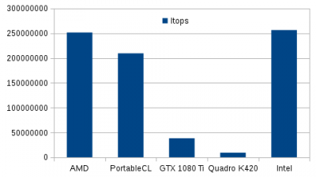

Il est assez intéressant que les implémentations CPU offrent quasiment la même performance. Par contre les GPU offrent une performance bien moindre (6x moins pour la GTX 1080 Ti et presque 30x moins pour la Quadro K420).

Il est aussi intéressant qu'étrange que le nombre de "coups" à l'intérieur du quadrant d'exploration ne soit pas le même pour toutes les implémentations. C'est un artéfact lié à la multiplication du *RNG* par la constante pour le placer entre 0 et 1. 

.. container:: note note-important

  **Exercice #10.3 : exécution sur tous les périphériques pour un PR=1**

  * Exécutez le programme sur toutes (GPU & CPU) avec un nombre d'itérations de 1 milliard
  * Repérez les éléments de **durée**, **itops** et le **inside**
  * Tracez l'histogramme correspondant aux performances sur le modèle ci-dessus
  * Quel ratio existe entre le ou les GPU et les processeurs ?

Nous pouvons maintenant explorer la réponse des périphériques, notamment pour des régimes de parallélisme bien plus élevés, par exemple la valeur par défaut de ``1024``. Nous portons par contre le nombre d'itérations à 10000000000, soit 10x plus que précédemment.

+----------------+---------+-------------+------------+
|  Périphérique  |  Durée  |  Itops      |  Inside    |
+================+=========+=============+============+
|  AMD           |  4.28   |  2338471813 |  7853958701|
+----------------+---------+-------------+------------+
|  PortableCL    |  24.23  |  412737304  |  7853958701|
+----------------+---------+-------------+------------+
|  GTX 1080 Ti   |  0.37   |  26864605077|  7853958630|
+----------------+---------+-------------+------------+
|  Quadro K420   |  3.04   |  3287218047 |  7853958630|
+----------------+---------+-------------+------------+
|  Intel         |  1.25   |  7973063801 |  7853958630|
+----------------+---------+-------------+------------+

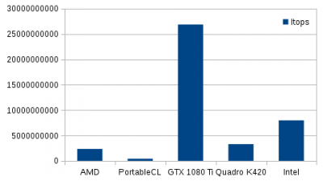

Cette seconde expérience montre de manière assez spectaculaire que les GPU ne dévoilent leur puissance "que" pour des régimes de parallélisme élevé. Notons aussi que les implémentations sur CPU ont des performances très très disparates.

.. container:: note note-important

  **Exercice #10.4 : exécution sur tous les périphériques pour un PR=1024**

  * Exécutez le programme sur toutes (GPU & CPU) avec un nombre d'itérations de 10 milliards
  * Repérez les éléments de **durée**, **itops** et **inside**
  * Tracez l'histogramme correspondant aux performances sur le modèle ci-dessus
  * Quel ratio existe entre le ou les GPU et les processeurs ?

Dans l'expérience précédente, nous avons exploité un régime de parallélisme sur les processeurs très supérieur au nombre de *Compute Units*, lesquelles sont identifiées comme les coeurs. Il y avait 8 coeurs physiques et nous avons "chargé" chaque coeur à 256 fois leur charge. Que se passe-t-il si nous effectuons la même chose avec les GPU ?

Dans notre exemple, la GTX 1080 Ti dispose de 3584 *cuda cores*. La Quadro K420 de 192 *cuda cores*. Explorons ces périphériques avec des  **PR** de 256x ces valeurs (nous sommes obligés de porter les itérations à 1000 milliards) :

+----------------+---------+--------------+--------------+
|  Périphérique  |  Durée  |  Itops       |  Inside      |
+================+=========+==============+==============+
|  GTX 1080 Ti   |  3.77   |  265583420021|  785397498152|
+----------------+---------+--------------+--------------+
|  Quadro K420   |  290.03 |  3447937882  |  785398065372|
+----------------+---------+--------------+--------------+

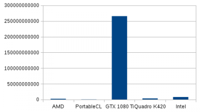

Ce graphique montre sans ambiguité la puissance "brute" qu'offre une GPU de gamer en comparaison de CPU traditionnelle (33x dans la meilleure implémentation CPU, celle d'Intel). Notons également que GPU n'est pas synonyme de puissance brute : la "petite" Quadro K420, bien que "professionnelle" présente des performances 77x inférieures.

.. container:: note note-important

  **Exercice #10.5 : exécution sur tous les périphériques pour un PR optimal**

  * Reprenez les spécifications des GPU et isolez le nombre de *cuda cores*
  * Exécutez le programme sur les GPU avec un nombre d'itérations de 100 milliards et un PR de 256x le nombre de *cuda cores*
  * Repérez les éléments de **durée**, **itops** et **inside**
  * Tracez l'histogramme correspondant aux performances sur le modèle ci-dessus
  * Quel ratio de performance existe entre la GPU la plus puissante et la meilleure implémentation des CPU ?

Nous avons déjà noté, dans l'exploitation de ``xGEMM`` que les performances pour les GPU étaient largement influencées par la précision utilisée pour les calculs.

Pour les mêmes périphériques mais en passant en double précision, nous avons :

+---------------+-----------+-------------+-------------+
|  Périphérique	|  Elapsed  |  Itops      |  Inside     |
+===============+===========+=============+=============+
|  AMD          |  4.05     |  2472082769 |  7853958184 |
+---------------+-----------+-------------+-------------+
|  PortableCL   |  18.89    |  529471467  |  7853958184 |
+---------------+-----------+-------------+-------------+
|  GTX 1080 Ti  |  3.34     |  29909278511|  78540290903|
+---------------+-----------+-------------+-------------+
|  QuadroK420   |  12.52    |  798857983  |  7854068741 |
+---------------+-----------+-------------+-------------+
|  Intel        |  16.24    |  6156907937 |  78539995659|
+---------------+-----------+-------------+-------------+

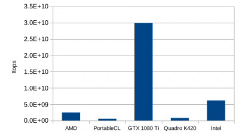

Nous avons présenté dans le cours qu'un mauvais choix de régime de parallélisme pouvait largement influencer la performance.

Par exemple, regardons pour la meilleure implémentation de CPU et pour la GPU la plus puissante, quelle influence a le choix du régime de parallélisme autour du régime de parallélisme optimal.

.. container:: note note-important

  **Exercice #10.6 : exécution sur tous les périphériques pour un PR optimal en double précision**

  * Reprenez les expériences ci-dessus en précisant un calcul en double précision
  * Tracez l'histogramme avec tous les périphériques OpenCL
  * Quel ratio de performance existe entre la GPU la plus puissante et la meilleure implémentation des CPU ?

Implémentation Python/OpenCL Python/CUDA 
~~~~~~~~~~~~~~~~~~~~~~~~~~~~~~~~~~~~~~~~

Dans l'exemple précédent, nous avons exploité un programme en C "pur". Nous avons vu comment s'intégrait la portion de code (le noyau ou le *kernel*) qui était exécutée, soit par les GPU, soit par différentes implémentations pour CPU de OpenCL. Nous avons aussi pu "juger" du côté assez "compliqué" de découvertes des périphériques et des mécanismes d'entrée/sortie.

Avec le programme ``PiXPU.py``, situé dans le dossier ``bench4gpu/Pi/XPU`` nous allons pouvoir exploiter les périphériques de calcul plus simplement, et bénéficier de toutes les facilités d'un langage évolué.

Regardons d'abord sa sortie lorsqu'il est sollicité avec l'option ``-h`` :

.. code-block:: bash

  $ cd $HOME/bench4gpu/Pi/XPU
  $ python3 PiXPU.py -h
  PiXPU.py -o (Out of Core Metrology) -c (Print Curves) -k (Case On IfThen) -d <DeviceId> -g <CUDA/OpenCL> -i <Iterations> -b <BlocksBegin> -e <BlocksEnd> -s <BlocksStep> -f <ThreadsFirst> -l <ThreadsLast> -t <ThreadssTep> -r <RedoToImproveStats> -m <SHR3/CONG/MWC/KISS> -v <INT32/INT64/FP32/FP64>

  Informations about devices detected under OpenCL API:
  Device #0 from Advanced Micro Devices, Inc. of type xPU : Intel(R) Xeon(R) CPU E5-2637 v4 @ 3.50GHz
  Device #1 from The pocl project of type xPU : pthread-Intel(R) Xeon(R) CPU E5-2637 v4 @ 3.50GHz
  Device #2 from NVIDIA Corporation of type xPU : GeForce GTX 1080 Ti
  Device #3 from NVIDIA Corporation of type xPU : Quadro K420
  Device #4 from Intel(R) Corporation of type xPU : Intel(R) Xeon(R) CPU E5-2637 v4 @ 3.50GHz

  Informations about devices detected under CUDA API:
  Device #0 of type GPU : GeForce GTX 1080 Ti
  Device #1 of type GPU : Quadro K420

Nous disposons de plus d'options pour le lancement. Ce programme étant un programme de test de performances, il permet une exploration de régimes de parallélisme. Dans les approches de programmation CUDA ou OpenCL, il y a deux étages de parallélisme : 

* le premier pour des tâches indépendantes : *Blocks* et *Work items* en sont les éléments
* le second pour des tâches nécessitant une synchronisation : ce sont les *Threads*

Il y a donc, pour explorer ces deux régimes de parallélisme, 6 options différentes :

* ``-b <BlocksBegin>``  : le premier nombre de *Work items* ou de *Blocks* à explorer
* ``-e <BlocksEnd>``    : le dernier nombre de *Work items* ou de *Blocks* à explorer
* ``-s <BlocksStep>``   : le pas entre deux *Work items* ou de *Blocks*
* ``-f <ThreadsFirst>`` : le premier nombre de *Threads* à explorer
* ``-l <ThreadsLast>``  : le dernier nombre de *Threads* à explorer
* ``-t <ThreadssTep>``  : le pas entre deux *Threads* à explorer
Il est aussi possible de coupler les deux régimes de parallélisme en appelant 16 *work items* avec 16 *threads*.

Par exemple, pour explorer des régimes de parallélisme de 16 à 128 avec des pas de 16 en *Work items* et 4 à 8 en *Threads* avec des pas unitaires, nous aurons ``-b 16 -e 128 -s 16 -f 4 -l 8 -t 1 -p 2``.

D'autres options :

* ``-g <CUDA/OpenCL>`` : pour sélectionner l'utilisation de CUDA ou OpenCL
* ``-i <Iterations> `` : pour le nombre total d'itérations
* ``-r <RedoToImproveStats>`` : pour refaire plusieurs expériences en série
* ``-m <SHR3/CONG/MWC/KISS>`` : pour sélectionner le type de *Random Number Generator* de Marsaglia
* ``-v <INT32/INT64/FP32/FP64>`` : pour sélectionner le type de variable à exploiter
* ``-k (Case On IfThen)`` : pour forcer l'exploitation du test avec un mécanisme en ``IfThen``
* ``-d <DeviceId>`` : pour sélectionner le périphérique en utilisant l'ID fourni avec le ``-h``

L'appel du programme ci-dessus nous montre qu'il y a le même nombre de périphériques OpenCL visibles (les 3 implémentations OpenCL pour CPU et les 2 GPU Nvidia), la nouveauté est que nous voyons également deux périphériques CUDA.

En sortie, lors d'un appel simple ne précisant que le périphérique, ici le premier, ``#0``, nous avons : 

.. code-block:: bash

  $ python3 PiXPU.py -d 0 
  Devices Identification : [0]
  GpuStyle used : OpenCL
  Iterations : 10000000
  Number of Blocks on begin : 1
  Number of Blocks on end : 1
  Step on Blocks : 1
  Number of Threads on begin : 1
  Number of Threads on end : 1
  Step on Threads : 1
  Number of redo : 1
  Metrology done out of XPU : False
  Type of Marsaglia RNG used : MWC
  Type of variable : FP32
  Device #0 from Advanced Micro Devices, Inc. of type xPU : Intel(R) Xeon(R) CPU E5-2637 v4 @ 3.50GHz
  Device #1 from The pocl project of type xPU : pthread-Intel(R) Xeon(R) CPU E5-2637 v4 @ 3.50GHz
  Device #2 from NVIDIA Corporation of type xPU : GeForce GTX 1080 Ti
  Device #3 from NVIDIA Corporation of type xPU : Quadro K420
  Device #4 from Intel(R) Corporation of type xPU : Intel(R) Xeon(R) CPU E5-2637 v4 @ 3.50GHz
  ([0], {0: 'xPU'})
  ('Inside ', {'Blocks': 1, 'ValueType': 'FP32', 'RNG': 'MWC', 'Threads': 1, 'Iterations': 10000000, 'Device': 0, 'Steps': 1, 'IfThen': False})
  ('CPU/GPU selected: ', 'Intel(R) Xeon(R) CPU E5-2637 v4 @ 3.50GHz')
  (Blocks/Threads)=(1,1) method done in 0.06 s...
  {'Duration': array([0.06270599]), 'Inside': 7852019.0, 'NewIterations': 10000000}
  Pi estimation 3.14080760
  0.06 0.06 0.00 0.06 0.06 159474388 159474388 0 159474388 159474388

Deux fichiers de sortie sont créés et reprennent dans leur titre les paramètres d'entrée :

* ``Pi_FP32_MWC_xPU_OpenCL_1_1_1_1_10000000_Device0_InMetro_opencluster2``
* ``Pi_FP32_MWC_xPU_OpenCL_1_1_1_1_10000000_Device0_InMetro_opencluster2.npz``

Le premier est uniquement lisible avec Python, le second est utilisable directement, pas exemple avec GNUplot.

Examen du code source
"""""""""""""""""""""

.. container:: note note-important

  **Exercice #11.1 : récupération des éléments dans le code source**

  * Editez le code source avec l'outil ``gedit``
  * Identifiez l'appel de la procédure principale OpenCL : ligne
  * Identifiez la zone de code de cette procédure OpenCL : lignes
  * Examinez dans cette procédure la **construction** du noyau OpenCL : ligne
  * Examinez dans cette procédure l'**appel** du noyau OpenCL : ligne
  * Identifiez le noyau OpenCL appelé par cette procédure : lignes
  * Identifiez l'appel de la procédure principale CUDA : ligne
  * Identifiez la zone de code de cette procédure CUDA : lignes
  * Identifiez le noyau CUDA appelé par cette procédure : lignes
  * Examinez dans cette procédure la **construction** du noyau CUDA : ligne
  * Examinez dans cette procédure l'**appel** du noyau CUDA : ligne
  * Quelles similarités distinguez-vous entre les noyaux OpenCL et CUDA ?

Exploitation du programme
~~~~~~~~~~~~~~~~~~~~~~~~~

Ainsi, si nous voulons étudier la scalabilité du CPU en *Work items* de 1 à 16x le nombre de coeurs (ici 8 physiques) en exploitant l'implémentation AMD de OpenCL, nous appelons la commande : <code>python3 PiXPU.py -d 0 -b 1 -e $((8*16)) -r 10 -i 1000000000 </code>

Dans notre cas, nous avons les deux fichiers suivants à exploiter : 

* ``Pi_FP32_MWC_xPU_OpenCL_1_128_1_1_1000000000_Device0_InMetro_opencluster2.npz``
* ``Pi_FP32_MWC_xPU_OpenCL_1_128_1_1_1000000000_Device0_InMetro_opencluster2``

Nous pouvons ensuite exploiter l'outil simple ``gnuplot`` pour afficher nos résultats :

.. code-block:: bash

  gnuplot
  set xlabel 'Parallel Rate'
  set ylabel 'Itops'
  set yrange [0:*]
  plot 'Pi_FP32_MWC_xPU_OpenCL_1_128_1_1_1000000000_Device0_InMetro_opencluster2' using 1:9 title 'OpenCL AMD'

Il existe un bouton d'export du graphique en image au format PNG ou SVG. Nous obtenons le suivant :

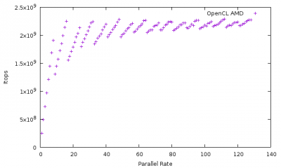

Nous observons que la scalabilité pour un code aussi simple n'est pas si triviale que cela à analyser. Il n'y a pas continuité en fonction de PR croissant. Notons une pseudo-période correspondant au nombre de coeurs physiques, avec des maximums locaux pour les multiples de cette valeur (le *handsaw curve effect*).

.. container:: note note-important

  **Exercice #11.2 : étude de la scalabilité d'une implémentation CPU**
  
  * Identifiez avec ``python3 PiXPU.py -h`` un périphérique CPU
  * Exécutez le d'un PR=1 à un PR égal à 8x le nombre de coeurs physiques
  * Tracez les résultats avec GNUplot

Nous pouvons également "explorer" la scalabilité des GPU forts de notre expérience de ``PiOpenCL``. Par exemple, du nombre de *cuda cores* à ce nombre multiplié par 16, par pas de 128. La commande appelée est la suivante :

.. code-block:: bash

  python3 PiXPU.py -d 2 -b 3584 -e $((3584*8)) -s 128 -r 3 -i 100000000000

Nous obtenons pour notre GTX 1080 Ti les résultats suivants :

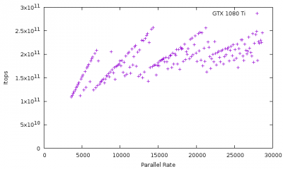

Nous pouvons constater que la scalabilité est très peu continue, encore moins que pour la scalabilité étudiée des CPU. Nous constatons également que des pseudo-lignes se chevauchent. Le PR optimal était autour de 4x le nombre de *cuda cores* et offrait une performance de **268 Gitops**.

.. container:: note note-important

  **Exercice #11.3 : étude de la scalabilité d'une GPU**

  * Identifiez avec ``python3 PiXPU.py -h`` un périphérique GPU
  * Exécutez-le d'un PR=<NbCudaCores> à un PR égal à 8x<NbCudaCores> par pas de 128 en OpenCL
  * Tracez les résultats avec GNUplot
  * Identifiez pour quel PR la performance est maximale

Comme nous avons également la même implémentation en CUDA, lançons l'exploration avec CUDA pour le PR optimal, ici identifié à 4x le nombre de *cuda cores* :<code>python3 PiXPU.py -g CUDA -d 0 -b $((3584*4)) -e $((3584*4)) -r 3 -i 10000000000</code>

Comme résultat de cette implémentation CUDA, nous n'obtenons pas **268 Gitops**, mais seulement **6 Gitops** !

La seule manière de retrouver une performance comparable en CUDA est de solliciter le second étage de parallélisme des GPU, les *Threads*. Avec la commande suivante, avec 1024 Threads, nous plafonnons à **198 Gitops** :<code>python3 PiXPU.py -g CUDA -d 0 -b $((3584*4)) -e $((3584*4)) -f 1024 -l 1024 -r 3 -i 1000000000000</code>

En relançant le calcul précédent, nous parvenons à **271 Gitops** soit plus que l'implémentation OpenCL.

.. container:: note note-important

  **Exercice #11.4 : étude de l'implémentation CUDA autour du PR optimal**

  * Identifiez avec ``python3 PiXPU.py -h`` le périphérique GPU déjà utilisé en CUDA
  * Exécutez le avec le PR optimal des *Blocks* en CUDA
  * Quel ratio de performance avez-vous entre CUDA et OpenCL ?
  * Exécutez le avec le PR optimal des *Blocks* et 1024 *Threads*
  * Quel ratio de performance avez-vous entre CUDA et OpenCL ?

Il existe aussi des artéfacts sur des régimes de parallélisme spéciaux en OpenCL sur les GPU Nvidia : en explorant autour du PR optimal, quelles sont les PR qu'il ne faut surtout pas exploiter et quel est leur point commun ?

En lançant cette exploration suivante, nous obtenons :

.. code-block:: bash

  python3 PiXPU.py -d 2 -b $((3584*4-16)) -e $((3584*4+16)) -r 3 -i 100000000000

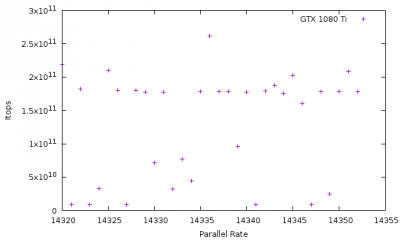

Alors que l'optimum de performance est atteint autour d'un PR de 14336 avec **258 Gitops**, nous n'obtenons un Itops que de **8.5 Gitops** (soit 30x moins) sur 5 valeurs particulières : 14321, 14323, 14327, 14341, 14347. Le point commun entre ces valeurs de PR est à rechercher sur le site `de mathématiques <http://www.math.com/students/calculators/source/prime-number.htm>`_

.. container:: note note-important

  **Exercice #11.4 : étude de valeurs particulières de PR**

  * Exécutez ``PiXPU.py`` autour du PR égal à 4x le nombre de *cuda cores* (16 avant et 16 après)
  * Tracez les résultats avec GNUplot
  * Quels sont les PR avec les performances les plus faibles ?

Exploration par un corps N-Corps à "grain fin"
----------------------------------------------

Le code de test **Pi Monte Carlo** avait pour avantage de ne solliciter que très peu la mémoire. La seule mémoire sollicitée sur les périphériques se résumait au nombre de tirages dans le quadrant de cercle. De plus, l'opération de parallélisation divisait un nombre total d'itérations en un nombre équivalent pour chaque *work item*, chaque *block* ou chaque *thread*. Chaque calcul était indépendant des autres : nous avions non seulement un **code ALU** (ne sollicitant que les unités de traitement) mais aussi un **code gros grain** (indépendance des calculs).

Dans le code ``NBody.py``, situé dans ``bench4gpu/NBody``, le principe est de déterminer dans un modèle newtonien la position et la vitesse de chaque particule en intéraction avec toutes les autres. A chaque itération, chaque position et chaque vitesse de chaque particule vont être modifiées par la proximité de toutes les autres : nous disposons d'un **code grain fin**. De plus, la détermination de la vitesse et la position de chaque particule à chaque instant nécessite un accès à la position de chacune des autres : un accès permanent à la mémoire est donc indispensable.

Le programme ``NBody.py`` n'est disponible qu'en OpenCL. Son invocation avec l'option ``-h`` offre la sortie suivante :

.. code-block:: bash
  
  $ cd $HOME/bench4gpu/NBody
  $ python3 NBody.py -h
  NBody.py -h [Help] -r [InitialRandom] -g [OpenGL] -e [VirielStress] -o [Verbose] -p [Potential] -x <None|NegExp|CorRad> -d <DeviceId> -n <NumberOfParticules> -i <Iterations> -z <SizeOfBoxOrBall> -v <Velocity> -s <Step> -b <Ball|Box> -m <ImplicitEuler|RungeKutta|ExplicitEuler|Heun> -t <FP32|FP64>

  Informations about devices detected under OpenCL:
  Device #0 from Advanced Micro Devices, Inc. of type xPU : Intel(R) Xeon(R) CPU E5-2637 v4 @ 3.50GHz
  Device #1 from The pocl project of type xPU : pthread-Intel(R) Xeon(R) CPU E5-2637 v4 @ 3.50GHz
  Device #2 from NVIDIA Corporation of type xPU : GeForce GTX 1080 Ti
  Device #3 from NVIDIA Corporation of type xPU : Quadro K420
  Device #4 from Intel(R) Corporation of type xPU : Intel(R) Xeon(R) CPU E5-2637 v4 @ 3.50GHz

Un certain nombre des paramètres sont à définir avec une valeur :

* ``-d <DeviceId>`` : sélection du périphérique (défaut **0**)
* ``-n <NumberOfParticules>`` : nombre de particules du système (défaut **2**)
* ``-s <Step>`` : pas d'intégration (défaut **1/32**)
* ``-m <ImplicitEuler|RungeKutta|ExplicitEuler|Heun>`` : type d'intégration différentielle (défaut **ImplicitEuler**) 
* ``-t <FP32|FP64>`` : précision de calcul (défaut **FP32**)
* ``-i <Iterations>`` : nombre d'itérations (défaut **10**)
* ``-x <None|NegExp|CorRad>`` : introduction d'un "rayon de coeur" pour éviter les divergences (défaut **None**)
* ``-z <SizeOfBoxOrBall>`` : taille de la boîte ou de la boule (défaut **sqrt(2)**)
* ``-v <Velocity>`` : vitesse initiale des particules (défaut définie par le Viriel)
* ``-b <Ball|Box>`` : type de distribution aléatoire (défaut **Ball**)

D'autres sont des booléens :

* ``-h [Help]`` : la sortie précédente
* ``-r [InitialRandom]`` : défaut
* ``-g [OpenGL]`` : pour une sortie graphique
* ``-e [VirielStress]`` : par défaut
* ``-o [Verbose]`` : impression position et vitesse des particules
* ``-p [Potential]`` : exploitation du potentiel à la place de la force

Par défaut, une invocation sans option offre la sortie suivante :

.. code-block:: bash

 python3 NBody.py 
  Device choosed : 0
  Number of particules : 2
  Size of Shape : 1.4142135
  Initial velocity : 1.0
  Step of iteration : 0.03125
  Number of iterations : 10
  Method of resolution : ImplicitEuler
  Initial Random for RNG Seed : False
  ValueType is : FP32
  Viriel distribution of stress : True
  OpenGL real time rendering : False
  Speed rendering : False
  Interaction type : Force
  Counter Artevasion type : None
  ('CPU/GPU selected: ', 'Intel(R) Xeon(R) CPU E5-2637 v4 @ 3.50GHz')
  ('Platform selected: ', 'AMD Accelerated Parallel Processing')
  /usr/lib/python2.7/dist-packages/pyopencl/cffi_cl.py:1470: CompilerWarning: Non-empty compiler output encountered. Set the environment variable PYOPENCL_COMPILER_OUTPUT=1 to see more.
    "to see more.", CompilerWarning)
  All particles superimposed.
  All particules distributed
  Center Of Mass estimated: (-0.05390843,0.25029457,-0.0005747825)
  All particules stressed
  Energy estimated: Viriel=-5.960464477539063e-08 Potential=-0.94194394 Kinetic=0.47097194

  Starting!
  ..........
  Ending!

  Center Of Mass estimated: (-0.05390393,0.25027496,-0.00055484474)
  Energy estimated: Viriel=-2.7835369110107422e-05 Potential=-0.94973665 Kinetic=0.4748544

  Duration stats on device 0 with 10 iterations :
    Mean:	0.0017527103424072265
    Median:	0.00153350830078125
    Stddev:	0.0007242915279449818
    Min:	0.0013959407806396484
    Max:	0.0039031505584716797

    Variability:	0.4723101450288789

  FPS stats on device 0 with 10 iterations :
    Mean:	623.2326583734787
    Median:	653.6473926380554
    Stddev:	130.28936462458745
    Min:	256.2032862989432
    Max:	716.3627668659266

  Squertz in log10 & complete stats on device 0 with 10 iterations :
    Mean:	3.396710194304037	2492.9306334939147
    Median:	3.417403524471372	2614.5895705522216
    Stddev:	2.716968957513558	521.1574584983498
    Min:	3.01064468743274	1024.813145195773
    Max:	3.4571929965271666	2865.4510674637063

Les éléments de sortie sont les statistiques de chaque itération, exprimées en **squertz**, contraction de **square** (pour "carré") avec **Hertz**. En effet, le nombre de calculs élémentaires évolue suivant une loi en **N(N-1)** (chaque particule parmi **N** intéragit avec les **N-1** autres particules).

Analyse du programme
""""""""""""""""""""

Lors de l'initialisation du "système N-Corps", plusieurs opérations sont effectuées : 

* l'initialisation de la position des particules
* la distribution aléatoire des particules dans le volume (boule ou cube)
* la détermination du centre de gravité
* la distribution semi-aléatoire des vitesses en fonction du Viriel
* l'évolution du système

.. container:: note note-important

  **Exercice #12.1 : étude du source de ``NBody.py``**

  * Editez le programme avec gedit
  * Identifiez le bloc de noyaux OpenCL : lignes
  * Identifiez les appels des noyaux OpenCL : lignes
  * Identifiez les récupérations de positions et vitesses des particules
  * Identifiez la portion de code OpenGL

Pour un lancement sur 32768 particules et les différents périphériques (3 CPU et 2 GPU), pour des calculs en 32 et 64 bits en flottants, nous avons les résultats suivants :

+---------------+--------------+-------------+
|  Périphérique	|  Squertz SP  |  Squertz DP |
+===============+==============+=============+
|  AMD          |  2583647198  |  1141839568 |
+---------------+--------------+-------------+
|  PortableCL   |  1277518016  |  782950973  |
+---------------+--------------+-------------+
|  GTX 1080 Ti  |  104176444905|  2853097176 |
+---------------+--------------+-------------+
|  QuadroK420   |  3242286836  |  116285732  |
+---------------+--------------+-------------+
|  Intel        |  4728894103  |  1444506859 |
+---------------+--------------+-------------+

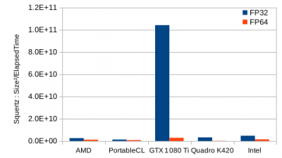

La figure ci-dessus illustre l'écrasante performance de la GTX 1080 Ti en comparaison de toutes les autres implémentations : plus d'un facteur 22 en simple précision et presque un facteur 2 en double précision pour la meilleure des implémentations CPU.

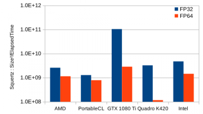

Seule une représentation en log permet de ne pas trop écraser les performances des implémentations CPU.

.. container:: note note-important

  **Exercice #12.2 : lancement de ``NBody.py`` pour 32768 particules**

  * Exécutez le programme pour tous les périphériques détectés
  * Ajoutez l'option pour un calcul en 64 bits et réexécutez
  * Tracez les histogrammes de performances
  * Quel est le ratio entre la meilleure GPU et la meilleure en CPU en 32 bits
  * Quel est le ratio entre la meilleure GPU et la meilleure en CPU en 64 bits
  * Quel est le ratio pour un même périphérique entre 32 et 64 bits ?

Vous pouvez également exécuter ``NBody.py`` avec l'option ``-g`` pour disposer d'une animation en temps réel du calcul.

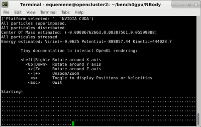

La fenêtre de rendu offre la vision suivante :

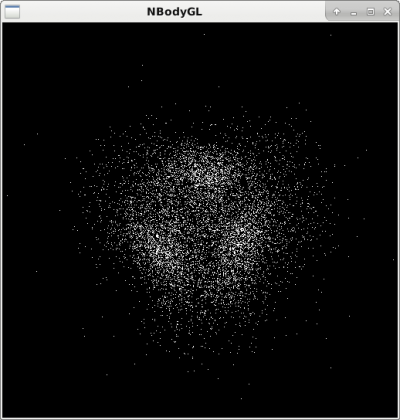

La pression sur la touche ``<Esc>`` permet de sortir du programme pour afficher les statistiques de la simulation.

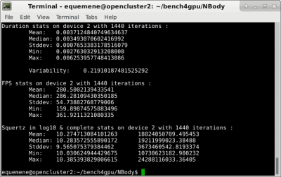

Si nous changeons de manière insignifiante le nombre de particules (de 8192 à 8191), nous obtenons des performances très différentes :

.. image:: ../../_static/Plateformes/nbody_007.png
  :class: img-fluid center
  :alt: Image nbody_007

.. container:: note note-important
  
  **Exercice #12.3 : lancement de ``NBody.py`` en mode ``-g``**

  * Exécutez le programme pour la meilleure implémentation sur CPU sur 8192 particules
  * Appuyez sur ``s`` pour passer des positions aux vitesses
  * Utilisez les flèches pour les opérations de rotations
  * Utilisez les <+> ou <-> pour les opérations de zoom ou dézoom
  * Sortez avec <Esc> et notez finalement la performance médiane en Squertz
  * Exécutez le programme sur la GPU la plus puissante avec 8192 particules
  * Sortez avec <Esc> et notez la performance médiane en Squertz
  * Exécutez le programme sur la GPU la plus puissante avec 8191 particules
  * Sortez avec <Esc> et notez la performance médiane en Squertz
  * Quel ratio entre Squertz existe entre 8192 et 8191 particules ?
  * Pourquoi un tel ratio ?

Conclusion
----------

Comme vous l'aurez remarqué au cours de ces Travaux Pratiques, l'exploitation peut être pleine de surprises : une métrologie pertinente ne peut se passer de la connaissance du matériel exploité.

L'exploitation de "codes métier" vous aura aussi permis d'entrevoir la difficulté d'intégrer et d'exécuter des programmes dans des environnements pourtant bien homogènes : toutes les stations exploitées ont exactement le même système d'exploitation, ` <developpement:productions:SIDUS|SIDUS]]. Les "astuces" permettant de simplement pouvoir exécuter les programmes illustraient aussi que, sans expérience, difficile de s'en sortir.

--- `Emmanuel Quemener <emmanuel.quemener@ens-lyon.fr>`_ 2022/07/20 15:13