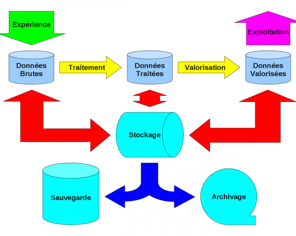

.. _stockmonod:

Stockage Informatique pour les laboratoires du site Monod
=========================================================

.. role:: line
    :class: line

.. container:: note note-imp

    L'enquête est terminée. Le rapport pré-final a été remis à la direction de la recherche le 31 mars dernier. Merci à tous ceux qui se sont mobilisés pour cette étude. Dommage pour les autres...

Introduction
------------

Fin 2009, la direction de la recherche a reçu de la part des laboratoires de biologie de l'établissement une demande de financement pour une infrastructure de stockage. 

Dans ce cadre, j'ai été mandaté (`par une lettre de mission de la direction de la recherche <http://www.cbp.ens-lyon.fr/emmanuel.quemener/documents/lettre_mission_e.quemener.pdf>`_) pour effectuer une évaluation des besoins de stockage, de sauvegarde et d'archivage de tous les laboratoires de l'établissement, site Jacques Monod.

Démarche
--------

Cette étude se déroulera en 6 étapes, avant la remise du rapport à la direction de la recherche fin mars (fin février sera marqué par la remise d'un rapport préliminaire sur les expressions de besoins des laboratoires) :

#. réalisation d'un questionnaire permettant d'établir un état des lieux de l'existant et des besoins associés (**semaine 1**) ;
#. expédition du questionnaire aux directeurs de laboratoire et invitation à rediffuser l'information aux personnels concernés (**fin semaine 1**)
#. analyse des retours de questionnaires (**semaine 9**)
#. consultation des directeurs, de leurs responsables d'activités et de leurs informaticiens pour un affinage (**semaine 10**);
#. synthèse des besoins, analyse et rédaction d'un cahier des charges (**semaine 13**) ;
#. proposition d'une infrastructure adaptée dans le rapport final (**semaine 14**).

Circuit des données numériques
------------------------------

.. container:: note note-imp
    
    Le questionnaire se **focalise** plus sur les **processus** que sur les **données**.

Quatre processus manipulent ces données à l'aide de **plates-formes** :

* `l'expérience <#>`_ : la "génération" des données, leur indexation, ... ;
* `le traitement <#>`_ : leurs réduction, synthèse, analyse, indexation, ...
* **la valorisation** : leur transformation en contenu scientifique. Cela constitue le "coeur de métier" du chercheur".
* **l'exploitation** : leur diffusion sur tous les médias scientifiques

Ainsi, les données, à la source ou destination de ces processus sont finalement de 3 natures distinctes :

* les données "brutes" : directement issues des expériences ;
* les données "traitées" : premiers résultats ;
* les données "valorisées" : résultats à destination des travaux de publication.

De plus, le schéma synoptique présente un entrepôt de ces données avec une triple nature :

* le **stockage** : accès direct aux données
* la **sauvegarde** : duplication complète/partielle, synchrone/asynchrone de l'espace de stockage dans un endroit apportant une sûreté aux données en cas de perte du stockage
* l'**archivage** : état du stockage complet ou partiel, à un instant dans le passé. Ces états sont d'une fréquence et d'une pérennité à définir

Pour qu'aucune information importante n'échappe à l'étude préliminaire a été choisi la collecte basée sur une  `démarche analytique classique <http://fr.wikipedia.org/wiki/QQOQCCP>`_. Elle propose de répondre aux sept questions élémentaires **Pourquoi ? Quoi ? Qui ? Quand ? Où ? Combien ? Comment ?** 

Les questionnaires
------------------

.. container:: note note-imp
    
    L'échéance proche de fin février impose de limiter les questionnaires aux plates-formes expérimentales et à celles réalisant les traitements

Questionnaires en ligne
~~~~~~~~~~~~~~~~~~~~~~~

:line:`Sondages, ancienne version, disponibles uniquement dans l'ENS :`

.. raw:: html 

    <ul class="simple"> 
        <li> <del><a href="http://sondages.ljc.ens-lyon.fr/phpesp/public/survey.php?name=Storage4Labs4ExperiencesV2">Plates-formes expérimentales</a></del>, prioritaire` </li>
        <li> <del><a href="http://sondages.ljc.ens-lyon.fr/phpesp/public/survey.php?name=Storage4Labs4ProcessV2">Plates-formes de traitement</a></del>, prioritaire` </li>
        <li> <del><a href="http://sondages.ljc.ens-lyon.fr/phpesp/public/survey.php?name=Storage4Labs4UseV2">Exploitation des résultats de la recherche</a></del>, prioritaire` </li>
    </ul>

Sondages, nouvelle version, disponibles de partout :

* `Plates-formes expérimentales <http://limesurvey.cbp.ens-lyon.fr/limesurvey/index.php?sid=93877&lang=en>`_, prioritaire
* `Plates-formes de traitement <http://limesurvey.cbp.ens-lyon.fr/limesurvey/index.php?sid=39829&lang=en>`_, prioritaire
* `Exploitation des résultats de la recherche <http://limesurvey.cbp.ens-lyon.fr/limesurvey/index.php?sid=42114&lang=en>`_, secondaire

.. container:: note note-important
 
    La **"valorisation"** : si son importance est capitale, les contraintes techniques associées à leur gestion (volume de données, débit nécessaire, contrôle d'accès, etc...) sont moins importantes que pour les 3 autres processus. Elle sera donc étudiée au besoin ultérieurement

Comment remplir les questionnaires
~~~~~~~~~~~~~~~~~~~~~~~~~~~~~~~~~~

**Informations pratiques**

* les questionnaires ci-dessus sont accessibles par défaut de l'intérieur de l'ENS. Pour pouvoir les y accéder, il suffit :
    
    * soit d'être connecté directement au réseau de l'établissement, site Jacques Monod,
    * soit de se connecter à partir de l'extérieur de l'école en utilisant `la passerelle IPsec <http://www.ens-lyon.fr/PSI/aide/doku.php?id=vpn:accueil>`_ (demande indispensable sur l'ENT),
    * soit de se connecter à partir de l'extérieur de l'école en utilisant `la passerelle OpenVPN <http://www.ens-lyon.fr/PSI/aide/doku.php?id=openvpn:accueil>`_ ;
* toute personne de l'ENS après authentification avec leur identifiant/mot de passe ENS ;
* **une personne en charge de plusieurs plates-formes doit remplir autant de questionnaires que de plates-formes**.

Résultats
---------

* `Document préliminaire <http://www.cbp.ens-lyon.fr/emmanuel.quemener/documents/ENSL-Storage4labs-100226.pdf>`_ : remis le 26 février 2010 à la direction de la recherche
* `Document final v1 <http://www.cbp.ens-lyon.fr/emmanuel.quemener/documents/ENSL-Storage4labs-100415.pdf>`_ : issu du rapport remis le 31 mars 2010 à la direction de la recherche, corrigé de quelques coquilles
* `Document final v2 <http://www.cbp.ens-lyon.fr/emmanuel.quemener/documents/ENSL-Storage4labs-100607.pdf>`_ : issu du rapport remis le 7 juin 2010 à la direction de la recherche, modifié suite aux ajustements du LBMC.
 
.. container:: note note-important
    
    Tous ces documents, textes et schémas exigent l'accord préalable de l'auteur pour leur exploitation dans une quelconque autre étude.
