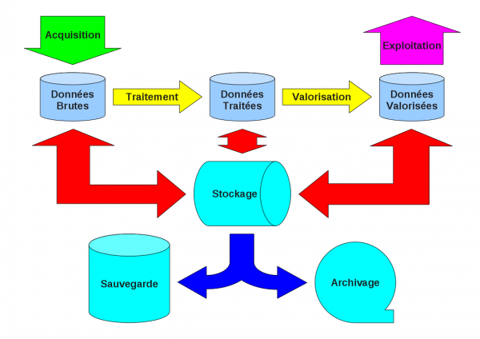

.. _stockdescartes:

Stockage Informatique pour les laboratoires du site Descartes et Pôle de Diffusion des Savoirs
==============================================================================================

.. container:: note note-important
    
    L'enquête est terminée. Les résultats ont été rendus à la direction de la recherche comme spécifiée lors de la lettre de mission.

Introduction
------------

Fin 2009, la direction de la recherche a reçu de la part des laboratoires de biologie de l'établissement une demande de financement pour une infrastructure de stockage. 

Dans ce cadre, j'ai été à nouveau mandaté (`par une lettre de mission de la direction de la recherche <http://www.cbp.ens-lyon.fr/emmanuel.quemener/documents/lettre_mission_e.quemener_Descartes.pdf>`_) pour effectuer une évaluation des besoins de stockage, de sauvegarde et d'archivage de tous les laboratoires de l'établissement, site Descartes, ainsi que pour les installations du pôle de diffusion des savoirs.

Démarche
--------

Cette étude se déroulera en 6 étapes, avant la remise du rapport à la direction de la recherche fin mai :

#. adaptation des questionnaires existants aux spécificités du site Descartes (**semaine 15**) ;
#. rencontre avec les interlocuteurs des laboratoires pour recueillir leurs expressions de besoins (**semaines 17 et 18**)
#. analyse des retours de questionnaires (**semaines 18 à 19**);
#. synthèse des besoins, analyse et rédaction des livrables (**semaines 20 à 21**)
#. remise des livrables (**fin semaine 21**).

Circuit des données numériques
------------------------------

.. container:: note note-important
    
    Le questionnaire se **focalise** plus sur les **processus** que sur les **données**.

Quatre processus manipulent ces données à l'aide de **plates-formes** :

* `l'acquisition <#>`_ : la "génération" des données, leur indexation, ... elle se rapproche de l'expérience ;
* `le traitement <#>`_ : leurs réduction, synthèse, analyse, indexation, ...
* **la valorisation** : leur transformation en contenu scientifique. Cela constitue le "coeur de métier" du chercheur".
* **l'exploitation** : leur diffusion sur tous les médias scientifiques

Ainsi, les données, à la source ou destination de ces processus sont finalement de 3 natures distinctes :

* les données "brutes" : directement issues des acquisitions ;
* les données "traitées" : premiers résultats ;
* les données "valorisées" : résultats à destination des travaux de publication.

De plus, le schéma synoptique présente un entrepôt de ces données avec une triple nature :

* le **stockage** : accès direct aux données
* la **sauvegarde** : duplication complète/partielle, synchrone/asynchrone de l'espace de stockage dans un endroit apportant une sûreté aux données en cas de perte du stockage
* l'**archivage** : état du stockage complet ou partiel, à un instant dans le passé. Ces états sont d'une fréquence et d'une pérennité à définir

Pour qu'aucune information importante n'échappe à l'étude préliminaire a été choisi la collecte basée sur une  `démarche analytique classique <http://fr.wikipedia.org/wiki/QQOQCCP>`_. Elle propose de répondre aux sept questions élémentaires **Pourquoi ? Quoi ? Qui ? Quand ? Où ? Combien ? Comment ?** 

Etat d'avancement du projet
---------------------------

L'enquête est terminée. Les livrables sont présentés en libre accès, ci-dessous.

* `Document  v0, site Descartes <http://www.cbp.ens-lyon.fr/emmanuel.quemener/documents/ENSL-Storage4labs2Descartes-100528.pdf>`_ : issu du rapport remis le 28 mai 2010 à la direction de la recherche
* `Document v0, Pôle de diffusion des savoirs <http://www.cbp.ens-lyon.fr/emmanuel.quemener/documents/ENSL-Storage4labs2PDS-100528.pdf>`_ : issu du rapport remis le 28 mai 2010 à la direction de la recherche
 
.. container:: note note-warning 

    Tous ces documents, textes et schémas exigent l'accord préalable de l'auteur pour leur exploitation dans une quelconque autre étude.

