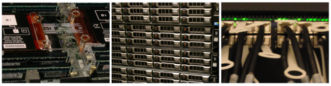

.. _clustserv:

Les clusters et les serveurs
============================

`New Documentation (Debian 11 / Slurm) <http://www.ens-lyon.fr/PSMN/Documentation/>`_

Le PSMN propose une infrastructure permettant :

* des calculs longs (temps moyen de 168 heures, jusqu'à 744 heures maximum, sur demande),
* des calculs sur un grand nombre de coeurs (7296 maximum, jusqu'à ~17000 sur demande).

Les équipements mis à disposition regroupent environ **~650 noeuds** dans **30 racks 42/48U**, avec le même système d'exploitation (GNU/Linux Debian) pour un total brut de **>30 000 coeurs**. L'ensemble des serveurs de fichiers représente **~8Po de stockage**.

Ils sont décrits plus en détail dans les pages qui suivent.

* :ref:`Configuration matérielle des clusters <confmat>`
* :ref:`Statistiques d'utilisation des clusters <statsutil>`

Le PSMN a reçu un financement "equipex" en 2012. Les nouveaux serveurs, dépendants du programme "Équip@méso", sont entrés en production depuis Q3 2013 (cluster E5).

Transferts technologiques
-------------------------

.. container:: note note-info
    
    Les configurations du système d'exploitation, ainsi que sa diffusion (SIDUS) sur les noeuds ont profité des travaux préparatoires, recettes et intégrations réalisés sur la plate-forme expérimentale du CBP.

