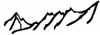
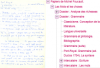
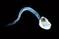

.. _projinfra:

Projets d'infrastructure
========================

.. |br| raw:: html

    

.. role:: underline-bold
    :class: underline-bold
    
2016
----

:underline-bold:`Houches 2016`

:ref:`Computational Physics : Computational Astrophysics <houches2016>` |br|
Maitrise d'oeuvre : Emmanuel Quemener

----

:underline-bold:`Sidus4Labs @ ISA`

:ref:`Sidus4Labs @ ISA <sidus4labs>` |br|
Maitrise d'oeuvre : Emmanuel Quemener

----

:underline-bold:`DH-Foucault (2016-20xx)`

:ref:`Exploration d'outils numériques pour la bibliothèque Foucault <explofoucault>`

Maitrise d'oeuvre : Emmanuel Quemener

----

:underline-bold:`OIKO (2015-2016)`

:ref:`Sidus4Labs @ ISA <oiko>`

Maitrise d'oeuvre : Emmanuel Quemener

2015
----

:underline-bold:`Houches 2015`

:ref:`Computational Physics : Multiscale modeling of materials <houches2015>` |br|
Maitrise d'oeuvre : Emmanuel Quemener

----

:underline-bold:`Galaxy`

:ref:`Galaxy Easy Gateway for Biological ENS Laboratories <galaxy>` |br|
Maitrise d'oeuvre : Emmanuel Quemener

2014
----

:underline-bold:`Houches 2014`

:ref:`Computational Physics : From quantum gases to strongly correlated systems <houches2014>` |br|
Maitrise d'oeuvre : Emmanuel Quemener

2013
----

:underline-bold:`UMPA`

:ref:`Evolution de l'infrastructure informatique de l'UMPA <umpaProj>` |br|
Maitrise d'oeuvre : Emmanuel Quemener

----

:underline-bold:`Houches 2013`

:ref:`Computational Physics : from DNA to evolution <houches2013>` |br|
Maitrise d'oeuvre : Emmanuel Quemener

----

:underline-bold:`Projet de création, administration et maintenance du site web du CBP (2013-20xx)`

.. image:: ../_static/img_projets/cbp_ens.jpeg
    :class: img-float pe-3
    :width: 100px
    :alt: Logo CBP

:ref:`Site web collaboratif du Centre Blaise Pascal <camwebcbp>`

Coordination : Samantha Barendson & Loïs Taulelle

----

:underline-bold:`Projet de création, administration et maintenance du site web du PSMN (2013-20xx)`

:ref:`Site web collaboratif du Pole Scientifique de Modélisation Numérique <camwebpsmn>` |br|
Coordination : Loïs Taulelle & Samantha Barendson

----

:underline-bold:`ENVeMedis (2013-20xx)`

:ref:`Exploration de nouveaux vecteurs de médiation et de diffusion des savoirs <explovmds>`

Maitrise d'oeuvre : Emmanuel Quemener |br|

2012
----

:underline-bold:`Houches 2012`

:ref:`Computational Physics : DFT <houches2012>` |br|
Maitrise d'oeuvre : Emmanuel Quemener

----

:underline-bold:`Equip@Meso (2012-20XX)`

:ref:`Stockage Temporaire Hautes Performances <sthp>` |br|
Maitrise d'oeuvre : Emmanuel Quemener

2011
----

:underline-bold:`Houches 2011`

:ref:`Computational Physics : soft matter <houches2011>` |br|
Maitrise d'oeuvre : Emmanuel Quemener

----

:underline-bold:`VASP 4 Workstation`

:ref:`Vasp Running on my workstation <vasp>`

Maitrise d'oeuvre : Emmanuel Quemener

----

:underline-bold:`Projet de développement, administration et maintenance du site web collaboratif pour le CFCAM-RA (2011-20XX)`

:ref:`Site web du Centre Français de Calcul Atomique et Moléculaire – Rhône-Alpes <cfcamra>` |br|
Coordination : Cerasela Calugaru / Assistance : Samantha Barendson

2010
----

:underline-bold:`Enquêtes Stockages ENS`

.. container:: d-flex mb-3

    .. image:: ../_static/img_projets/stockageens.png
        :alt: Image stockageens

    .. container::

        :ref:`Enquêtes sur les Besoins de Stockage de l'ENS-Lyon <stockens>`

        Maitrise d'oeuvre : Emmanuel Quemener

----

:underline-bold:`SIDUS 2010-2021`

.. container:: d-flex mb-3

    .. image:: ../_static/img_projets/sidus.png
        :alt: Image sidus

    .. container::

        :ref:`Single Instance Distributing Universal System <sidusdoc>`

        Maitrise d'oeuvre : Emmanuel Quemener

2009
----

:underline-bold:`From Cecam to CBP`

.. image:: ../_static/img_projets/cecam_logo.png
    :class: img-float pe-3
    :alt: Logo CECAM

`Du Cecam à l'ENS-Lyon au Centre Blaise Pascal <#>`_ |br|
Maitrise d'oeuvre : Emmanuel Quemener

----

:underline-bold:`Projet de développement, administration et maintenance du site web collaboratif pour le PSMN (2009 - avril 2013)`

:ref:`Site web collaboratif du Pole Scientifique de Modélisation Numérique <pdampsmn>` |br|
Coordination : Cerasela Calugaru

----

:underline-bold:`Création du plateau technique de multi-noeuds`

.. image:: ../_static/img_projets/cbp_ens.jpeg
    :class: img-float pe-3
    :width: 100px
    :alt: Logo CBP

`Plateau Technique Multi-Noeuds <#>`_

Maitrise d'oeuvre : Emmanuel Quemener

----

:underline-bold:`Création d'une passerelle OpenVPN pour l'établissement`

:ref:`Création d'une passerelle OpenVPN <openvpn>` |br|
Maitrise d'oeuvre : Emmanuel Quemener

2008
----

:underline-bold:`Projet de développement, administration et maintenance du site web collaboratif pour le CBP (2008 - avril 2013)`

.. image:: ../_static/img_projets/cbp_ens.jpeg
    :class: img-float pe-3
    :alt: Logo CBP

:ref:`Site web collaboratif du Centre Blaise Pascal <pdamcbp>`

Coordination : Cerasela Calugaru
