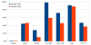
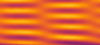
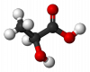
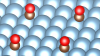
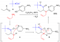

Projets
=======

.. |br| raw:: html

    

.. container:: disp
   
    .. toctree::
        :maxdepth: 1
        :caption: Table des matières

        Projets/Academics
        Projets/ACCLT
        Projets/ADAL
        Projets/AECO2
        Projets/AHN
        Projets/AIMDMS
        Projets/ANRCadenced
        Projets/ANRChimi
        Projets/ANRDyquma
        Projets/ANRFscf
        Projets/ANRFscf2
        Projets/ANRGalac
        Projets/ANRGalac2
        Projets/ANRLoris
        Projets/ANRMuse
        Projets/ANRRideporph
        Projets/ANRStatocean
        Projets/APCD
        Projets/ASPAPM
        Projets/Carpaccio
        Projets/CEANR
        Projets/CERDL
        Projets/CESS
        Projets/CLIDAR
        Projets/CMECEEC
        Projets/CMOM
        Projets/CPSBM
        Projets/DCOROI
        Projets/DDMNMS
        Projets/DFED
        Projets/DPCBMP
        Projets/DYN4DRUGS
        Projets/EICDMRN
        Projets/ENIPPFDP
        Projets/Epifly
        Projets/EPVMO
        Projets/ETBG
        Projets/EuroSim
        Projets/FAMST
        Projets/FSL4GE
        Projets/HydroWood
        Projets/IMPACT
        Projets/IPAB
        Projets/LaBS
        Projets/LSM
        Projets/LTEF
        Projets/MAEP
        Projets/MOCSG
        Projets/MRLSSE
        Projets/NPASSMB
        Projets/ONLMTGE
        Projets/PCCESM
        Projets/PLIAISON 
        Projets/Pumamind
        Projets/Pumamind2
        Projets/PVACFCA
        Projets/RMP
        Projets/RNCST
        Projets/SDMLEM
        Projets/SEFCPT
        Projets/SIBCp
        Projets/SIBCp2
        Projets/SIMBIO
        Projets/SimuEau-Glace
        Projets/SMOLU
        Projets/Solvay
        Projets/Tobeplanet
        Projets/WRMAJD
        Projets/WRZRMS
        Projets/WTF       
        Projets/WURM
        Projets/WURM2
        Autre/ACNICAquaSol
        Autre/INFAquaSol
        Autre/OMANI
        Autre/forge

**PSMN**

Projets ERC
-----------

.. _erc:

**ERC CRUSLID Formation, magmatic evolution and present-day structure of the CRUsts of Stagnant-LID planets (2021-2026)**

* `https://cordis.europa.eu/project/id/101001689/fr <https://cordis.europa.eu/project/id/101001689/fr>`_

Élucider les secrets de la formation de la croûte des planètes.
La faible densité de la croûte continentale de la planète pourrait avoir donné naissance à la tectonique des plaques, à savoir les mouvements de la lithosphère de la Terre. Des études ont révélé que cette faible densité trouve son origine dans des processus qui ont affecté la répartition des matériaux à travers les continents. Cependant, il existe encore des lacunes dans nos connaissances concernant les caractéristiques de la croûte sur d’autres planètes telluriques et la manière dont elle s’est formée. Plus particulièrement, des processus physiques analogues pourraient-ils se produire sur d’autres planètes dépourvues de tectonique des plaques? Le projet CRUSLID, financé par l’UE, cherche à combler ces lacunes en développant un modèle révolutionnaire qui permettra de déterminer les caractéristiques de la croûte d’autres planètes. Pour ce faire, il tirera parti de recherches multidisciplinaires et de nouvelles observations planétaires susceptibles de fournir de précieuses informations sur la formation de la croûte des corps telluriques primitifs.

ERC-COG - Consolidator Grant

Coordination : (Lauréate) Chloé MICHAUT (LGL-TPE)

**ERC PODCAST - Predictions and Observations for Discs: Planetary Cores and dust Aggregates from 
non-ideal MHD Simulations with radiative Transfer (2020-2025)**

* `https://cordis.europa.eu/project/id/864965/fr <https://cordis.europa.eu/project/id/864965/fr>`_

One of the most fascinating and challenging question of Modern Astrophysics is: How do planets form? Indeed, micronic dust grains must grow over 30 orders of magnitude in mass to build planet cores. Global numerical simulations of dust grains that couple the dynamics of the particles to their growth/fragmentation and the radiation in the disc are compulsory to understand this process. Yet, this coupling has never been realised, given tremendous difficulties that originate from fundamental physical properties of dusty flows. The evolution of the dust distribution in protoplanetary discs remains therefore very poorly understood. Our novel groundbreaking code is the first to handle non-ideal MHD, radiation and dust with dynamical growth and fragmentation. We can therefore overcome all past difficulties to model gasgrains mixtures in discs consistently. PODCAST is designed to study the different stages of gas and dust evolution in the various regions of the disc, with the main objective of combining these steps in a holistic model for planet formation. We will confront the results directly with observations, unleashing the full potential of the grand instruments ALMA, SPHERE, JWST and SKA.

ERC Consolidator Grant

Coordination  : (Lauréat) Guillaume LAIBE (CRAL)

**ERC SENECA - Shape-Shifting Ultrathin 2D Colloidal NanoPlatelets (2020-2025)**

Mechanical instabilities of thin sheets has long been exploited in Nature to create patterns and ensure vital functions such as stimuli responsiveness. By applying forces at the surface of thin objects, it is possible to create a wide variety of chiral 3D shapes such as helices, twists and rolls. Moreover, minute changes on these forces can induce dramatic shape-shifting between different geometries. Our goal is to use this general principle to establish a new class of chiral and addressable nanostructures that current synthetic strategies can not afford. Building on our pioneering results, i will use organic ligands at the surface of two dimensional colloidal nanoplatelets to bend and twist ultrathin nanosheets into complex shapes. We first aim at establishing generic synthetic principles for colloidal 2D materials. To do so, we will develop in situ scattering methods to get atomistic insight on their formation mechanism. We will then determine the link between surface chemistry, interfacial stress and conformation in a set of model systems. Based on these insights, we will design stimuli responsive surface ligands whose conformational change upon excitation by an external stimuli will impact the nanoparticle shape. Finally, understanding the nanoscale colloidal forces and geometric frustration between these new building blocks will enable the design of nanostructured solids made by out-of-equilibrium assembly. This research program will advance our fundamental knowledge on mechanics at the nanoscale and provide a mechanistic framework for synthetic chemistry of 2D materials. The nanoparticles that we will synthesize are expected to have broad applications due to their chiroptical properties and their stimuli responsive character in fields as diverse as nano-swimmers, detection of chiral bio-coumpounds, photo-catalysis, soft-robotic or sensors/actuators..

ERC Consolidator Grant

Coordination  : (Lauréat) Benjamin Abécassis (LCH)

.. _ercimpact:

**ERC IMPACT The Giant Impact and the Earth and Moon Formation Consolidator Grant (2016-2021)**

* `The Giant Impact and the Earth and Moon Formation <https://moonimpact.eu/home/>`_ 

Very little is understood of the physics governing the Giant Impact and the subsequent formation of the Moon. [...]
We employ a multiscale approach to bridge the gap between atomic, geological sample, and planetary scales via thermodynamics [...]. Plausible impact scenarios, features of the impactor and of the proto-Earth will be constrained with a feedback loop, until convergence between predictions of final Earth-Moon compositions and observations is reached.

Coordination  : (Lauréat) Razvan Caracas

.. _mesoprobio:

**ERC MESOPROBIO (2015-2020)**

* `Mesoscopic models for propagation in biology <http://www.dr7.cnrs.fr/IMG/pdf/erc_starting_vincent-calvez.pdf>`_, représente non seulement un défi mathématique, c’est aussi un réel apport pour mieux appréhender les mouvements collectifs. Des bactéries aux espaces invasives, il s'agit de décrire le vivant par des équations.

Coordination  : (Lauréat) Vincent Calvez

.. _transition:

**ERC TRANSITION (2013-2018)**

* "Large Deviations and Non Equilibrium Phase Transitions for Turbulent Flows, Climate and the Solar System", en français "Théorie des grandes déviations et prédiction d'événements rares et leur application à des écoulements turbulents, des changements abrupts de climat, et la dynamique du système solaire"

Coordination ENS de Lyon : (Lauréat) Freddy Bouchet

.. _tofu:

**ERC TOFU (2012-2018)**

* "Toward a new generation of multi-dimensional stellar evolution models : the TOol of the FUture", en français " Vers une nouvelle génération de modèles multi-dimensionnels d'évolution stellaire: l'outil d'avenir"

Coordination ENS de Lyon : Rolf Walder (Lauréate : Isabelle Baraffe)

.. _multidisciplinary:

**Multidisciplinary ERC (2012-2016)**

* "Structure and dynamics of biomolecules by two-dimensional ultraviolet spectroscopy". Multidisciplinary.

Co-Investigator Marco Garavelli

IUF
---

IUF Elise Dumont (2019-2024)
----------------------------

Chaire industrielle IDEXLYON ENSL IFPEN
---------------------------------------

**Chaire industrielle Road4cat (2018-2022)**

Laureat Pascal Raybaud:

* `description IFPEN <https://www.ifpenergiesnouvelles.fr/article/chaire-road4cat-signature-premiere-chaire-industrielle-idexlyon>`_
* `description ENS de Lyon <http://www.ens-lyon.fr/actualite/lecole/chaire-road4cat-signature-de-la-premiere-chaire-idexlyon>`_

IDEX Lyon FELLOWSHIPS
---------------------

**Molecular Thermodynamics of Ionic Liquids (2018-2021)**

Lauréate ENS de Lyon Margarida Costa Gomes: (`description <http://www.ens-lyon.fr/actualite/recherche/appel-projets-idexlyon-fellowships-resultats-de-ledition-2018?ctx=contexte>`_)

IDEX Lyon ELAN ERC
------------------

**(2018-2020)**

Lauréate ENS de Lyon Elise Dumont: `description <#>`_

Contrats Européens
------------------

**Puma Mind (2012-2015)**

:ref:`International R&D project that aims to advance the state of knowledge in designing new tools for Proton Exchange Membrane Fuel Cells (PEMFCs) <pumamind>` |br|
Coordination ENS de Lyon : (Lauréat David Loffreda)

Collaborations Industrielles
----------------------------

**Collaboration ENS-IFP EN (2021-2025)**

Coordination ENS de Lyon : Stephan Steimann

**Collaboration ENS-IFP EN (2019-2023)**

Coordination ENS de Lyon : Carine Michel

**Collaboration ENS-Solvay-Rhodia (2018-2022)**

Coordination ENS de Lyon : Carine Michel

.. _ens-total:

**Collaboration ENS-Total**

.. image:: ../_static/img_projets/total.jpg
    :class: img-fluid img-float pe-2
    :alt: Logo Total

**Développement d'un outil d'évaluation des paramètres du procédé mis en oeuvre par Hutchinson dans le cas des mélanges PP-EPDM 
Développement d'un modèle mésoscale des phénomènes d'adhésion à l'interface des systèmes Silicone-Silane-Métal** |br|
Coordination ENS de Lyon : Philippe Sautet & Carine Michel

.. _ens-solvay:

**Collaboration ENS-Solvay**

.. container:: d-flex

    .. image:: ../_static/img_projets/solvay.png
        :class: img-fluid pe-2
        :alt: Logo Solvay

    .. container::

        :ref:`Étude théorique au niveau DFT du mécanisme d’oxydation du cyclohexane par des catalyseurs de type métal-oxo. <collab-solvay>`

        Coordination ENS de Lyon : Philippe Sautet & Carine Michel

**FUI LaBS (2009-2013)**

.. container:: d-flex 

    .. image:: ../_static/img_projets/labs.png
        :class: img-fluid
        :alt: Logo LaBS

    .. container::

        :ref:`Lattice Boltzmann solver <labs>`

        Coordination ENS de Lyon : Emmanuel Lévêque  

Projets ANR
-----------
    
**ANR VPflows (2021-2024)**

* Partenaire ENS de Lyon Laboratoire de Mathématiques (UMPA): `description <#>`_

**ANR FRAMA (2021-2024)**

Partenaire ENS de Lyon Laboratoire de Physique (PHYS): `description <#>`_

**ANR INGENCAT (2021-2024)**

Partenaire ENS de Lyon Laboratoire de Chimie (LCH): `description <#>`_

**ANR NucleoMAP (2020-2025)**

Partenaire ENS de Lyon Laboratoire de Chimie (LCH): `description <#>`_

**ANR DYCAT (2019-2023)**

Partenaire ENS de Lyon Laboratoire de Chimie (LCH): `description <#>`_

**ANR CryoGrad (2018-2022)**

Partenaire ENS de Lyon Julien Salort: `description <https://anr.fr/Projet-ANR-18-CE30-0007>`_

**ANR LIQUID2 (2018-2023)**

Partenaire ENS de Lyon Agilio Padua: `description <https://anr.fr/Projet-ANR-18-CE09-0018>`_

**ANR Photochromics (2018-2023)**

Partenaire ENS de Lyon Carine Michel: `description <https://anr.fr/Project-ANR-18-CE29-0012>`_

**ANR TeneMod (2017-2022)**

Partenaire ENS de Lyon Tangui Le Bahers: `description <https://anr.fr/Project-ANR-17-CE29-0007>`_

**ANR TANOPOL (2015-2019)**

Partenaire ENS de Lyon Carine Michel: `description <https://anr.fr/Project-ANR-15-CE07-0011>`_

.. _anr-azap:

**ANR AZAP (2014-2019)**

Partenaire ENS de Lyon Paul Fleurat-Lessard: `description <http://www.agence-nationale-recherche.fr/projet-anr/?tx_lwmsuivibilan_pi2%5BCODE%5D=ANR-14-CE06-0018>`_

.. _anr-mascat:

**ANR MASCAT (2014-2018)**

Coordination ENS de Lyon : Carine Michel

.. _anr-music:

**ANR MuSiC (2014-2018)**

Coordination ENS de Lyon : Philippe Sautet: `description <http://www.agence-nationale-recherche.fr/projet-anr/?tx_lwmsuivibilan_pi2%5BCODE%5D=ANR-14-CE06-0030>`_

.. _anr-shapes:

**ANR SHAPes (2013-2017)**

Coordination ENS de Lyon : Philippe Sautet, Carine Michel, Paul Fleurat-Lessard `description <http://www.agence-nationale-recherche.fr/?Projet=ANR-13-CDII-0004>`_

.. _anr-ln23:

**ANR Ln23 (2014-2017)**

Partenaire ENS de Lyon Elise Dumont: `description <http://www.agence-nationale-recherche.fr/projet-anr/?tx_lwmsuivibilan_pi2%5BCODE%5D=ANR-13-BS07-0007>`_

**ANR FSCF (2012-2015)**

.. container:: d-flex mb-3

    .. image:: ../_static/img_projets/fscf.png
        :class: img-fluid
        :alt: Logo FSCF

    .. container::

        :ref:`Fluctuations in Structured Coulomb Fluids <anrfscfm>` 

        Coordination ENS de Lyon : Ralf Everaers 

**ANR RIDEPORPH (2012-2015)**

.. container:: d-flex mb-3

    .. image:: ../_static/img_projets/porphyrin.png
        :alt: Image porphyrin

    .. container::

        :ref:`Exploring the RIDEr ligation at supported PORPHyrins using a combined theory and experiment atomic-sacle approach. <anrrideporph>` |br|
        
        Coordination : Marie-Laure Bocquet 

**ANR Galac (2011-2015)**

.. container:: d-flex mb-3

    .. image:: ../_static/img_projets/acide_lactique.png
        :alt: Image acide lactique

    .. container::

        :ref:`Synthèse d'acide acrylique à partir du glycérol via l'acide lactique <anrgalac>` |br|
        Coordination ENS de Lyon : Philippe Sautet & Carine Michel 

**ANR CADENCED (2009-2014)**

.. container:: d-flex mb-3

    .. image:: ../_static/img_projets/wgps3_ok.png
        :width: 100px
        :alt: Image wgps3_ok

    .. container::

        :ref:`Computer Assisted Discovery and Elucidation of Novel Catalysts for Economic Development of Saudi Arabia <cadenced>` |br|
        Coordination ENS de Lyon : Philippe Sautet 

**ANR LORIS (2010-2013)**

.. container:: d-flex mb-3

    .. image:: ../_static/img_projets/anr_loris.png
        :alt: Image anr loris

    .. container::

        :ref:`Numerical Computation of Large Deviations and out-of-equilibrium Statistical Mechanics of Turbulent Flows <anrloris>` |br|
        Coordination ENS de Lyon : Stefano Ruffo

**ANR ChimiGraphN (2010-2013)**

.. container:: d-flex mb-3

    .. image:: ../_static/img_projets/graphene.png
        :alt: Image graphene

    .. container::

        :ref:`Chemisorption, reactivity and defects on graphene <anrchimigraphN>` |br|
        Coordination ENS de Lyon : Marie-Laure Bocquet

**ANR Dyquma (2010-2013)**

.. container:: d-flex mb-3

    .. image:: ../_static/img_projets/dyquma.png
        :alt: Image dyquma

    .. container::

        :ref:`Études théoriques de la dynamique quantique de molécules absorbées <anrdyquma>` |br|
        Coordination ENS de Lyon : Philippe Sautet, Wei Dong & David Loffreda

**ANR STATOCEAN (2009-2012)**

.. container:: d-flex mb-3

    .. image:: ../_static/img_projets/statocean.jpg
        :alt: Logo FSCF

    .. container::

        :ref:`Out of equilibrium statistical mechanics of geophysical flows and applications to the Kuroshio current (east of Japan) and to the Zapiola anticyclone (east of Argentina) <anrstatocean>`  |br|
        Coordination ENS de Lyon : Freddy Bouchet

**ANR Muse (2008-2012)**

.. container:: d-flex  mb-3

    .. image:: ../_static/img_projets/ugi-smiles-reaction.png
        :alt: Image ugi smiles reaction

    .. container::

        :ref:`Couplage Ugi-Smiles : de l'accès éco-compatible à des produits pharmaceutiques à la synthèse de nouveaux ligands pour les métaux lourds <anrmuse>` |br|
        Coordination ENS de Lyon : Paul Fleurat-Lessard

Labex
-----

**Labex Z-project iMust (2022-2023)** 

Scientific coordination : S. Steimann :  

**Labex iMust (2021-2022)**  

Scientific coordination : S. Steimann :  

**Labex LIO (2020-2021)**  

**Upgrade of the Common Computing Facility (CCF) Cluster, phase 2 (Q1 2021)**
Scientific coordination : J. Blaizot & E. Debayle :  \\
Technical coordination : F. Dubuffet & L. Michel-Dansac

**Upgrade of the Common Computing Facility (CCF) Cluster, phase 1 (Q1 2020)**
Scientific coordination : J. Blaizot & E. Debayle :  \\
Technical coordination : F. Dubuffet & L. Michel-Dansac

Autres projets
--------------

**Dissipation des courants océaniques par radiation d'ondes internes (2016-2018)** 

.. container:: d-flex mb-3

    .. image:: ../_static/img_projets/illustration_internalwaves.png
        :alt: Illustration internalwaves

    .. container::

        :ref:`Dissipation des courants océaniques par radiation d'ondes internes <dcoroi>` |br|
        Coordination : Antoine Venaille 

**Convection dans le manteau et océans de magma (2015-2018)**

.. container:: d-flex mb-3

    .. image:: ../_static/img_projets/labrosse.png
        :alt: Image labrosse 

    .. container::
 
        :ref:`Convection dans le manteau et océans de magma <cmom>` |br|
        Coordination ENS de Lyon: Stephane Labrosse 

**Ecoulements turbulents bidimensionnels et géophysiques (2014-2016)** 

.. container:: d-flex mb-3

    .. image:: ../_static/img_projets/freddy1.png
        :width: 100px
        :alt: Image freddy1 

    .. container::

        :ref:`Equation barotrope stochastique 2D <etbg>` |br|
        Coordination ENS de Lyon : Freddy Bouchet 

**SIB_CP (2013-2016)**

.. container:: d-flex mb-3

    .. image:: ../_static/img_projets/sib1.png
        :alt: Image sib1

    .. container::

        :ref:`Développement d’une bibliothèque parallèle dans le domaine de la biologie cellulaire et du traitement d’images <sibcp>` |br|
        Coordination ENS de Lyon : Cerasela Calugaru et Annamaria Kiss 

**SIMBIO (2013-2018)**

.. container:: d-flex mb-3

    .. image:: ../_static/img_projets/simbio.png
        :alt: Image simbio

    .. container::

        :ref:`Structure and interactions of molecules with biological activity <simbio>` |br|
        Coordination ENS de Lyon : Martin Spichty

**WURM**

.. container:: d-flex mb-3

    .. image:: ../_static/img_projets/wurm.png
        :alt: Image wurm

    .. container::

        :ref:`A database of computed physical properties of minerals <wurm>` |br|
        Coordination ENS de Lyon : Razvan Caracas 

.. _phoenix:    

**PHOENIX Simulator**

.. container:: d-flex mb-3

    .. image:: ../_static/img_projets/phy.jpg
        :alt: Image phy

    .. container::

        `Star, Brown Dwarf and Planet Simulator <https://phoenix.ens-lyon.fr/simulator/index.faces>`_ |br|
        Coordination ENS de Lyon : France Allard

Projets Master
--------------

.. _masterbio:

**Master BioSciences ENS de Lyon (2014-2015)**

**Image processing : Anisotropic lter & Level-Set Method for segmentation on 3D biological images**
(:ref:`Level Set Method <lsm>` & :ref:`Anisotropic Blur <ipab>`)
Coordination ENS de Lyon : Annamaria Kiss et Cerasela Calugaru

Collaborations Start-Up
-----------------------

**CARPACCIO (2012-2015)**

.. container:: d-flex mb-3

    .. image:: ../_static/img_projets/carpacciologo.png
        :alt: Image carpacciologo

    .. container::

        :ref:`Program for muscle analysis enabling global, unbiased and multi-parametric characterization of fiber populations in muscle cross-sections <carpaccio>` |br|
        Coordination ENS de Lyon : Brian B. Rudkin

Collaborations Fournisseurs
---------------------------

* Société `Dell Technologies <http://www.dell.fr>`_
* Société `HPE <http://www.hpe.com/fr>`_
* Société `Serviware <http://www.serviware.fr>`_
* Société `TotaLinuX <http://www.totalinux.fr>`_

Le CBP soutient ou a soutenu les projets scientifiques suivants :

2021
----

**Simulations hautes performances des écoulements océaniques et des interactions eau-glace sur Terre ainsi qu'au sein des lunes de glace**

.. image:: ../_static/img_projets/cbp_ens.jpeg
    :class: img-float pe-2
    :alt: Logo CBP

:ref:`Simulations hautes performances des écoulements océaniques et des interactions eau-glace sur Terre ainsi qu'au sein des lunes de glace <simueauglace>` |br|
Chercheurs : Louis-Alexandre Couston, Clément de la Salle  (ENS de Lyon) |br|
Expert analyse numérique et calcul scientifique : Cerasela Calugaru (représentant CBP/PSMN)

**Hydrologic signals of floating wood in rivers. Case study: Monitoring floating large woods in the Ain River, France**

:ref:`Hydrologic signals of floating wood in rivers. Case study:Monitoring floating large woods in the Ain River, France <hydrowood>` |br|
Chercheurs : Hossein Ghaffarian (Post-doc, EVS), Samuel Dunesme (PhD, EVS), Herve Piégay (DR, EVS) |br|
Expertise IT : Emmanuel Quemener (CBP)

**Circumstellar environments reconstruction with deep learning**

:ref:`Circumstellar environments reconstruction with deep learning <cerdl>` |br|
Chercheuses : Assia Chahid (stagiaire, LabPhys, ENS-Lyon), Nelly Pustelnik (DR, LabPhys, ENS-Lyon) |br|
Expertise IT : Emmanuel Quemener (CBP)

**Resolving Morbilliviruses phylogeny**

.. image:: ../_static/img_projets/virus-4937553_1280.jpg
    :class: img-float pe-2
    :width: 120px
    :alt: Image virus-4937553_1280

:ref:`Resolving Morbilliviruses Phylogeny <rmp>` |br|
Chercheurs : Augustin Clessin (M1, ENS-Lyon), François Roudier (ENS-Lyon), ? (Université de Copenhague) |br|
Expertise IT : Emmanuel Quemener (CBP)

**Ab initio molecular dynamics and metadynamics simulations**

.. image:: ../_static/img_projets/cbp_ens.jpeg
    :class: img-float pe-2
    :alt: Logo CBP

:ref:`Ab initio molecular dynamics and metadynamics simulations <aimdms>` |br|
Chercheurs : Pierre-Adrien Payard, Lionel Perrin, Ludmilla Verrieux, Jordan Rio (ICBMS) |br|
Expert analyse numérique et calcul scientifique : Cerasela Calugaru (représentant CBP/PSMN)

**Etude des phénomènes de vaporisation de mélange d’oxydes**

:ref:`Etude des phénomènes de vaporisation de mélange d’oxydes <epvmo>` |br|
Chercheurs : Marwane Mokhtari (M2 au LGL, ENS-Lyon), Bernard Bourdon (LGL, ENS-Lyon) |br|
Expertise IT : Emmanuel Quemener (CBP)

**Moteur de Recherche en Langue des Signes par Sentence Embeddings**

.. image:: ../_static/img_projets/sentenceembeddings2021.png
    :class: img-float pe-2
    :alt: Image sentenceembeddings2021

:ref:`Moteur de Recherche en Langue des Signes par Sentence Embeddings <mrlsse>` |br|
Chercheuses : Coline Petit-Jean, Michèle Gouiffès (LISN, Université Paris-Saclay) et Hannah Bull (LISN, Université Paris-Saclay), |br|
Expertise IT : Emmanuel Quemener (CBP)

**SMOLU ou la coagulation de petits solides en agrégats**

:ref:`SMOLU ou la coagulation de petits solides en agrégats <smolu>` |br|
Chercheurs : Guillaume Laibe (CRAL, ENS-Lyon), Maxime Lombart (CRAL, ENS-Lyon), Benoit Commerçon (CRAL, ENS-Lyon), Timothee Davis-Clery (CRAL- ENS-Lyon) |br|
Expertise IT, portage GPU : Emmanuel Quemener (CBP)

**Approche computationnelle du changement linguistique sur Twitter**

.. container:: d-flex  mb-3

    .. image:: ../_static/img_projets/accltwitter2021.png
        :alt: Image accltwitter2021

    .. container::

        :ref:`Approche computationnelle du changement linguistique sur Twitter <acclt>` |br|
        Chercheurs : Jean-Philippe Magué (ICAR, ENS-Lyon), Louise Tarrade (ICAR, ENS-Lyon), Mélanie Veloso (ICAR, ENS-Lyon) |br|
        Expertise IT : Emmanuel Quemener (CBP)

2020
----

**Approche des Données par Annotations (Lyon)**

:ref:`Adal <adal>` |br|
Chercheurs : Bruno Morandière (IAO, ENS-Lyon), Peter Cornwell (Data-Futures) |br|
Expertise IT : Emmanuel Quemener (CBP)

**Wave Resonance and Multistability in Atmospheric Jet Dynamics (2019-2022)**

.. image:: ../_static/img_projets/cbp_ens.jpeg
    :class: img-float pe-2
    :alt: Logo CBP

:ref:`Projet Wave Resonance and Multistability in Atmospheric Jet Dynamics <wrmajd>` |br|
Coordination : Corentin Herbert (ENS-Lyon, Laboratoire de Physique) |br|
Partners : un doctorant et plusieurs étudiants en master au Laboratoire de Physique (à recruter) |br|
Expert analyse numérique et calcul scientifique : Cerasela Calugaru (représentant CBP/PSMN)

**Aide au diagnostic pulmonaire chez le carnivore domestique**

:ref:`Aide au diagnostic pulmonaire chez le carnivore domestique <apcd>` 

Chercheurs : Thomas Grenier (INSA-Lyon), Carolie Boulocher (VetagroSup), Léo Dumortier (VetagroSup) |br|
Expertise IT : Emmanuel Quemener (CBP)

**To be a planet, or not to be, that is the question**

.. container:: d-flex  mb-3

    .. image:: ../_static/img_projets/phantommcfost.png
        :alt: Image phantommcfost

    .. container::

        :ref:`Phantom/MCFort <tobe>` |br|
        Chercheurs : Guillaume Laibe (CRAL, ENS-Lyon), Guillaume Brochier (CRAL) |br|
        Expertise IT : Emmanuel Quemener (CBP)

**SimEmiFlu3D**

.. container:: d-flex  mb-3

    .. image:: ../_static/img_projets/simemiflu3d.png
        :alt: Image simemiflu3d

    .. container::

        :ref:`SimEmiFlu3D <sefcpt>` |br|
        Chercheurs : Eric Freyssingeas (Laboratoire de physique, ENS-Lyon), Etienne Pinard (M1) |br|
        Expertise IT : Emmanuel Quemener (CBP)

**FSL4GE**

.. container:: d-flex  mb-3

    .. image:: ../_static/img_projets/fsl4ge.png
        :alt: Image fsl4ge

    .. container::

        :ref:`FLS4GE <fsl4ge>` |br|
        Chercheurs : Thomas GRENIER (INSA Lyon), Soufian Targaoui, Yacine Youcef |br|
        Expertise IT : Emmanuel Quemener (CBP)

**DYN4DRUGS**

:ref:`Dyn4Drugs <dyn4drugs>` |br|
Chercheurs : Elisa Rioual (M2 Student), Claire Loison (ILM UMR5306/UCBL), Jérôme Boisbouvier (IBS UMR5075/CEA/UJF) |br|
Expertise IT : Emmanuel Quemener (CBP)

**FAuST**

:ref:`FAuST <famst>` 

Chercheurs : Hakim Hadj-Djilani (IXXI) 

Expertise IT : Emmanuel Quemener (CBP)

**Academics**

.. image:: ../_static/img_projets/cbp_ens.jpeg
    :class: img-float pe-2
    :alt: Logo CBP

:ref:`Academics <academics>` |br|
Chercheurs : Patrice Abry, Pienne Borgnat, Freddy Bouchet (Laboratoire de Physique, ENS-Lyon) |br|
Expertise IT : Emmanuel Quemener (CBP)

2019
----

**Réseaux neuronaux convolutifs pour la segmentation de texture.**

:ref:`Réseaux neuronaux convolutifs pour la segmentation de texture <rncst>` 

Chercheurs : Barbara Pascal, Nelly Pustelnik, Patrice Abry (Laboratoire de Physique, ENS-Lyon)

Expertise IT : Emmanuel Quemener (CBP)

**Etude numérique de l'influence des particules puits sur la formation des disques protostellaires.**

:ref:`Etude numérique de l'influence des particules puits sur la formation des disques protostellaires. <enippfdp>` |br|
Chercheurs :  Benoit Gay (CRAL, ENS-Lyon), Benoit Commerçon (CRAL, ENS-Lyon) |br|
Expertise IT : Emmanuel Quemener (CBP)

**Modélisation de l'organisation des chromosomes lors de la spermatogénèse du grillon**

.. image:: ../_static/img_projets/jost2019.png
    :class: img-float pe-2
    :alt: Image jost2019

:ref:`Modélisation de l'organisation des chromosomes lors de la spermatogénèse du grillon <mocsg>` |br|
Chercheurs : Daniel Jost (LBMC, ENS-Lyon), Maxime Tortora (LBMC, ENS-Lyon) |br|
Expertise IT : Emmanuel Quemener (CBP)

**Evolution spectrale d’une supernova 1A à double détonation**

:ref:`Calcul de l’évolution spectrale d’une supernova 1A à double détonation avant son pic de luminosité à l’aide du code de transfert radiatif 1D CMFGEN <cess>` |br|
Chercheurs : Stéphane Blondin (LAM), Jules Allègre (ENS-Lyon, stagiaire) |br|
Expertise IT : Emmanuel Quemener (CBP)

**Apprentissage statistique profond (deep learning) pour l’analyse de processus multifractales**

.. image:: ../_static/img_projets/roux2019.jpg
    :class: img-float pe-2
    :alt: Image roux2019

:ref:`Apprentissage statistique profond (deep learning) pour l’analyse de processus multifractales. <aspapm>` 

Chercheurs : Stéphane Gaëtan Roux (ENS-Lyon, Physique) 

Expertise GPU & IT : Emmanuel Quemener (CBP)

**Modélisation de l’atmosphère des étoiles et des planètes (2019-2022)**

.. container:: d-flex  mb-3

    .. image:: ../_static/img_projets/phoenix.png
        :alt: Image phoenix

    .. container::

        :ref:`Projet Modélisation de l’atmosphère des étoiles et des planètes <maep>` |br|
        Coordination : France Allard  (ENS-Lyon, CRAL) |br|
        Expert analyse numérique et calcul scientifique : Cerasela Calugaru (représentant CBP/PSMN)

**Projet Vectorisation automatique de corridors fluviaux sur des cartes anciennes**

.. image:: ../_static/img_projets/vacfca.png
    :class: img-float pe-2
    :alt: Image vacfca

:ref:`Projet Vectorisation automatique de corridors fluviaux sur des cartes anciennes <pvacfca>` 

Direction : Hervé Piegay (ENS-Lyon, UdL), Sébastien Mustière (IGN, ENSG) 

Partners : Samuel Dumesne (ENS-Lyon) 

Expertise GPU & IT : Emmanuel Quemener (CBP)

**Portage du code CESM sur le calculateur du CINES (OCCIGEN) (2019)**

.. image:: ../_static/img_projets/cesm.png
    :class: img-float pe-2
    :alt: Image cesm

:ref:`Projet Portage du code CESM sur le calculateur du CINES (OCCIGEN) <pccesm>` |br|
Coordination : Freddy Bouchet (ENS-Lyon, Laboratoire de Physique) |br|
Partners : Francesco Ragone  (ENS-Lyon, Laboratoire de Physique) |br|
Expert analyse numérique et calcul scientifique : Cerasela Calugaru (représentant CBP/PSMN)

2018
----

**Projet Wave Topology in Fluids - ANR 2018-2021**

.. image:: ../_static/img_projets/diapositive1.png
    :class: img-float pe-2
    :width: 180px
    :alt: Image cesm

:ref:`Projet WTF (Wave Topology in Fluids) <wtf>` 

Coordination : Antoine Venaille

Partenaires ENS de Lyon : Denis Bartolo, Pierre Delplace, David Carpentier (Laboratoire de Physique) 

Expert analyse numérique et calcul scientifique : Cerasela Calugaru (représentant CBP/PSMN)

**Projet LIAISON**

.. image:: ../_static/img_projets/liaison.png
    :class: img-float pe-2
    :alt: Image liaison

:ref:`Projet LIAISON (Deep Learning for Linguistic & Social Network) <pliaison>` 

Coordination : Márton Karsai (IXXI, LIP, ENSL) 

Partners : Sébastien Lerique, Jacobo Levy-Abitbol |br|
Expertise GPU & IT : Emmanuel Quemener (CBP)

**Projet IMPACT (L'impact géant et la formation de la Terre et de la Lune) -ERC 2016-2021**

.. image:: ../_static/img_projets/wurm1.jpg
    :class: img-float pe-2
    :width: 160px
    :alt: Image wurm1

:ref:`Projet IMPACT (L’impact géant et la formation de la Terre et de la Lune) <impact>` 

Coordination : Razvan Caracas (Laboratoire de Géologie, ENSL) 

Parteners : Natalia Solomatova, Ema Bobocioiu, Anais Kobsch, Zhi Li, Helene Plihon, Sarah H. Stewart, Francois Soubiran 

Expert analyse numérique et calcul scientifique : Cerasela Calugaru

**Simulation numérique des ondes topologiques dans les eaux peu profondes**

`Simulation numérique des ondes topologiques dans les eaux peu profondes <#>`_ **(2018-2020)** |br|
Coordination : Antoine Venaille (Laboratoire de Physique, ENSL) |br|
Parteners : Denis Bartolo, Pierre Delplace, David Carpentier, Antoine Renaud (Laboratoire de Physique, ENSL) |br|
Expert analyse numérique et calcul scientifique : Cerasela Calugaru (CBP)

**Optimisation non lisse des matrices de transfert pour la géographie électorale**

.. image:: ../_static/img_projets/kszxo8.png
    :class: img-float pe-2
    :width: 75px
    :alt: Image kszxo8

:ref:`Optimisation non lisse des matrices de transfert pour la géographie électorale <onlmtge>` 

Auteurs : Pablo Jensen, Nelly Pustelnik, Marion Foare, Yacouba Kalouga (équipe Sysiphe, Laboratoire de Physique, ENSL) 

Expertise GPU & IT : Emmanuel Quemener (CBP) |br|

**Waves in the radiative zones of rotating magnetized stars**

.. image:: ../_static/img_projets/wavesstars.png
    :class: img-float pe-2
    :alt: Image wavesstars

:ref:`Waves in the radiative zones of rotating magnetized stars <wrzrms>` |br|
Auteurs : A.Valade, V.Prat, S.Mathis, K.Augustson (ENS de Lyon et Master AMS UPSaclay,Service AstroPhysique (Sap), IRFU, CEA Saclay) |br|
Expertise GPU & IT : Emmanuel Quemener (CBP)

**Analyse de données biomédicales par réseaux de neurones sur GPU**

.. container:: d-flex mb-3

    .. image:: ../_static/img_projets/bioneurongpu.png
        :alt: Image bioneurongpu

    .. container::

        :ref:`Etude des infrastructures de calculs GPU haute performances pour l'analyse de données médicales par réseaux de neurones <eicdmrn>` |br|
        Coordination : Thomas Grenier (CREATIS, INSA de Lyon) |br|
        Expertise GPU & IT : Emmanuel Quemener (CBP)

2016
----

**AHN : Atelier des Humanités Numériques**

.. image:: ../_static/img_projets/ahn_logo.png
    :class: img-float pe-2
    :alt: Logo AHN

`Liste des projets AHN <https://ahnenslyon.hypotheses.org>`_ 

Coordination : Nathalie Arlin 

Responsable : Pierre-Yves Jallud |br|

**Deciphering the developmental modules using closely related non model species**

.. image:: ../_static/img_projets/illustration_microbat.png
    :class: img-float pe-2
    :alt: Image illustration_microbat

:ref:`Deciphering the developmental modules using closely related non model species <ddmnms>` 

Functional Manager: Alexa Sadier 

IT Manager : Emmanuel Quemener

**Dissipation des courants océaniques par radiation d'ondes internes (2016-2018)**

:ref:`Dissipation des courants océaniques par radiation d'ondes internes <dcoroi>` **(2016-2018)** |br|
Coordination : Antoine Venaille |br|
Expert analyse numérique et calcul scientifique : Cerasela Calugaru

2015
----

**Caractérisation par LIDAR de la végétation des rives de la Drome (2015-2018)** 

.. image:: ../_static/img_projets/evs.png
    :class: img-float pe-2
    :width: 100px
    :alt: Image evs

:ref:`Pioneer riparian vegetation characterization on the Drome River <clidar>` 

Responsables fonctionnels : Hervé Piégay, Kristell Michel (EVS, UMR 5600) 

Expert infrastructure informatique scientifique : Emmanuel Quemener

**Convection dans le manteau et océans de magma (2015-2018/ 2020-2021)** 

.. image:: ../_static/img_projets/test_t00250.png
    :class: img-float pe-2
    :alt: Image test_t00250

:ref:`Convection dans le manteau et océans de magma <cmom>` 

Coordination : Stephane Labrosse 

Expert analyse numérique et calcul scientifique : Cerasela Calugaru

2014
----

**Thèse École doctorale de Chimie (2014-2017)**

:ref:`Conception de molécules électro-chromiques pour des encres électroniques en couleur : une approche computationnelle <cmeceec>` 

Coordination : Marco Garavelli 

Thésard : Baptiste Demoulin

**Thèse École doctorale de Chimie (2014-2017)**

:ref:`Dynamique de fluides dans des environnements désordonnés <dfed>` 

Coordination : Wei Dong, Vincent Krakoviack 

Thésard : Thomas Konincks

**Post-doc Solvay (2013-2015)**

.. image:: ../_static/img_projets/co2.png
    :class: img-float pe-2
    :alt: Image co2

:ref:`Activation electrocatalytique du CO2 <aeco2>`  

Coordination : Carine Michel 

Post-doc : Stephan Steinmann

**Thèse CNRS-Solvay (2013-2016)**

:ref:`Nouveaux procédés d’amination sélective pour la synthèse de monomères biosourcés <npassmb>` |br|
Coordination : Carine Michel |br|
Thésard : Alexandre Dumon

**Master (2014/2016)**

**Image processing : Anisotropic lter & Level-Set Method for segmentation on 3D biological images** (:ref:`Level Set Method <lsm>` & :ref:`Anisotropic Blur <ipab>`) |br|
Coordination : Annamaria Kiss et Cerasela Calugaru |br|
Etudiant : Typhaine Moreau

**Ecoulements turbulents bidimensionnels et géophysiques (2014-2016)**

.. image:: ../_static/img_projets/zonal_velocity.png
    :class: img-float pe-2
    :alt: Image zonal_velocity

:ref:`Equation barotrope stochastique 2D <etbg>` 

Coordination : Freddy Bouchet 

Expert analyse numérique et calcul scientifique : Cerasela Calugaru

**Epifly (2014-2015)**

:ref:`Base de données et interfaçage pour le traitement, la visualisation et la modélisation de l'épigénome de la mouche D. melanogaster <epifly>` 

Coordination : Cédric Vaillant, Emmanuel Quemener 

**Structure et Dynamique de membranes lipidiques à l'échelle moléculaire  (2014)**

.. container:: d-flex  mb-3

    .. image:: ../_static/img_projets/dilipimol.jpg
        :alt: Image dilipimol

    .. container::

        :ref:`Structure et Dynamique de membranes lipidiques à l'échelle moléculaire <sdmlem>` |br|
        Coordination : Claire Loison, Emmanuel Quemener 

2013
----

**SIB_CP (2013-2016)**

.. container:: d-flex  mb-3

    .. image:: ../_static/img_projets/stage_rdp.png
        :alt: Image stage_rdp

    .. container::

        :ref:`Développement d’une bibliothèque parallèle dans le domaine de la biologie cellulaire et du traitement d’images <sibcp2>` |br|
        Coordination : Cerasela Calugaru et Annamaria Kiss 

**Fishin'TE (2013-2014)**

.. image:: ../_static/img_projets/fishinte.jpg
    :class: img-float pe-2
    :alt: Image fishinte

:ref:`A landscape of transposable elements in fish <ltef>` 

Coordination : Domitile Chalopin, Magali Naville, Emmanuel Quemener 

**SIMBIO (2013-2018)**

.. container:: d-flex  mb-3

    .. image:: ../_static/img_projets/simbio.png
        :alt: Image simbio

    .. container::

        :ref:`Structure and interactions of molecules with biological activity <simbio>` |br|
        Coordination : Martin Spichty 

2012
----

**Humanités numériques (2012-20xx)**

.. container:: d-flex  mb-3

    .. image:: ../_static/img_projets/ahn_logo.png
        :alt: Logo AHN

    .. container::

        :ref:`Atelier des Humanités numériques de l'ENS de Lyon <ahn>` |br|
        Coordination : Jean-Philippe Magué 

**ANR FSCF (2012-2015)**

.. image:: ../_static/img_projets/proteins.png
    :class: img-float pe-2
    :alt: Image proteins

:ref:`Fluctuations in Structured Coulomb Fluids <anrfscf2>` |br|
Coordination : Ralf Everaers |br|
Post-doc : Sam Meyer |br|
Expert analyse numérique et calcul scientifique : Cerasela Calugaru

**CARPACCIO (2012-20xx)**

:ref:`Program for muscle analysis enabling global, unbiased and multi-parametric characterization of fiber populations in muscle cross-sections <carpaccio>` 

Coordination : Brian B. Rudkin

**WURM project (2012-20xx)**

.. image:: ../_static/img_projets/wurm1.jpg
    :class: img-float pe-2
    :width: 140px
    :alt: Image wurm1

:ref:`A database of computed physical properties of minerals <wurm2>` 

Coordination : Razvan Caracas 

Expert analyse numérique et calcul scientifique : Cerasela Calugaru

**ANR Rideporph (2012-2015)**

.. image:: ../_static/img_projets/porphyrin.png
    :class: img-float pe-2
    :alt: Image porphyrin

:ref:`Exploring the RIDEr ligation at supported PORPHyrins using a combined theory and experiment atomic-sacle approach. <anrrideporph>` 

Coordination : Marie-Laure Bocquet 

Post-doc : Marie Lattelais

**Puma Mind (2012-2015)**

:ref:`International R&D project that aims to advance the state of knowledge in designing new tools for Proton Exchange Membrane Fuel Cells (PEMFCs) <pumamind2>` |br|
Coordination ENS : David Loffreda |br|

**Bourse Eiffel (2012-2015)**

.. image:: ../_static/img_projets/campusfrance.jpg
    :class: img-float pe-2
    :alt: Image campusfrance

Ce programme de prestige récompense les étudiants étrangers présentés par l'établissement français dans lequel ils poursuivront leurs études, et retenus par un jury d'évaluateurs.

**Étude de fluides complexes d'intérêt biologique et de fluides confinés dans des matériaux nano-poreux** |br|
Lauréat : Falin Tian |br|
Directeur de Thèse : Wei Dong

2011
----

**ANR Galac (2011-2015)**

:ref:`Synthèse d'acide acrylique à partir du glycérol via l'acide lactique <anrgalac2>` 

Coordination ENS : Philippe Sautet & Carine Michel |br|
Doctorant : Jérémie Zaffran

**Collaboration ENS - Total**

.. image:: ../_static/img_projets/total.jpg
    :class: img-float pe-2
    :alt: Logo total

**Développement d'un outil d'évaluation des paramètres du procédé mis en oeuvre par Hutchinson dans le cas des mélanges PP-EPDM 
Développement d'un modèle mésoscale des phénomènes d'adhésion à l'interface des systèmes Silicone-Silane-Métal** |br|
Coordination ENS : Philippe Sautet

**Collaboration ENS - Solvay**

.. image:: ../_static/img_projets/solvay.png
    :class: img-float pe-2
    :alt: Image solvay

:ref:`Étude théorique au niveau DFT du mécanisme d’oxydation du cyclohexane par des catalyseurs de type métal-oxo. <collab-solvay>` 

Coordination ENS : Philippe Sautet & Carine Michel

Post-doc : Prokopis Andrikopoulos 

2010
----

**ANR Dyquma (2010-2013)**

:ref:`Études théoriques de la dynamique quantique de molécules absorbées <anrdyquma>` 

Coordination ENS : Philippe Sautet, Wei Dong & David Loffreda

**ANR ChimigraphN (2010-2013)**

.. image:: ../_static/img_projets/graphene.png
    :class: img-float pe-2
    :width: 90px
    :alt: Image graphene

:ref:`Chemisorption, reactivity and defects on graphene <anrchimigraphN>` 

Coordination ENS : Marie-Laure Bocquet

**ANR LORIS (2010-2013)**

.. container:: d-flex  mb-3

    .. image:: ../_static/img_projets/anr_loris.png
        :alt: Image anr_loris

    .. container::

        :ref:`Numerical Computation of Large Deviations and out-of-equilibrium Statistical Mechanics of Turbulent Flows <anrloris>` |br|
        Coordination : Stefano Ruffo

2009
----

**Biophysique et développement (2009-2017)**

.. container:: d-flex  mb-3

    .. image:: ../_static/img_projets/vasculature.png
        :alt: Image vasculature

    .. container::

        :ref:`Descriptive and predictive cell-based models for the emergence of shape in plants <dpcbmp>` |br|
        Coordination : Arezki Boudaoud

**CADENCED (2009-2014)**

.. container:: d-flex  mb-3

    .. image:: ../_static/img_projets/wgps3_ok.png
        :width: 100px
        :alt: Image wgps3_ok

    .. container::

        :ref:`Computer Assisted Discovery and Elucidation of Novel Catalysts for Economic Development of Saudi Arabia <cadenced>` |br|
        Coordination ENS : Philippe Sautet

**LaBS (2009-2013)**

.. container:: d-flex  mb-3

    .. image:: ../_static/img_projets/labs.png
        :alt: Image labs

    .. container::

        :ref:`Lattice Boltzmann solver <labs>` |br|
        Coordination : Emmanuel Lévêque |br|
        Post-doc : Hatem Touil

**ANR STATOCEAN (2009-2012)**

:ref:`Out of equilibrium statistical mechanics of geophysical flows and applications to the Kuroshio current (east of Japan) and to the Zapiola anticyclone (east of Argentina) <anrstatocean>` 

Coordination : Freddy Bouchet

2008
----

**ANR Muse (2008-2012)**

:ref:`Couplage Ugi-Smiles : de l'accès éco-compatible à des produits pharmaceutiques à la synthèse de nouveaux ligands pour les métaux lourds <anrmuse>`

Coordination ENS : Paul Fleurat-Lessard

2007
----

**Marie Curie Early Stage Training (EST) EuroSim (2006-2010)**

.. container:: d-flex mb-3

    .. image:: ../_static/img_projets/cordis-logo.gif
        :alt: Logo Cordis

    .. container::

        :ref:`European Molecular Simulations Training Program <eurosim>` |br|
        Coordination : Ralf Everaers

**CompPhysSoftBioMat (2005-20xx)**

    .. image:: ../_static/img_projets/sofmatter.jpg
        :class: img-float pe-2
        :alt: Image sofmatter

:ref:`Computational Physics of Soft and Biological Matter <cpsbm>` |br|
Coordination : Ralf Everaers |br|
:ref:`Chaire d'excellence ANR <ceanr>` |br|
Ralf Everaers