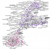

.. _acclt:

Approche computationnelle du changement linguistique sur Twitter
================================================================

.. |br| raw:: html

    
    

**ENS-Lyon - ICAR** : Jean-Philippe Magué |br|
**ENS-Lyon - ICAR** : Louise Tarrade |br|
**ENS-Lyon - ICAR** : Mélanie Veloso |br|
**Centre Blaise Pascal :** Emmanuel Quémener

Les données massives produites par des médias sociaux comme Twitter permettent l’observation d’une variété de français qui se distingue du français normé, et qui se caractérise entre autres par un fort taux d’innovations. 

À partir d’un très grand corpus de tweets, ce projet a pour objectif d’étudier les changements linguistiques, qu’ils soient lexicaux (un nouveau mot par exemple) ou sémantiques (l’apparition pour un mot d’une nouvelle signification remplaçant ou s’ajoutant à l’ancienne) et la manière dont ils se diffusent dans une population, ici les utilisateurs de Twitter. Ce qui nous intéresse plus particulièrement est d’observer comment les structures sociales au sein d’une population régissent la diffusion de ces changements jusqu’à leur éventuelle adoption par l’ensemble de celle-ci. 

Une des principales motivations de ce projet est de mobiliser des méthodes de plusieurs disciplines (sociolinguistique computationnelle, science des réseaux, traitement automatique des langues) pour porter ce questionnement aux différentes strates de la population et ainsi détecter les changements de différents ordres, comprendre leur mécanisme de diffusion dans les communautés de locuteurs, et identifier les rôles joués plus spécifiquement par chaque individu dans la mise en place de ce phénomène.

Contribution du CBP
-------------------

Ce projet nécessite entre autres l’utilisation de méthodes de deep learning et le Centre Blaise Pascal nous fournit les socles matériels et logiciels nécessaires à cela. 
