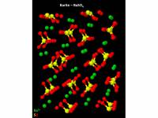

.. _impact:

IMPACT : L’impact géant et la formation de la Terre et de la Lune
=================================================================

.. |br| raw:: html

    

Coordination : Razvan Caracas (Laboratoire de Géologie, ENSL) 

Parteners : Natalia Solomatova, Ema Bobocioiu, Anais Kobsch, Zhi Li, Helene Plihon, Sarah H. Stewart, Francois Soubiran 

Expert analyse numérique et calcul scientifique : Cerasela Calugaru 

`Website of the project <https://moonimpact.eu/home/>`_

**L’impact géant et la formation de la Terre et de la Lune** 

Ce projet ERC est porté par l’équipe de Razvan Caracas (Laboratoire de Géologie) et propose d’étudier le modèle de formation et d’évolution du disque proto-lunaire en utilisant une combinaison de simulations abinitio atomistiques (théorie de la fonctionnelle densité DFT à grande échelle couplée avec les fonctions Green GWet les techniques DFT dépendant du temps). L’objectif est de contraindre les scénarios d’impact plausibles et les caractéristiques de l’impacteur et de la proto-Terre dans un algorithme de convergence minimisant l’écart entre les prédictions des compositions finales Terre-Lune et les observations.  

Contribution of CBP/PSMN
------------------------

Dans le cadre de ce projet, le CBP apporte une expertise et soutien en informatique et calcul scientifique notamment pour le portage, déboggage et l’optimisation de codes (dont ABINIT, VASP et CALYPSO) et des exécutions intensives sur les plateformes de calcul :

* Installation du code CALYPSO, la rédaction des instructions d’utilisation, aide au couplage avec le logiciel VASP et mise en place d’un programme de recherche  de l’origine de divers problèmes 
* Vérification des options d’exécution MPI pour le code ABINIT, notamment les protocoles de communication inter-processus, l'export de variable d’environnement, le fichier hostfile 
* Explication de la stratégie et mise en oeuvre d’une procédure de soumission manuelle et automatique pour l’exécution d’une enchainement particulier de simulations, puis déboggage de son script pour l’intégration d’une partie en langage PERL. 
* Assistance à l’utilisation de VASP sur le scratch des serveur de calcul
* Initiation à l’utilisation en ligne de commande du système de versionning git; information sur les diverses formations git déjà proposées au niveau local par d’autres formateurs
* Aide au montage d’un ensemble matériel pour la VR (Virtual Reality), à la configuration logiciel et aux tests de fonctionnement 
* Installation optimisée de la version ABINIT 8.10.3 et tests de fonctionnement 
* Mise en place d’une solution de visualisation des hologrammes : étude des diverses pistes (dont anaconda et pip) pour la définition d’un environnement Python pour installation et le bon fonctionnement du paquet Open3D ; analyse d’un ensemble de scripts Python / IDL et d’autres fichiers issus de l’utilisation d’une équipe américaine (travail à continuer) 
* Installation d’un couplage du logiciel LAMMPS_3Mar20-quip-gap avec l'instalation de librairies GAP et QUIP (et ASE) 
* Expertise pour une  erreur survenue pour le postprocessing "anaddb" de la version ABINIT 8.10.3  
* Installation optimisée de la version ABINIT 9.4.1 avec l'instalation de librairies HDF5, NetCDF, LibXC et tests de fonctionnement 