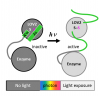

.. _simbio:

Structure and interactions of molecules with biological activity
================================================================

.. |br| raw:: html

    

Team SIMBIO |br|
Laboratoire de Biologie Moléculaire de la Cellule (LBMC/UMR 5239) |br|
Ecole Normale Supérieure de Lyon |br|
46, allée d'Italie |br|
69364 Lyon cedex 07 |br|
France  

We apply atomic-level computer simulations to gain insights into the dynamic structure of biomolecules and their interactions. In collaboration with experimental biologists of the Laboratoire de Biologie Moléculaire de la Cellule (LBMC/ENS de Lyon) we aim to understand how the structure and interactions of biomolecules influence their biological function in living cells. One of our project focuses on the design of photosensitive proteins, i.e., enzymes that can be activated and deactivated through light. A difficult task to overcome in the design of photosensitive proteins is to find the correct balance of stability between the inactive structure and the light-activated structure (see Figure). We use free-energy calculations based on molecular dynamics simulations to identify the crucial factors of this balance and use this information to aid the design of photosensors prior to their costly biotechnological construction and testing in living cells.

Contribution of PSMN/CBP
------------------------

Atomic-level computer simulation using molecular dynamics require high-performance computing infrastructures, such as the one of the PSMN/ENS de Lyon. We are thus very grateful for the CPU time provided by the PSMN. In recent years the use of GPUs as computing units have become a very attractive alternative to CPUs. The CBP provides us access to several machines with GPU-acceleration. The PSMN provides us access to several servers with GPU-acceleration.

*"Last year, we have built up a small cluster of 7 GPU machines (14x GTX 780) in our lab. With the SIDUS technology, developed by Emmanuel Quemener, we can have access over the network to an optimized operating system with CUDA software. This facilitates the management of the cluster enormously.  Emmanuel was very helpful in explaining the use of this new technology. I also appreciate his reactivity on requests from our side. As an example, we needed for our hardware a specific driver for the ethernet card; Emmanuel provided us in short time with a solution."* Martin Spichty